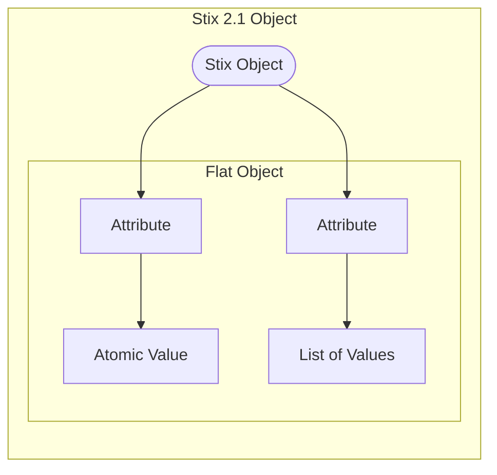

# Stix Modelling Overview - How Does it Work?

At high level, the Stix model transforms quite cleanly into a TypeQL model, and if one understands how the transforms work then it is easy to predict the TypeQL syntax. First one needs to consider the basic STIX model.

## STIX Model Overview

The STIX Model is based on seven different types of objects, as can be seen in the table below, and there are a number of common properties across the objects.


from the [Stix 2.1 Standard](https://docs.oasis-open.org/cti/stix/v2.1/os/stix-v2.1-os.html#_xzbicbtscatx)

The majority of the STIX 2.1 system can be understood by examining the three Core Objects:
1. 18 x STIX Domain Objects
2. 18 x STIX Cyber Observable Objects
3. 31 x STIX Relationship Objects

By understanding the common features of these objects we cam quickly get an overview of how the whole model works. 
There are two different types of similarities through the Stix standard:
1. Similarities based on object ierarchy, such as common properties in the table above
2. Similarities based on underlying data shape, as outlined in the discussion below.

Firstly, consider the construction of each of the 3 types of objects.


### STIX DOmain Objects (SDO)
There are 18 STIX Domain Objects, as shown in the diagram below


### STIX Cyber Observable Objects (SCO)
There are 18 STIX Cyber Observable Objects, as shown in the diagram below

### STIX Relationship Objects (SRO)
There are 30 STIX Relationship Objects, 31 if the Sighting Object is included, as shown in the diagram below


## The Generic Flat STIX Object
*Note: We establish a simple concept for a generic STIX object in order to demonstrate the key features of how Stix objkects work. There is no actual generic STIX object, it is simply a device used to talk through the common features of the core 66 objects.*

The generic flat stix object has some key features. It is an entity, or relation, that has:
- a "type" property, which is the name of the object type
- an "id" property, which is a unique key field that contains the type of the object and a UUID
- additional properties, which are a basic datatype: string, integer, double, boolean or datetime stamps


An example of a flat Stix object, with no sub-object shapes is shown below, an identity object. One can see that the object only has properties comprised of basic datatypes.
```json
        {
            "type": "identity",
            "spec_version": "2.1",
            "id": "identity--733c5838-34d9-4fbf-949c-62aba761184c",
            "created": "2016-08-23T18:05:49.307Z",
            "modified": "2016-08-23T18:05:49.307Z",
            "name": "Disco Team",
            "description": "Disco Team is the name of an organized threat actor crime-syndicate.",
            "identity_class": "organization",
            "contact_information": "disco-team@stealthemail.com"
        }
```
We can add an additional sub-type to the generic flat object, and this is where there is a list of basic datatypes. In this case, then the below threat-actor object with lists of strings is also a generic flat object.
```json
        {
            "type": "threat-actor",
            "spec_version": "2.1",
            "id": "threat-actor--dfaa8d77-07e2-4e28-b2c8-92e9f7b04428",
            "created": "2014-11-19T23:39:03.893Z",
            "modified": "2014-11-19T23:39:03.893Z",
            "name": "Disco Team Threat Actor Group",
            "description": "This organized threat actor group operates to create profit from all types of crime.",
            "threat_actor_types": [
                "crime-syndicate"
            ],
            "aliases": [
                "Equipo del Discoteca"
            ],
            "roles": [
                "agent"
            ],
            "goals": [
                "Steal Credit Card Information"
            ],
            "sophistication": "expert",
            "resource_level": "organization",
            "primary_motivation": "personal-gain"
        }
```
In short, a generic flat object is any entity or relation, with properties that are either basic datatypes or lists of basic datatypes. Any time a proeprty name represents a different shape, like a dict, list of dicts, a key-value store, then we can consider it a sub-object. This is shown in the diagram below.



There are two types of sub objects, ones that are common properties in the table, and others that are based on the common data shape.

## Hashes Sub Object
Hashes are actually a Basic Sub Object (i.e. an entity and relation that acts )

```json
    {
        "type": "file",
        "id": "file--364fe3e5-b1f4-5ba3-b951-ee5983b3538d",
        "spec_version": "2.1",
        "hashes": {
            "MD5": "1717b7fff97d37a1e1a0029d83492de1",
            "SHA-1": "c79a326f8411e9488bdc3779753e1e3489aaedea"
        },
        "size": 83968,
        "name": "resume.pdf"
    }
```
This is shown in the diagram below.


## Granular Markings Sub Object
The Granular MArkings sub object is actually just a list of objects, but it has its own category as it is a common property.

```json
{
    "type": "indicator",
    "spec_version": "2.1",
    "id": "indicator--1ed8caa7-a708-4706-b651-f1186ede6ca1",
    "created_by_ref": "identity--b38dfe21-7477-40d1-aa90-5c8671ce51ca",
    "created": "2017-04-27T16:18:24.318Z",
    "modified": "2017-04-27T16:18:24.318Z",
    "name": "Fake email address",
    "description": "Known to be used by The Joker.",
    "indicator_types": [
        "malicious-activity",
        "attribution"
    ],
    "pattern": "[email-message:from_ref.value MATCHES '.+\\\\banking@g0thamnatl\\\\.com$']",
    "pattern_type": "stix",
    "valid_from": "2017-04-27T16:18:24.318Z",
    "granular_markings": [
        {
            "marking_ref": "marking-definition--5e57c739-391a-4eb3-b6be-7d15ca92d5ed",
            "selectors": [
                "description"
            ]
        },
        {
            "marking_ref": "marking-definition--f88d31f6-486f-44da-b317-01333bde0b82",
            "selectors": [
                "indicator_types.[1]"
            ]
        },
        {
            "marking_ref": "marking-definition--34098fce-860f-48ae-8e50-ebd3cc5e41da",
            "selectors": [
                "indicator_types.[0]",
                "name",
                "pattern"
            ]
        }
    ]
}
```


## Embedded Relation Sub Object

## List of Objects

## Extension

## Key-Value Store


## Basic Sub Object
