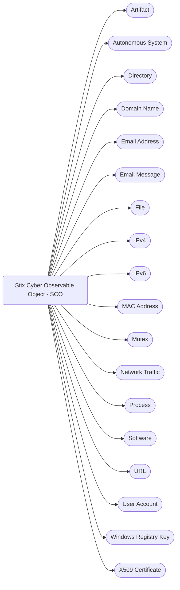

# Stix Modelling Overview - How Does it Work?

At high level, the Stix model transforms quite cleanly into a TypeQL model, and if one understands how the transforms work then it is easy to predict the TypeQL syntax. First one needs to consider the basic STIX model.

The STIX Model is based on six different types of objects, but the bulk of the system can be understood by examining just three:
1. 18 x STIX Domain Objects
2. 18 x STIX Cyber Observable Objects
3. 31 x STIX Relationship Objects

These two types of entities and one type of relation contain the bulk of the meaning expressed by Stix. By understanding the common features of these objects we cam quickly get an overview of how the whole model works. First, we examine the obects at high level.

There are two different types of similarities through the Stix standard:
1. Similarities based on object ierarchy, such as common properties
2. Similarities based on underlying data shape

The common properties that are widely used are  demonstrated in the image below.


## STIX Model Overview
The STIX model is based on more than 70 core objects (entities and relations), which can be considered as a flat core object with 7 optional sub objects.


### STIX DOmain Objects (SDO)
There are 18 STIX Domain Objects, as shown in the diagram below


### STIX Cyber Observable Objects (SCO)
There are 18 STIX Cyber Observable Objects, as shown in the diagram below

### STIX Relationship Objects (SRO)
There are 30 STIX Relationship Objects, 31 if the Sighting Object is included, as shown in the diagram below


## The Generic Flat STIX Object
*Note: We establish a simple concept for a generic STIX object in order to demonstrate the key features of how Stix objkects work. There is no actual generic STIX object, it is simply a device used to talk through the common features of the core 66 objects.*

The generic flat stix object has some key features. It is an entity, or relation, that has:
- a "type" property, which is the name of the object type
- an "id" property, which is a unique key field that contains the type of the object and a UUID
- additional properties, which are a basic datatype: string, integer, double, boolean or datetime stamps

An example of a flat Stix object, with no sub-object shapes is shown below, an identity object.
```json
        {
            "type": "identity",
            "spec_version": "2.1",
            "id": "identity--733c5838-34d9-4fbf-949c-62aba761184c",
            "created": "2016-08-23T18:05:49.307Z",
            "modified": "2016-08-23T18:05:49.307Z",
            "name": "Disco Team",
            "description": "Disco Team is the name of an organized threat actor crime-syndicate.",
            "identity_class": "organization",
            "contact_information": "disco-team@stealthemail.com"
        }
```
We can add an additional sub-type to the generic flat object, and this is where there is a string of basic datatypes. In this case, then the below threat-actor object with lists of strings is also a generic flat object.
```json
        {
            "type": "threat-actor",
            "spec_version": "2.1",
            "id": "threat-actor--dfaa8d77-07e2-4e28-b2c8-92e9f7b04428",
            "created": "2014-11-19T23:39:03.893Z",
            "modified": "2014-11-19T23:39:03.893Z",
            "name": "Disco Team Threat Actor Group",
            "description": "This organized threat actor group operates to create profit from all types of crime.",
            "threat_actor_types": [
                "crime-syndicate"
            ],
            "aliases": [
                "Equipo del Discoteca"
            ],
            "roles": [
                "agent"
            ],
            "goals": [
                "Steal Credit Card Information"
            ],
            "sophistication": "expert",
            "resource_level": "organization",
            "primary_motivation": "personal-gain"
        }
```
In short, a generic flat object is any data object where it consists of an entity or relation, with perties comprised of basic datatypes or lists of basic datatypes.

## Hashes Sub Onject
Hashes are actually a Basic Sub Object (i.e. an entity and relation that acts )

```json
    {
        "type": "file",
        "id": "file--364fe3e5-b1f4-5ba3-b951-ee5983b3538d",
        "spec_version": "2.1",
        "hashes": {
            "MD5": "1717b7fff97d37a1e1a0029d83492de1",
            "SHA-1": "c79a326f8411e9488bdc3779753e1e3489aaedea"
        },
        "size": 83968,
        "name": "resume.pdf"
    }
```


## Granular Markings Sub Object

## Embedded Relarion Sub Object

## List of Objects

## Extension

## Key-Value Store


## Basic Sub Object
