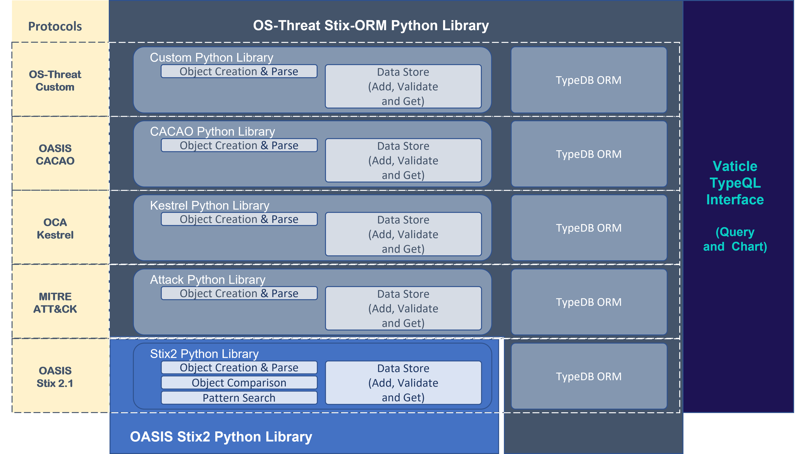

# Stix-ORM Overview

The Stix-ORM Library is an open-source Python Library built on top of the [OASIS Stix2 Python Library](https://stix2.readthedocs.io/en/latest/index.html) in order to make it simple to use TypeDB as a [DataStore](https://stix2.readthedocs.io/en/latest/guide/datastore.html), and extend it to suit additional protocols, such as Mitre ATT&CK, OASIS CACAO, OCA Kestrel, and custom objects (e.g. case management, feed management etc).

## What is it?
The [OASIS Stix2 Python Library](https://stix2.readthedocs.io/en/latest/index.html) is designed to make it as easy as possible to produce and consume Stix 2.1 content. It is comprised of three layers:
1. Object Layer: Is where Python objects representing the Stix 2,1 data types (SDO, SCO and SRO), and sub-objects (external references, kill-chain phases, extensions etc.) are create and can be sereialised and deserialised to and from their JSON representation
2. Environment Layer: Components that make it easier to handle Stix 2.1 data as part of alarger applications, including DataSink's for storing data, DataSource's for retrieving data, and Object Factory's to create al of the common properties and markings
3. Workbench Layer: Python functions for use in an interctive environment (e.g. Jupyter Notebook) to enable comparison of objects, searching for objects and comparison of graphs.

The [OS-Threat Stix-ORM Library]() integrates with the OASIS Stix 2 Python Library to:
1. Provide a TypeDB DataSource and DataSink capability to store and retrieve Stix objects using simple python verbs, add, get, delete etc., including a simple reasoning system
2. Extend the Python Object, Parse, TypeDB DataSource and DataSink capabilities to additional cybersecurity protocols, such as MITRE ATT&CK, enabling validation of incoming objects, and the ability to create new correct objects
3. Enable custom objects, Stix extensions and new language protocols to be added relatively easily, so the library can be extended easily by users and researchers. 
4. Load common data assets, Stix - TLP-markings, common objects, MITRE ATT&CK, CVE's
5. Produce a platform for further developments and collaboration

The OS-Threat Stix-ORM library can be installed using pip, and is well documented.

An image of these concepts is shown below.

## What are the Benefits?
[TypeDB is without a doubt, the most powerful datastore for cybersecurity](typedb_benefits.md), because:
1. Semantic Hypergraph: Enables elegant, succinct representation of intricate cybersecurity objects and relationships
2. Fully Normalised Attributes: Data is only written once (e.g. Stix-ID, hash etc.), as attrbutes are normalised as a database guarantee
3. Unique Data Modelling: Unique modelling capabilities of attributes owning attributes (used in key-value store), and relations able to play roles in other relations
4. Class hierarchy on Entities, Relations and Attributes: Enables rich behavioural modelling of objects, sub-objects, properties, relations and linkages
5. When->Then Horn Logic rule system, enabling inference over large datasets dynamically triggered at query time, with an included example
6. Elegant query of complex objects through class hierarchy combined with rulesets

## Near-term Feature Roadmap
Very quickly we aim to add the following features to the system.
1. Add support for OASIS CACAO and OCA Kestrel protocols
2. Add support for Stix Patterns, and extend the method to all objects and properties
3. Add support for open vocabulary words to be selectively added
4. Add support for Stix extensions, and the ability to import Stix extensions
5. Add support for Detections, Mitigations and Tests connected to TTP's, and NIST Controls
6. Add import capability for all rulesets, tests and controls (e.g. Control Compass and Engenuity CTID)

The documentation system contains the following sections:
- [Using the Stix-ORM](using/configuration.md)
- [How the ORM Works](orm/orm_oveview.md)
- [Protcols Supported](protocols/_orig.md)
- [Interacting with Stix-ORM](interactions/overview.md)

The current supported objects can be viewed here

