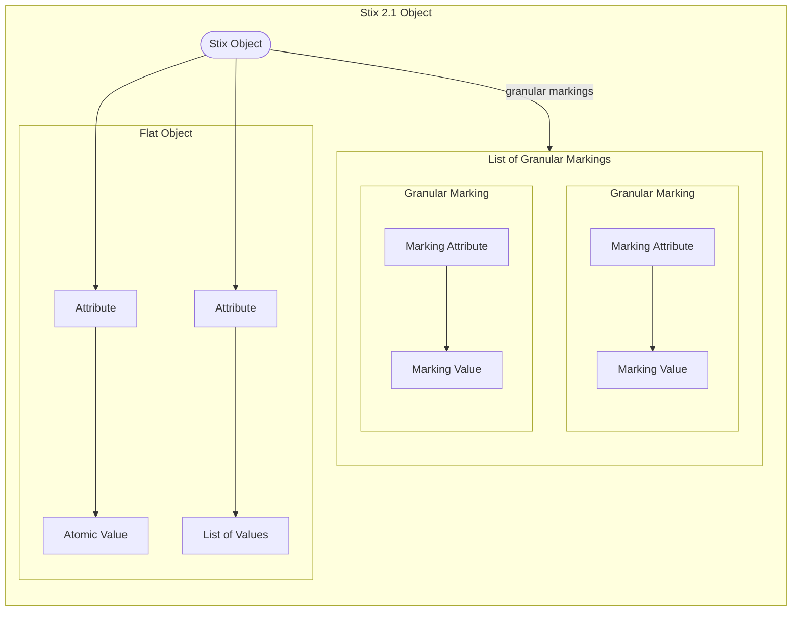

# Granualar Marking


## Granular Markings Sub Object
The Granular MArkings sub object is actually just a list of objects, but it has its own category as it is a common property.

```json
{
    "type": "indicator",
    "spec_version": "2.1",
    "id": "indicator--1ed8caa7-a708-4706-b651-f1186ede6ca1",
    "created_by_ref": "identity--b38dfe21-7477-40d1-aa90-5c8671ce51ca",
    "created": "2017-04-27T16:18:24.318Z",
    "modified": "2017-04-27T16:18:24.318Z",
    "name": "Fake email address",
    "description": "Known to be used by The Joker.",
    "indicator_types": [
        "malicious-activity",
        "attribution"
    ],
    "pattern": "[email-message:from_ref.value MATCHES '.+\\\\banking@g0thamnatl\\\\.com$']",
    "pattern_type": "stix",
    "valid_from": "2017-04-27T16:18:24.318Z",
    "granular_markings": [
        {
            "marking_ref": "marking-definition--5e57c739-391a-4eb3-b6be-7d15ca92d5ed",
            "selectors": [
                "description"
            ]
        },
        {
            "marking_ref": "marking-definition--f88d31f6-486f-44da-b317-01333bde0b82",
            "selectors": [
                "indicator_types.[1]"
            ]
        },
        {
            "marking_ref": "marking-definition--34098fce-860f-48ae-8e50-ebd3cc5e41da",
            "selectors": [
                "indicator_types.[0]",
                "name",
                "pattern"
            ]
        }
    ]
}
```


