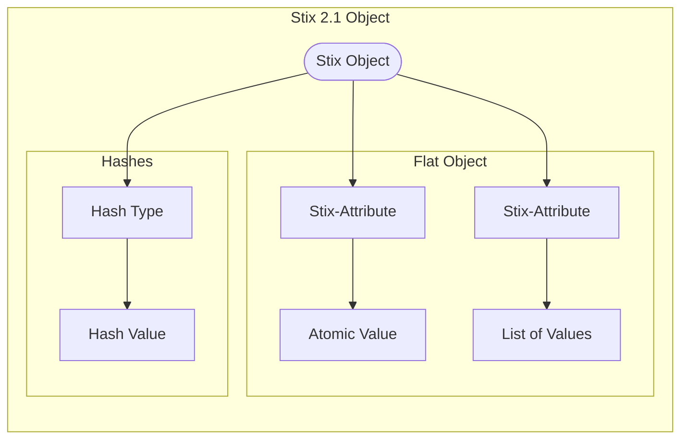

# HAshes


## Hashes Sub Object
Hashes are actually a Basic Sub Object (i.e. an entity and relation that acts )

```json
    {
        "type": "file",
        "id": "file--364fe3e5-b1f4-5ba3-b951-ee5983b3538d",
        "spec_version": "2.1",
        "hashes": {
            "MD5": "1717b7fff97d37a1e1a0029d83492de1",
            "SHA-1": "c79a326f8411e9488bdc3779753e1e3489aaedea"
        },
        "size": 83968,
        "name": "resume.pdf"
    }
```
This is shown in the diagram below.




### 1.4 Stix Hashes Modelled by Vaticle TypeDB Relations

The Stix Hashes sub-data-object (https://docs.oasis-open.org/cti/stix/v2.1/os/stix-v2.1-os.html#_odoabbtwuxyd) represents one or more cryptographic hashes. An example is shown below

```json
{
  "SHA-256": "6db12788c37247f2316052e142f42f4b259d6561751e5f401a1ae2a6df9c674b",
  "MD5": "e4d909c290d0fb1ca068ffaddf22cbd0"
}
````

The Stix hashes can be connected with a number of Stix obhjects, including external-reference, file, ntfs-ext, artifact, windows-pebinary-ext, windows-pe-optional-header-type, windows-pe-scetion and X509-certificate.

The Vaticle hash implmentation creates a basic entity record, and then uses sub-classing to reflect the various types. The Hash entity is then related as contained to the owner through the Hashes relation.

```
hash sub entity, 
	owns hash-value, 
	plays hashes:contained; 

	md5 sub hash;
	sha-1 sub hash; 
	sha-256 sub hash;
	sha-512 sub hash; 
	sha3-256 sub hash; 
	sha3-512 sub hash;
	ssdeep sub hash; 
	tlsh sub hash; 


hashes sub relation,
	relates contained,
	relates owner;
```