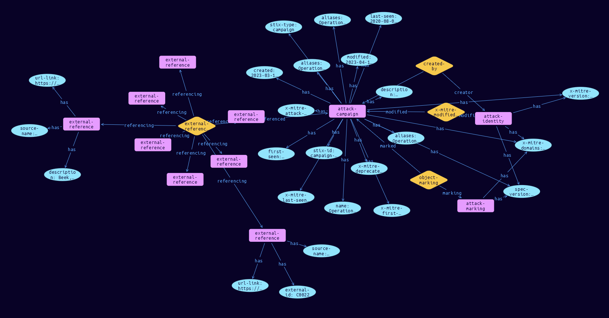

# Campaign Domain Object

**Stix and TypeQL Object Type:**  `campaign`

A Campaign in ATT&CK is defined as a campaign object.

[Reference in Stix2.1 Standard](https://github.com/mitre-attack/attack-stix-data/blob/master/USAGE.md#campaigns)
## Stix 2.1 Properties Converted to TypeQL
Mapping of the Stix Attack Pattern Properties to TypeDB

|  Stix 2.1 Property    |           Schema Name             | Required  Optional  |      Schema Object Type | Schema Parent  |
|:--------------------|:--------------------------------:|:------------------:|:------------------------:|:-------------:|
|  type                 |            stix-type              |      Required       |  stix-attribute-string    |   attribute    |
|  id                   |             stix-id               |      Required       |  stix-attribute-string    |   attribute    |
|  spec_version         |           spec-version            |      Required       |  stix-attribute-string    |   attribute    |
|  created              |             created               |      Required       | stix-attribute-timestamp  |   attribute    |
|  modified             |             modified              |      Required       | stix-attribute-timestamp  |   attribute    |
|  name                 |               name                |      Required       |  stix-attribute-string    |   attribute    |
|  description          |           description             |      Optional       |  stix-attribute-string    |   attribute    |
|  aliases              | aliases              |      Optional       |  stix-attribute-string    |   attribute    |
| first_seen |first-seen |      Optional       | stix-attribute-timestamp  |   attribute    |
| last_seen |last-seen |      Optional       | stix-attribute-timestamp  |   attribute    |
| objective |objective |      Optional       |  stix-attribute-string    |   attribute    |
|  created_by_ref       |        created-by:created         |      Optional       |   embedded     |relation |
| x_mitre_platforms |x-mitre-platforms |Required |  stix-attribute-string    |   attribute    |
| x_mitre_aliases |x-mitre-aliases |Required |  stix-attribute-string    |   attribute    |
| x_mitre_version |x-mitre-version |Required |  stix-attribute-string    |   attribute    |
| x_mitre_first_seen_citation |x-mitre-first-seen-citation |Required |  stix-attribute-string    |   attribute    |
| x_mitre_last_seen_citation |x-mitre-last-seen-citation |Required |  stix-attribute-string    |   attribute    |
| x_mitre_contributors |x-mitre-contributors |Required |  stix-attribute-string    |   attribute    |
| x_mitre_modified_by_ref |x-mitre-modified-by-ref:modified |Required |   embedded     |relation |
| x_mitre_domains |x-mitre-domains |Required |  stix-attribute-string    |   attribute    |
| x_mitre_attack_spec_version |x-mitre-attack-spec-version |Required |  stix-attribute-string    |   attribute    |
| x_mitre_deprecated |x-mitre-deprecated |Optonal |  stix-attribute-boolean   |   attribute    |
|  revoked              |             revoked               |      Optional       |  stix-attribute-boolean   |   attribute    |
|  labels               |              labels               |      Optional       |  stix-attribute-string    |   attribute    |
|  confidence           |            confidence             |      Optional       |  stix-attribute-integer   |   attribute    |
|  lang                 |               lang                |      Optional       |  stix-attribute-string    |   attribute    |
|  external_references  | external-references:referencing   |      Optional       |   embedded     |relation |
|  object_marking_refs  |      object-marking:marked        |      Optional       |   embedded     |relation |
|  granular_markings    |     granular-marking:marked       |      Optional       |   embedded     |relation |
|  extensions           |               n/a                 |        n/a          |           n/a             |      n/a       |

## The Example Campaign in JSON
The original JSON, accessible in the Python environment
```json
{
    "modified": "2023-04-10T19:18:19.033Z",
    "name": "Operation Dream Job",
    "description": "[Operation Dream Job](https://attack.mitre.org/campaigns/C0022) was a cyber espionage operation likely conducted by [Lazarus Group](https://attack.mitre.org/groups/G0032) that targeted the defense, aerospace, government, and other sectors in the United States, Israel, Australia, Russia, and India. In at least one case, the cyber actors tried to monetize their network access to conduct a business email compromise (BEC) operation. In 2020, security researchers noted overlapping TTPs, to include fake job lures and code similarities, between [Operation Dream Job](https://attack.mitre.org/campaigns/C0022), Operation North Star, and Operation Interception; by 2022 security researchers described [Operation Dream Job](https://attack.mitre.org/campaigns/C0022) as an umbrella term covering both Operation Interception and Operation North Star.(Citation: ClearSky Lazarus Aug 2020)(Citation: McAfee Lazarus Jul 2020)(Citation: ESET Lazarus Jun 2020)(Citation: The Hacker News Lazarus Aug 2022)",
    "aliases": [
        "Operation Dream Job",
        "Operation North Star",
        "Operation Interception"
    ],
    "first_seen": "2019-09-01T04:00:00.000Z",
    "last_seen": "2020-08-01T04:00:00.000Z",
    "x_mitre_first_seen_citation": "(Citation: ESET Lazarus Jun 2020)",
    "x_mitre_last_seen_citation": "(Citation: ClearSky Lazarus Aug 2020)",
    "x_mitre_deprecated": false,
    "x_mitre_version": "1.0",
    "type": "campaign",
    "id": "campaign--0257b35b-93ef-4a70-80dd-ad5258e6045b",
    "created": "2023-03-17T13:37:42.596Z",
    "created_by_ref": "identity--c78cb6e5-0c4b-4611-8297-d1b8b55e40b5",
    "revoked": false,
    "external_references": [
        {
            "source_name": "mitre-attack",
            "url": "https://attack.mitre.org/campaigns/C0022",
            "external_id": "C0022"
        },
        {
            "source_name": "Operation Interception",
            "description": "(Citation: ESET Lazarus Jun 2020)"
        },
        {
            "source_name": "Operation North Star",
            "description": "(Citation: McAfee Lazarus Jul 2020)(Citation: McAfee Lazarus Nov 2020)"
        },
        {
            "source_name": "McAfee Lazarus Nov 2020",
            "description": "Beek, C. (2020, November 5). Operation North Star: Behind The Scenes. Retrieved December 20, 2021.",
            "url": "https://www.mcafee.com/blogs/other-blogs/mcafee-labs/operation-north-star-behind-the-scenes/"
        },
        {
            "source_name": "ESET Lazarus Jun 2020",
            "description": "Breitenbacher, D and Osis, K. (2020, June 17). OPERATION IN(TER)CEPTION: Targeted Attacks Against European Aerospace and Military Companies. Retrieved December 20, 2021.",
            "url": "https://www.welivesecurity.com/wp-content/uploads/2020/06/ESET_Operation_Interception.pdf"
        },
        {
            "source_name": "McAfee Lazarus Jul 2020",
            "description": "Cashman, M. (2020, July 29). Operation North Star Campaign. Retrieved December 20, 2021.",
            "url": "https://www.mcafee.com/blogs/other-blogs/mcafee-labs/operation-north-star-a-job-offer-thats-too-good-to-be-true/?hilite=%27Operation%27%2C%27North%27%2C%27Star%27"
        },
        {
            "source_name": "ClearSky Lazarus Aug 2020",
            "description": "ClearSky Research Team. (2020, August 13). Operation 'Dream Job' Widespread North Korean Espionage Campaign. Retrieved December 20, 2021.",
            "url": "https://www.clearskysec.com/wp-content/uploads/2020/08/Dream-Job-Campaign.pdf"
        },
        {
            "source_name": "The Hacker News Lazarus Aug 2022",
            "description": "Lakshmanan, R. (2022, August 17). North Korea Hackers Spotted Targeting Job Seekers with macOS Malware. Retrieved April 10, 2023.",
            "url": "https://thehackernews.com/2022/08/north-korea-hackers-spotted-targeting.html"
        }
    ],
    "object_marking_refs": [
        "marking-definition--fa42a846-8d90-4e51-bc29-71d5b4802168"
    ],
    "x_mitre_attack_spec_version": "3.1.0",
    "x_mitre_modified_by_ref": "identity--c78cb6e5-0c4b-4611-8297-d1b8b55e40b5",
    "x_mitre_domains": [
        "enterprise-attack"
    ],
    "spec_version": "2.1"
}
```


## Inserting the Example Campaign in TypeQL
The TypeQL insert statement
```typeql
match  $identity0 isa identity, has stix-id "identity--c78cb6e5-0c4b-4611-8297-d1b8b55e40b5";
 $identity1 isa identity, has stix-id "identity--c78cb6e5-0c4b-4611-8297-d1b8b55e40b5";
 $attack-marking03 isa attack-marking, has stix-id "marking-definition--fa42a846-8d90-4e51-bc29-71d5b4802168";
 
insert $attack-campaign isa attack-campaign,
 has stix-type $stix-type,
 has spec-version $spec-version,
 has stix-id $stix-id,
 has created $created,
 has modified $modified,
 has name $name,
 has description $description,
 has x-mitre-version $x-mitre-version,
 has x-mitre-domains $x_mitre_domains0,
 has x-mitre-attack-spec-version $x-mitre-attack-spec-version,
 has x-mitre-first-seen-citation $x-mitre-first-seen-citation,
 has x-mitre-last-seen-citation $x-mitre-last-seen-citation,
 has aliases $aliases0,
 has aliases $aliases1,
 has aliases $aliases2,
 has first-seen $first-seen,
 has last-seen $last-seen,
 has x-mitre-deprecated $x-mitre-deprecated;

 $stix-type "campaign";
 $spec-version "2.1";
 $stix-id "campaign--0257b35b-93ef-4a70-80dd-ad5258e6045b";
 $created 2023-03-17T13:37:42.596;
 $modified 2023-04-10T19:18:19.033;
 $name "Operation Dream Job";
 $description "[Operation Dream Job](https://attack.mitre.org/campaigns/C0022) was a cyber espionage operation likely conducted by [Lazarus Group](https://attack.mitre.org/groups/G0032) that targeted the defense, aerospace, government, and other sectors in the United States, Israel, Australia, Russia, and India. In at least one case, the cyber actors tried to monetize their network access to conduct a business email compromise (BEC) operation. In 2020, security researchers noted overlapping TTPs, to include fake job lures and code similarities, between [Operation Dream Job](https://attack.mitre.org/campaigns/C0022), Operation North Star, and Operation Interception; by 2022 security researchers described [Operation Dream Job](https://attack.mitre.org/campaigns/C0022) as an umbrella term covering both Operation Interception and Operation North Star.(Citation: ClearSky Lazarus Aug 2020)(Citation: McAfee Lazarus Jul 2020)(Citation: ESET Lazarus Jun 2020)(Citation: The Hacker News Lazarus Aug 2022)";
 $x-mitre-version "1.0";
 $x_mitre_domains0 "enterprise-attack";
 $x-mitre-attack-spec-version "3.1.0";
 $x-mitre-first-seen-citation "(Citation: ESET Lazarus Jun 2020)";
 $x-mitre-last-seen-citation "(Citation: ClearSky Lazarus Aug 2020)";
 $aliases0 "Operation Dream Job";
 $aliases1 "Operation North Star";
 $aliases2 "Operation Interception";
 $first-seen 2019-09-01T04:00:00.000;
 $last-seen 2020-08-01T04:00:00.000;
 $x-mitre-deprecated false;

 $created-by0 (created:$attack-campaign, creator:$identity0) isa created-by;

 $x-mitre-modified-by-ref1 (modified:$attack-campaign, modifier:$identity1) isa x-mitre-modified-by-ref;
$external-reference0 isa external-reference,
 has source-name "mitre-attack",
 has url-link "https://attack.mitre.org/campaigns/C0022",
 has external-id "C0022";
$external-reference1 isa external-reference,
 has source-name "Operation Interception",
 has description "(Citation: ESET Lazarus Jun 2020)";
$external-reference2 isa external-reference,
 has source-name "Operation North Star",
 has description "(Citation: McAfee Lazarus Jul 2020)(Citation: McAfee Lazarus Nov 2020)";
$external-reference3 isa external-reference,
 has source-name "McAfee Lazarus Nov 2020",
 has description "Beek, C. (2020, November 5). Operation North Star: Behind The Scenes. Retrieved December 20, 2021.",
 has url-link "https://www.mcafee.com/blogs/other-blogs/mcafee-labs/operation-north-star-behind-the-scenes/";
$external-reference4 isa external-reference,
 has source-name "ESET Lazarus Jun 2020",
 has description "Breitenbacher, D and Osis, K. (2020, June 17). OPERATION IN(TER)CEPTION: Targeted Attacks Against European Aerospace and Military Companies. Retrieved December 20, 2021.",
 has url-link "https://www.welivesecurity.com/wp-content/uploads/2020/06/ESET_Operation_Interception.pdf";
$external-reference5 isa external-reference,
 has source-name "McAfee Lazarus Jul 2020",
 has description "Cashman, M. (2020, July 29). Operation North Star Campaign. Retrieved December 20, 2021.",
 has url-link "https://www.mcafee.com/blogs/other-blogs/mcafee-labs/operation-north-star-a-job-offer-thats-too-good-to-be-true/?hilite=%27Operation%27%2C%27North%27%2C%27Star%27";
$external-reference6 isa external-reference,
 has source-name "ClearSky Lazarus Aug 2020",
 has description "ClearSky Research Team. (2020, August 13). Operation 'Dream Job' Widespread North Korean Espionage Campaign. Retrieved December 20, 2021.",
 has url-link "https://www.clearskysec.com/wp-content/uploads/2020/08/Dream-Job-Campaign.pdf";
$external-reference7 isa external-reference,
 has source-name "The Hacker News Lazarus Aug 2022",
 has description "Lakshmanan, R. (2022, August 17). North Korea Hackers Spotted Targeting Job Seekers with macOS Malware. Retrieved April 10, 2023.",
 has url-link "https://thehackernews.com/2022/08/north-korea-hackers-spotted-targeting.html";

 $external-references (referenced:$attack-campaign, referencing:$external-reference0, referencing:$external-reference1, referencing:$external-reference2, referencing:$external-reference3, referencing:$external-reference4, referencing:$external-reference5, referencing:$external-reference6, referencing:$external-reference7) isa external-references;

 $object-marking3 (marked:$attack-campaign, marking:$attack-marking03) isa object-marking;
```

## Retrieving the Example Campaign in TypeQL
The typeQL match statement

```typeql
match  
   $a isa attack-campaign,
      has stix-id  "campaign--0257b35b-93ef-4a70-80dd-ad5258e6045b",
      has $b;
   $c isa stix-sub-object,
      has $d;
   $e (owner:$a, pointed-to:$c) isa embedded;
   $f (owner:$a, pointed-to:$g) isa embedded; 
```


will retrieve the example attack-pattern object in Vaticle Studio


## Retrieving the Example Campaign  in Python
The Python retrieval statement

```python
from stixorm.module.typedb import TypeDBSink, TypeDBSource
connection = {
    "uri": "localhost",
    "port": "1729",
    "database": "stix",
    "user": None,
    "password": None
}

import_type = {
    "STIX21": True,
    "CVE": False,
    "identity": False,
    "location": False,
    "rules": False,
    "ATT&CK": False,
    "ATT&CK_Versions": ["12.0"],
    "ATT&CK_Domains": ["enterprise-attack", "mobile-attack", "ics-attack"],
    "CACAO": False
}

typedb = TypeDBSource(connection, import_type)
stix_obj = typedb.get("campaign--0257b35b-93ef-4a70-80dd-ad5258e6045b")
```

 

[Back to MITRE ATT&CK Overview](../overview.md)
 

[Back to All Protocols Overview](../../overview.md)
 

[Back to Overview Doc](../../../overview.md)
