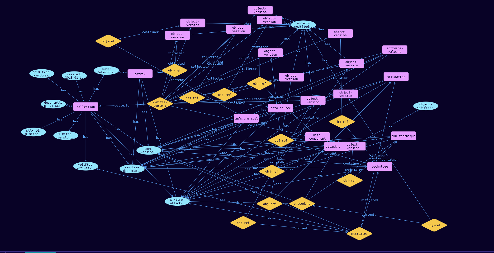

# Collection Domain Object

**Stix and TypeQL Object Type:**  `x-mitre-collection`

A collection is a set of related ATT&CK objects; collections may be used to represent specific releases of a dataset such as "Enterprise ATT&CK v7.2", or any other set of objects one may want to share with someone else.

[Reference in Stix2.1 Standard](https://github.com/center-for-threat-informed-defense/attack-workbench-frontend/blob/master/docs/collections.md)
## Stix 2.1 Properties Converted to TypeQL
Mapping of the Stix Attack Pattern Properties to TypeDB

|  Stix 2.1 Property    |           Schema Name             | Required  Optional  |      Schema Object        | Schema Parent  |
|:--------------------|:--------------------------------:|:------------------:|:------------------------:|:-------------:|
|  type                 |            stix-type              |      Required       |  stix-attribute-string    |   attribute    |
|  id                   |             stix-id               |      Required       |  stix-attribute-string    |   attribute    |
|  spec_version         |           spec-version            |      Required       |  stix-attribute-string    |   attribute    |
|  created              |             created               |      Required       | stix-attribute-timestamp  |   attribute    |
|  modified             |             modified              |      Required       | stix-attribute-timestamp  |   attribute    |
|  name                 |               name                |      Required       |  stix-attribute-string    |   attribute    |
|  description          |           description             |      Optional       |  stix-attribute-string    |   attribute    |
|  aliases              | aliases              |      Optional       |  stix-attribute-string    |   attribute    |
| action |action |Reserved |  stix-attribute-string    |   attribute    |
|  created_by_ref       |        created-by:created         |      Optional       |   embedded     |relation |
| x_mitre_version |x-mitre-version |Required |  stix-attribute-string    |   attribute    |
| x_mitre_attack_spec_version |x-mitre-attack-spec-version |Required |  stix-attribute-string    |   attribute    |
| x_mitre_contents |x-mitre-content:collector |Required |   embedded     |relation |

## The Example Collection in JSON
The original JSON, accessible in the Python environment
```json
{
    "type": "x-mitre-collection",
    "id": "x-mitre-collection--b76ed159-6b5c-4d89-8286-ccf339d38ad0",
    "spec_version": "2.1",
    "x_mitre_attack_spec_version": "2.1.0",
    "name": "Enterprise ATT&CK",
    "x_mitre_version": "10.1",
    "description": "ATT&CK for Enterprise provides a knowledge base of real-world adversary behavior targeting traditional enterprise networks. ATT&CK for Enterprise covers the following platforms: Windows, macOS, Linux, PRE, Office 365, Google Workspace, IaaS, Network, and Containers.",
    "created_by_ref": "identity--c78cb6e5-0c4b-4611-8297-d1b8b55e40b5",
    "created": "2018-01-17T12:56:55.080Z",
    "modified": "2021-11-10T14:00:00.188Z",
    "object_marking_refs": [
      "marking-definition--fa42a846-8d90-4e51-bc29-71d5b4802168"
    ],
    "x_mitre_contents": [
      {
        "object_ref": "attack-pattern--d0b4fcdb-d67d-4ed2-99ce-788b12f8c0f4",
        "object_modified": "2021-04-29T14:49:39.188Z"
      },
      {
        "object_ref": "attack-pattern--67720091-eee3-4d2d-ae16-8264567f6f5b",
        "object_modified": "2021-07-28T01:04:39.141Z"
      },
      {
        "object_ref": "attack-pattern--67720091-eee3-4d2d-ae16-8264567f6f5b",
        "object_modified": "2021-07-28T01:04:39.141Z"
      },
      {
        "object_ref": "intrusion-set--7113eaa5-ba79-4fb3-b68a-398ee9cd698e",
        "object_modified": "2021-07-28T01:04:39.141Z"
      },
      {
        "object_ref": "course-of-action--93e7968a-9074-4eac-8ae9-9f5200ec3317",
        "object_modified": "2021-07-28T01:04:39.141Z"
      },
      {
        "object_ref": "relationship--d7360dcb-fd97-4775-90fe-a892b9b24b54",
        "object_modified": "2021-07-28T01:04:39.141Z"
      },
      {
        "object_ref": "relationship--b427e519-8ec0-4ae3-9dda-273cc71f00eb",
        "object_modified": "2021-07-28T01:04:39.141Z"
      },
      {
        "object_ref": "x-mitre-data-component--18b236d8-7224-488f-9d2f-50076a0f653a",
        "object_modified": "2021-07-28T01:04:39.141Z"
      },
      {
        "object_ref": "x-mitre-data-source--d6188aac-17db-4861-845f-57c369f9b4c8",
        "object_modified": "2021-07-28T01:04:39.141Z"
      },
      {
        "object_ref": "x-mitre-matrix--eafc1b4c-5e56-4965-bd4e-66a6a89c88cc",
        "object_modified": "2021-07-28T01:04:39.141Z"
      },
      {
        "object_ref": "malware--0f1ad2ef-41d4-4b7a-9304-ddae68ea3005",
        "object_modified": "2021-07-28T01:04:39.141Z"
      },
      {
        "object_ref": "tool--f59508a6-3615-47c3-b493-6676e1a39a87",
        "object_modified": "2021-07-28T01:04:39.141Z"
      }
    ]
  }
```


## Inserting the Example Collection in TypeQL
The TypeQL insert statement
```typeql
match  $identity0 isa identity, has stix-id "identity--c78cb6e5-0c4b-4611-8297-d1b8b55e40b5";
 $attack-marking01 isa attack-marking, has stix-id "marking-definition--fa42a846-8d90-4e51-bc29-71d5b4802168";
 $technique0 isa technique, has stix-id "attack-pattern--d0b4fcdb-d67d-4ed2-99ce-788b12f8c0f4";
 $technique1 isa technique, has stix-id "attack-pattern--67720091-eee3-4d2d-ae16-8264567f6f5b";
 $technique2 isa technique, has stix-id "attack-pattern--67720091-eee3-4d2d-ae16-8264567f6f5b";
 $attack-group3 isa attack-group, has stix-id "intrusion-set--7113eaa5-ba79-4fb3-b68a-398ee9cd698e";
 $mitigation4 isa mitigation, has stix-id "course-of-action--93e7968a-9074-4eac-8ae9-9f5200ec3317";
 $stix-core-relationship5 isa stix-core-relationship, has stix-id "relationship--d7360dcb-fd97-4775-90fe-a892b9b24b54";
 $stix-core-relationship6 isa stix-core-relationship, has stix-id "relationship--b427e519-8ec0-4ae3-9dda-273cc71f00eb";
 $data-component7 isa data-component, has stix-id "x-mitre-data-component--18b236d8-7224-488f-9d2f-50076a0f653a";
 $data-source8 isa data-source, has stix-id "x-mitre-data-source--d6188aac-17db-4861-845f-57c369f9b4c8";
 $matrix9 isa matrix, has stix-id "x-mitre-matrix--eafc1b4c-5e56-4965-bd4e-66a6a89c88cc";
 $software-malware10 isa software-malware, has stix-id "malware--0f1ad2ef-41d4-4b7a-9304-ddae68ea3005";
 $software-tool11 isa software-tool, has stix-id "tool--f59508a6-3615-47c3-b493-6676e1a39a87";
 
insert $collection isa collection,
 has stix-type $stix-type,
 has spec-version $spec-version,
 has stix-id $stix-id,
 has created $created,
 has modified $modified,
 has name $name,
 has description $description,
 has x-mitre-version $x-mitre-version,
 has x-mitre-attack-spec-version $x-mitre-attack-spec-version,
 has x-mitre-deprecated $x-mitre-deprecated;

 $stix-type "x-mitre-collection";
 $spec-version "2.1";
 $stix-id "x-mitre-collection--b76ed159-6b5c-4d89-8286-ccf339d38ad0";
 $created 2018-01-17T12:56:55.080;
 $modified 2021-11-10T14:00:00.188;
 $name "Enterprise ATT&CK";
 $description "ATT&CK for Enterprise provides a knowledge base of real-world adversary behavior targeting traditional enterprise networks. ATT&CK for Enterprise covers the following platforms: Windows, macOS, Linux, PRE, Office 365, Google Workspace, IaaS, Network, and Containers.";
 $x-mitre-version "10.1";
 $x-mitre-attack-spec-version "2.1.0";
 $x-mitre-deprecated false;

 $created-by0 (created:$collection, creator:$identity0) isa created-by;

 $object-marking1 (marked:$collection, marking:$attack-marking01) isa object-marking;
$object-version0 isa object-version,
 has object-modified 2021-04-29T14:49:39.188;
$object-version1 isa object-version,
 has object-modified 2021-07-28T01:04:39.141;
$object-version2 isa object-version,
 has object-modified 2021-07-28T01:04:39.141;
$object-version3 isa object-version,
 has object-modified 2021-07-28T01:04:39.141;
$object-version4 isa object-version,
 has object-modified 2021-07-28T01:04:39.141;
$object-version5 isa object-version,
 has object-modified 2021-07-28T01:04:39.141;
$object-version6 isa object-version,
 has object-modified 2021-07-28T01:04:39.141;
$object-version7 isa object-version,
 has object-modified 2021-07-28T01:04:39.141;
$object-version8 isa object-version,
 has object-modified 2021-07-28T01:04:39.141;
$object-version9 isa object-version,
 has object-modified 2021-07-28T01:04:39.141;
$object-version10 isa object-version,
 has object-modified 2021-07-28T01:04:39.141;
$object-version11 isa object-version,
 has object-modified 2021-07-28T01:04:39.141;

 $x-mitre-content (collector:$collection, collected:$object-version0, collected:$object-version1, collected:$object-version2, collected:$object-version3, collected:$object-version4, collected:$object-version5, collected:$object-version6, collected:$object-version7, collected:$object-version8, collected:$object-version9, collected:$object-version10, collected:$object-version11) isa x-mitre-content;

 $obj-ref0 (container:$object-version0, content:$technique0) isa obj-ref;

 $obj-ref1 (container:$object-version1, content:$technique1) isa obj-ref;

 $obj-ref2 (container:$object-version2, content:$technique2) isa obj-ref;

 $obj-ref3 (container:$object-version3, content:$attack-group3) isa obj-ref;

 $obj-ref4 (container:$object-version4, content:$mitigation4) isa obj-ref;

 $obj-ref5 (container:$object-version5, content:$stix-core-relationship5) isa obj-ref;

 $obj-ref6 (container:$object-version6, content:$stix-core-relationship6) isa obj-ref;

 $obj-ref7 (container:$object-version7, content:$data-component7) isa obj-ref;

 $obj-ref8 (container:$object-version8, content:$data-source8) isa obj-ref;

 $obj-ref9 (container:$object-version9, content:$matrix9) isa obj-ref;

 $obj-ref10 (container:$object-version10, content:$software-malware10) isa obj-ref;

 $obj-ref11 (container:$object-version11, content:$software-tool11) isa obj-ref;
```

## Retrieving the Example Collection in TypeQL
The typeQL match statement

```typeql
match  
   $a isa collection,
      has stix-id  "x-mitre-collection--b76ed159-6b5c-4d89-8286-ccf339d38ad0",
      has $b;
   $c isa stix-sub-object,
      has $d;
   $e (owner:$a, pointed-to:$c) isa embedded;
   $f (owner:$a, pointed-to:$g) isa embedded; 
   $h (owner:$c, pointed-to:$i) isa embedded;
```


will retrieve the example attack-pattern object in Vaticle Studio


## Retrieving the Example Collection  in Python
The Python retrieval statement

```python
from stixorm.module.typedb import TypeDBSink, TypeDBSource
connection = {
    "uri": "localhost",
    "port": "1729",
    "database": "stix",
    "user": None,
    "password": None
}

import_type = {
    "STIX21": True,
    "CVE": False,
    "identity": False,
    "location": False,
    "rules": False,
    "ATT&CK": False,
    "ATT&CK_Versions": ["12.0"],
    "ATT&CK_Domains": ["enterprise-attack", "mobile-attack", "ics-attack"],
    "CACAO": False
}

typedb = TypeDBSource(connection, import_type)
stix_obj = typedb.get("x-mitre-collection--b76ed159-6b5c-4d89-8286-ccf339d38ad0")
```

 

[Back to MITRE ATT&CK Overview](../overview.md)
 

[Back to All Protocols Overview](../../overview.md)
 

[Back to Overview Doc](../../../overview.md)
