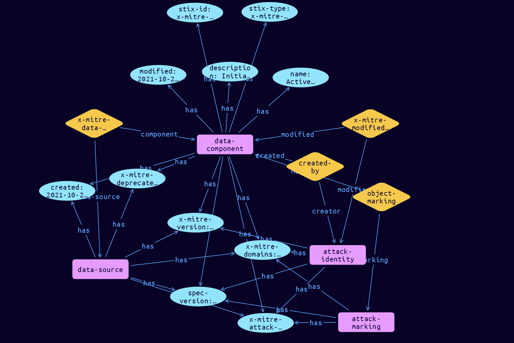

# Data-Component Domain Object

**Stix and TypeQL Object Type:**  `x-mitre-data-component`

A Data Component in ATT&CK is represented as an x-mitre-data-component object. As a custom STIX type they follow only the generic STIX Domain Object pattern.

[Reference in Stix2.1 Standard](https://github.com/mitre-attack/attack-stix-data/blob/master/USAGE.md#data-components)
## Stix 2.1 Properties Converted to TypeQL
Mapping of the Stix Attack Pattern Properties to TypeDB

|  Stix 2.1 Property    |           Schema Name             | Required  Optional  |      Schema Object  Type | Schema Parent  |
|:--------------------|:--------------------------------:|:------------------:|:------------------------:|:-------------:|
|  type                 |            stix-type              |      Required       |  stix-attribute-string    |   attribute    |
|  id                   |             stix-id               |      Required       |  stix-attribute-string    |   attribute    |
|  spec_version         |           spec-version            |      Required       |  stix-attribute-string    |   attribute    |
|  created              |             created               |      Required       | stix-attribute-timestamp  |   attribute    |
|  modified             |             modified              |      Required       | stix-attribute-timestamp  |   attribute    |
|  name                 |               name                |      Required       |  stix-attribute-string    |   attribute    |
|  description          |           description             |      Optional       |  stix-attribute-string    |   attribute    |
|  aliases              |            stix-role              |      Optional       |  stix-attribute-string    |   attribute    |
|  kill_chain_phases    | kill-chain-usage:kill-chain-used  |      Optional       |   embedded     |relation |
|  created_by_ref       |        created-by:created         |      Optional       |   embedded     |relation |
| x_mitre_version |x-mitre-version |Required |  stix-attribute-string    |   attribute    |
| x_mitre_contributors |x-mitre-contributors |Required |  stix-attribute-string    |   attribute    |
| x_mitre_modified_by_ref |x-mitre-modified-by-ref:modified |Required |   embedded     |relation |
| x_mitre_data_source_ref |x-mitre-data-source-ref:component |      Optional       |   embedded     |relation |
| x_mitre_domains |x-mitre-domains |Required |  stix-attribute-string    |   attribute    |
| x_mitre_attack_spec_version |x-mitre-attack-spec-version |Required |  stix-attribute-string    |   attribute    |
| tactic_refs |tactic-refs |Required |  stix-attribute-string    |   attribute    |
| x_mitre_deprecated |x-mitre-deprecated |Optonal |  stix-attribute-boolean   |   attribute    |
|  revoked              |             revoked               |      Optional       |  stix-attribute-boolean   |   attribute    |
|  labels               |              labels               |      Optional       |  stix-attribute-string    |   attribute    |
|  confidence           |            confidence             |      Optional       |  stix-attribute-integer   |   attribute    |
|  lang                 |               lang                |      Optional       |  stix-attribute-string    |   attribute    |
|  external_references  | external-references:referencing   |      Optional       |   embedded     |relation |
|  object_marking_refs  |      object-marking:marked        |      Optional       |   embedded     |relation |
|  granular_markings    |     granular-marking:marked       |      Optional       |   embedded     |relation |
|  extensions           |               n/a                 |        n/a          |           n/a             |      n/a       |

## The Example Data-Component in JSON
The original JSON, accessible in the Python environment
```json
{
    "object_marking_refs": [
        "marking-definition--fa42a846-8d90-4e51-bc29-71d5b4802168"
    ],
    "modified": "2021-10-20T15:05:19.274137Z",
    "id": "x-mitre-data-component--18b236d8-7224-488f-9d2f-50076a0f653a",
    "description": "Initial construction of a new active directory object (ex: Windows EID 5137)",
    "x_mitre_version": "1.0",
    "x_mitre_data_source_ref": "x-mitre-data-source--d6188aac-17db-4861-845f-57c369f9b4c8",
    "created_by_ref": "identity--c78cb6e5-0c4b-4611-8297-d1b8b55e40b5",
    "name": "Active Directory Object Creation",
    "created": "2021-10-20T15:05:19.274137Z",
    "type": "x-mitre-data-component",
    "spec_version": "2.1",
    "x_mitre_attack_spec_version": "2.1.0",
    "x_mitre_domains": [
        "enterprise-attack"
    ],
    "x_mitre_modified_by_ref": "identity--c78cb6e5-0c4b-4611-8297-d1b8b55e40b5"
}
```


## Inserting the Example Data-Component in TypeQL
The TypeQL insert statement
```typeql
match  $identity0 isa identity, has stix-id "identity--c78cb6e5-0c4b-4611-8297-d1b8b55e40b5";
 $identity1 isa identity, has stix-id "identity--c78cb6e5-0c4b-4611-8297-d1b8b55e40b5";
 $attack-marking02 isa attack-marking, has stix-id "marking-definition--fa42a846-8d90-4e51-bc29-71d5b4802168";
 $data-source3 isa data-source, has stix-id "x-mitre-data-source--d6188aac-17db-4861-845f-57c369f9b4c8";
 
insert $data-component isa data-component,
 has stix-type $stix-type,
 has spec-version $spec-version,
 has stix-id $stix-id,
 has created $created,
 has modified $modified,
 has name $name,
 has description $description,
 has x-mitre-version $x-mitre-version,
 has x-mitre-domains $x_mitre_domains0,
 has x-mitre-attack-spec-version $x-mitre-attack-spec-version,
 has x-mitre-deprecated $x-mitre-deprecated;

 $stix-type "x-mitre-data-component";
 $spec-version "2.1";
 $stix-id "x-mitre-data-component--18b236d8-7224-488f-9d2f-50076a0f653a";
 $created 2021-10-20T15:05:19.274;
 $modified 2021-10-20T15:05:19.274;
 $name "Active Directory Object Creation";
 $description "Initial construction of a new active directory object (ex: Windows EID 5137)";
 $x-mitre-version "1.0";
 $x_mitre_domains0 "enterprise-attack";
 $x-mitre-attack-spec-version "2.1.0";
 $x-mitre-deprecated false;

 $created-by0 (created:$data-component, creator:$identity0) isa created-by;

 $x-mitre-modified-by-ref1 (modified:$data-component, modifier:$identity1) isa x-mitre-modified-by-ref;

 $object-marking2 (marked:$data-component, marking:$attack-marking02) isa object-marking;

 $x-mitre-data-source-ref3 (component:$data-component, data-source:$data-source3) isa x-mitre-data-source-ref;
```

## Retrieving the Example Data-Component in TypeQL
The typeQL match statement

```typeql
match 
   $a isa data-component, 
      has stix-id  "x-mitre-data-component--18b236d8-7224-488f-9d2f-50076a0f653a",
      has $b;
   $e (owner:$a, pointed-to:$c) isa embedded;
```


will retrieve the example attack-pattern object in Vaticle Studio


## Retrieving the Example Data-Component  in Python
The Python retrieval statement

```python
from stixorm.module.typedb import TypeDBSink, TypeDBSource
connection = {
    "uri": "localhost",
    "port": "1729",
    "database": "stix",
    "user": None,
    "password": None
}

import_type = {
    "STIX21": True,
    "CVE": False,
    "identity": False,
    "location": False,
    "rules": False,
    "ATT&CK": False,
    "ATT&CK_Versions": ["12.0"],
    "ATT&CK_Domains": ["enterprise-attack", "mobile-attack", "ics-attack"],
    "CACAO": False
}

typedb = TypeDBSource(connection, import_type)
stix_obj = typedb.get( "x-mitre-data-component--18b236d8-7224-488f-9d2f-50076a0f653a")
```

 

[Back to MITRE ATT&CK Overview](../overview.md)
 

[Back to All Protocols Overview](../../overview.md)
 

[Back to Overview Doc](../../../overview.md)
