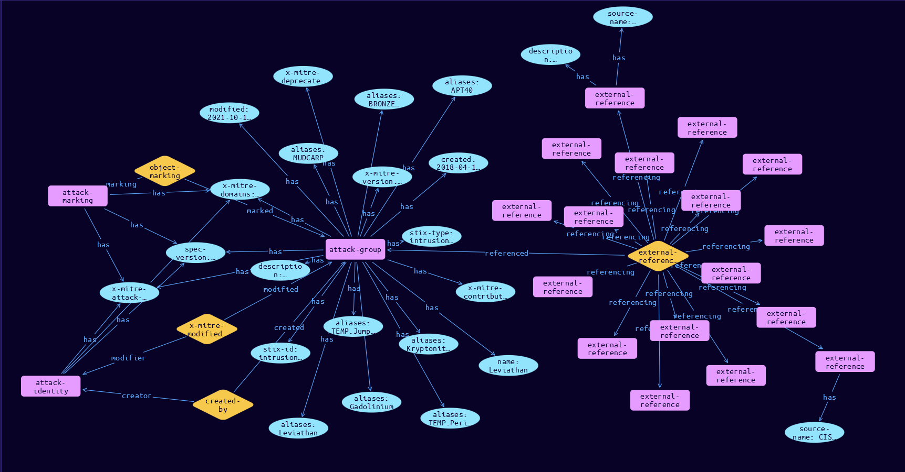

# Group Domain Object

**Stix and TypeQL Object Type:**  `intrusion-set`

A Group in ATT&CK is defined as an intrusion-set object. ATT&CK Groups do not depart from the STIX intrusion-set spec.

[Reference in Stix2.1 Standard](https://github.com/mitre-attack/attack-stix-data/blob/master/USAGE.md#groups )
## Stix 2.1 Properties Converted to TypeQL
Mapping of the Stix Attack Pattern Properties to TypeDB

|  Stix 2.1 Property    |           Schema Name             | Required  Optional  |      Schema Object Type | Schema Parent  |
|:--------------------|:--------------------------------:|:------------------:|:------------------------:|:-------------:|
|  type                 |            stix-type              |      Required       |  stix-attribute-string    |   attribute    |
|  id                   |             stix-id               |      Required       |  stix-attribute-string    |   attribute    |
|  spec_version         |           spec-version            |      Required       |  stix-attribute-string    |   attribute    |
|  created              |             created               |      Required       | stix-attribute-timestamp  |   attribute    |
|  modified             |             modified              |      Required       | stix-attribute-timestamp  |   attribute    |
|  name                 |               name                |      Optional       |  stix-attribute-string    |   attribute    |
|  description          |           description             |      Optional       |  stix-attribute-string    |   attribute    |
| aliases |aliases |      Optional       |  stix-attribute-string    |   attribute    |
| first_seen |first_seen |      Optional       | stix-attribute-timestamp  |   attribute    |
| last_seen |last-seen |      Optional       | stix-attribute-timestamp  |   attribute    |
| goals |goals |      Optional       |  stix-attribute-string    |   attribute    |
| resource_level |resource-level |      Optional       |  stix-attribute-string    |   attribute    |
| primary_motivation |primary-motivation |      Optional       |  stix-attribute-string    |   attribute    |
| secondary_motivations |secondary-motivations |      Optional       |  stix-attribute-string    |   attribute    |
|  created_by_ref       |        created-by:created         |      Optional       |   embedded     |relation |
| x_mitre_version |x-mitre-version |Required |  stix-attribute-string    |   attribute    |
| x_mitre_contributors |x-mitre-contributors |Required |  stix-attribute-string    |   attribute    |
| x_mitre_modified_by_ref |x-mitre-modified-by-ref:modified |Required |   embedded     |relation |
| x_mitre_domains |x-mitre-domains |Required |  stix-attribute-string    |   attribute    |
| x_mitre_attack_spec_version |x-mitre-attack-spec-version |Required |  stix-attribute-string    |   attribute    |
| x_mitre_deprecated |x-mitre-deprecated |Optonal |  stix-attribute-boolean   |   attribute    |
|  revoked              |             revoked               |      Optional       |  stix-attribute-boolean   |   attribute    |
|  labels               |              labels               |      Optional       |  stix-attribute-string    |   attribute    |
|  confidence           |            confidence             |      Optional       |  stix-attribute-integer   |   attribute    |
|  lang                 |               lang                |      Optional       |  stix-attribute-string    |   attribute    |
|  external_references  | external-references:referencing   |      Optional       |   embedded     |relation |
|  object_marking_refs  |      object-marking:marked        |      Optional       |   embedded     |relation |
|  granular_markings    |     granular-marking:marked       |      Optional       |   embedded     |relation |
|  extensions           |               n/a                 |        n/a          |           n/a             |      n/a       |

## The Example Group in JSON
The original JSON, accessible in the Python environment
```json
{
    "object_marking_refs": [
        "marking-definition--fa42a846-8d90-4e51-bc29-71d5b4802168"
    ],
    "modified": "2021-10-14T20:34:57.289Z",
    "name": "Leviathan",
    "x_mitre_version": "3.0",
    "created": "2018-04-18T17:59:24.739Z",
    "type": "intrusion-set",
    "id": "intrusion-set--7113eaa5-ba79-4fb3-b68a-398ee9cd698e",
    "description": "[Leviathan](https://attack.mitre.org/groups/G0065) is a Chinese state-sponsored cyber espionage group that has been attributed to the Ministry of State Security's (MSS) Hainan State Security Department and an affiliated front company.(Citation: CISA AA21-200A APT40 July 2021) Active since at least 2009, [Leviathan](https://attack.mitre.org/groups/G0065) has targeted the following sectors: academia, aerospace/aviation, biomedical, defense industrial base, government, healthcare, manufacturing, maritime, and transportation across the US, Canada, Europe, the Middle East, and Southeast Asia.(Citation: CISA AA21-200A APT40 July 2021)(Citation: Proofpoint Leviathan Oct 2017)(Citation: FireEye Periscope March 2018)",
    "x_mitre_contributors": [
        "Valerii Marchuk, Cybersecurity Help s.r.o."
    ],
    "external_references": [
        {
            "url": "https://attack.mitre.org/groups/G0065",
            "external_id": "G0065",
            "source_name": "mitre-attack"
        },
        {
            "description": "(Citation: Proofpoint Leviathan Oct 2017)",
            "source_name": "Leviathan"
        },
        {
            "description": "(Citation: CISA AA21-200A APT40 July 2021)(Citation: Accenture MUDCARP March 2019)",
            "source_name": "MUDCARP"
        },
        {
            "description": "(Citation: CISA AA21-200A APT40 July 2021)(Citation: Crowdstrike KRYPTONITE PANDA August 2018)",
            "source_name": "Kryptonite Panda"
        },
        {
            "description": "(Citation: CISA AA21-200A APT40 July 2021)(Citation: MSTIC GADOLINIUM September 2020)",
            "source_name": "Gadolinium"
        },
        {
            "description": "(Citation: CISA AA21-200A APT40 July 2021)(Citation: SecureWorks BRONZE MOHAWK n.d.)",
            "source_name": "BRONZE MOHAWK"
        },
        {
            "description": "Leviathan was previously reported upon by FireEye as TEMP.Periscope and TEMP.Jumper.(Citation: CISA AA21-200A APT40 July 2021)(Citation: FireEye APT40 March 2019)",
            "source_name": "TEMP.Jumper"
        },
        {
            "description": "FireEye reporting on TEMP.Periscope (which was combined into APT40) indicated TEMP.Periscope was reported upon as Leviathan.(Citation: CISA AA21-200A APT40 July 2021)(Citation: Proofpoint Leviathan Oct 2017)(Citation: FireEye Periscope March 2018)(Citation: FireEye APT40 March 2019)",
            "source_name": "APT40"
        },
        {
            "description": "Leviathan was previously reported upon by FireEye as TEMP.Periscope and TEMP.Jumper.(Citation: CISA AA21-200A APT40 July 2021)(Citation: FireEye Periscope March 2018)(Citation: FireEye APT40 March 2019)",
            "source_name": "TEMP.Periscope"
        },
        {
            "url": "https://us-cert.cisa.gov/ncas/alerts/aa21-200a",
            "description": "CISA. (2021, July 19). (AA21-200A) Joint Cybersecurity Advisory \u2013 Tactics, Techniques, and Procedures of Indicted APT40 Actors Associated with China\u2019s MSS Hainan State Security Department.. Retrieved August 12, 2021.",
            "source_name": "CISA AA21-200A APT40 July 2021"
        },
        {
            "source_name": "Proofpoint Leviathan Oct 2017",
            "description": "Axel F, Pierre T. (2017, October 16). Leviathan: Espionage actor spearphishes maritime and defense targets. Retrieved February 15, 2018.",
            "url": "https://www.proofpoint.com/us/threat-insight/post/leviathan-espionage-actor-spearphishes-maritime-and-defense-targets"
        },
        {
            "url": "https://www.fireeye.com/blog/threat-research/2018/03/suspected-chinese-espionage-group-targeting-maritime-and-engineering-industries.html",
            "description": "FireEye. (2018, March 16). Suspected Chinese Cyber Espionage Group (TEMP.Periscope) Targeting U.S. Engineering and Maritime Industries. Retrieved April 11, 2018.",
            "source_name": "FireEye Periscope March 2018"
        },
        {
            "url": "https://www.accenture.com/us-en/blogs/cyber-defense/mudcarps-focus-on-submarine-technologies",
            "description": "Accenture iDefense Unit. (2019, March 5). Mudcarp's Focus on Submarine Technologies. Retrieved August 24, 2021.",
            "source_name": "Accenture MUDCARP March 2019"
        },
        {
            "url": "https://www.crowdstrike.com/blog/two-birds-one-stone-panda/",
            "description": "Adam Kozy. (2018, August 30). Two Birds, One Stone Panda. Retrieved August 24, 2021.",
            "source_name": "Crowdstrike KRYPTONITE PANDA August 2018"
        },
        {
            "url": "https://www.microsoft.com/security/blog/2020/09/24/gadolinium-detecting-empires-cloud/",
            "description": "Ben Koehl, Joe Hannon. (2020, September 24). Microsoft Security - Detecting Empires in the Cloud. Retrieved August 24, 2021.",
            "source_name": "MSTIC GADOLINIUM September 2020"
        },
        {
            "url": "https://www.secureworks.com/research/threat-profiles/bronze-mohawk",
            "description": "SecureWorks. (n.d.). Threat Profile - BRONZE MOHAWK. Retrieved August 24, 2021.",
            "source_name": "SecureWorks BRONZE MOHAWK n.d."
        },
        {
            "url": "https://www.fireeye.com/blog/threat-research/2019/03/apt40-examining-a-china-nexus-espionage-actor.html",
            "description": "Plan, F., et al. (2019, March 4). APT40: Examining a China-Nexus Espionage Actor. Retrieved March 18, 2019.",
            "source_name": "FireEye APT40 March 2019"
        }
    ],
    "aliases": [
        "Leviathan",
        "MUDCARP",
        "Kryptonite Panda",
        "Gadolinium",
        "BRONZE MOHAWK",
        "TEMP.Jumper",
        "APT40",
        "TEMP.Periscope"
    ],
    "created_by_ref": "identity--c78cb6e5-0c4b-4611-8297-d1b8b55e40b5",
    "spec_version": "2.1",
    "x_mitre_attack_spec_version": "2.1.0",
    "x_mitre_domains": [
        "enterprise-attack"
    ],
    "x_mitre_modified_by_ref": "identity--c78cb6e5-0c4b-4611-8297-d1b8b55e40b5"
}
```


## Inserting the Example Group in TypeQL
The TypeQL insert statement
```typeql
match  $identity0 isa identity, has stix-id "identity--c78cb6e5-0c4b-4611-8297-d1b8b55e40b5";
 $identity1 isa identity, has stix-id "identity--c78cb6e5-0c4b-4611-8297-d1b8b55e40b5";
 $attack-marking03 isa attack-marking, has stix-id "marking-definition--fa42a846-8d90-4e51-bc29-71d5b4802168";
 
insert $attack-group isa attack-group,
 has stix-type $stix-type,
 has spec-version $spec-version,
 has stix-id $stix-id,
 has created $created,
 has modified $modified,
 has name $name,
 has description $description,
 has x-mitre-version $x-mitre-version,
 has x-mitre-contributors $x_mitre_contributors0,
 has x-mitre-domains $x_mitre_domains0,
 has x-mitre-attack-spec-version $x-mitre-attack-spec-version,
 has aliases $aliases0,
 has aliases $aliases1,
 has aliases $aliases2,
 has aliases $aliases3,
 has aliases $aliases4,
 has aliases $aliases5,
 has aliases $aliases6,
 has aliases $aliases7,
 has x-mitre-deprecated $x-mitre-deprecated;

 $stix-type "intrusion-set";
 $spec-version "2.1";
 $stix-id "intrusion-set--7113eaa5-ba79-4fb3-b68a-398ee9cd698e";
 $created 2018-04-18T17:59:24.739;
 $modified 2021-10-14T20:34:57.289;
 $name "Leviathan";
 $description "[Leviathan](https://attack.mitre.org/groups/G0065) is a Chinese state-sponsored cyber espionage group that has been attributed to the Ministry of State Security's (MSS) Hainan State Security Department and an affiliated front company.(Citation: CISA AA21-200A APT40 July 2021) Active since at least 2009, [Leviathan](https://attack.mitre.org/groups/G0065) has targeted the following sectors: academia, aerospace/aviation, biomedical, defense industrial base, government, healthcare, manufacturing, maritime, and transportation across the US, Canada, Europe, the Middle East, and Southeast Asia.(Citation: CISA AA21-200A APT40 July 2021)(Citation: Proofpoint Leviathan Oct 2017)(Citation: FireEye Periscope March 2018)";
 $x-mitre-version "3.0";
 $x_mitre_contributors0 "Valerii Marchuk, Cybersecurity Help s.r.o.";
 $x_mitre_domains0 "enterprise-attack";
 $x-mitre-attack-spec-version "2.1.0";
 $aliases0 "Leviathan";
 $aliases1 "MUDCARP";
 $aliases2 "Kryptonite Panda";
 $aliases3 "Gadolinium";
 $aliases4 "BRONZE MOHAWK";
 $aliases5 "TEMP.Jumper";
 $aliases6 "APT40";
 $aliases7 "TEMP.Periscope";
 $x-mitre-deprecated false;


 $created-by0 (created:$attack-group, creator:$identity0) isa created-by;

 $x-mitre-modified-by-ref1 (modified:$attack-group, modifier:$identity1) isa x-mitre-modified-by-ref;
$external-reference0 isa external-reference,
 has source-name "mitre-attack",
 has url-link "https://attack.mitre.org/groups/G0065",
 has external-id "G0065";
$external-reference1 isa external-reference,
 has source-name "Leviathan",
 has description "(Citation: Proofpoint Leviathan Oct 2017)";
$external-reference2 isa external-reference,
 has source-name "MUDCARP",
 has description "(Citation: CISA AA21-200A APT40 July 2021)(Citation: Accenture MUDCARP March 2019)";
$external-reference3 isa external-reference,
 has source-name "Kryptonite Panda",
 has description "(Citation: CISA AA21-200A APT40 July 2021)(Citation: Crowdstrike KRYPTONITE PANDA August 2018)";
$external-reference4 isa external-reference,
 has source-name "Gadolinium",
 has description "(Citation: CISA AA21-200A APT40 July 2021)(Citation: MSTIC GADOLINIUM September 2020)";
$external-reference5 isa external-reference,
 has source-name "BRONZE MOHAWK",
 has description "(Citation: CISA AA21-200A APT40 July 2021)(Citation: SecureWorks BRONZE MOHAWK n.d.)";
$external-reference6 isa external-reference,
 has source-name "TEMP.Jumper",
 has description "Leviathan was previously reported upon by FireEye as TEMP.Periscope and TEMP.Jumper.(Citation: CISA AA21-200A APT40 July 2021)(Citation: FireEye APT40 March 2019)";
$external-reference7 isa external-reference,
 has source-name "APT40",
 has description "FireEye reporting on TEMP.Periscope (which was combined into APT40) indicated TEMP.Periscope was reported upon as Leviathan.(Citation: CISA AA21-200A APT40 July 2021)(Citation: Proofpoint Leviathan Oct 2017)(Citation: FireEye Periscope March 2018)(Citation: FireEye APT40 March 2019)";
$external-reference8 isa external-reference,
 has source-name "TEMP.Periscope",
 has description "Leviathan was previously reported upon by FireEye as TEMP.Periscope and TEMP.Jumper.(Citation: CISA AA21-200A APT40 July 2021)(Citation: FireEye Periscope March 2018)(Citation: FireEye APT40 March 2019)";
$external-reference9 isa external-reference,
 has source-name "CISA AA21-200A APT40 July 2021",
 has description "CISA. (2021, July 19). (AA21-200A) Joint Cybersecurity Advisory – Tactics, Techniques, and Procedures of Indicted APT40 Actors Associated with China’s MSS Hainan State Security Department.. Retrieved August 12, 2021.",
 has url-link "https://us-cert.cisa.gov/ncas/alerts/aa21-200a";
$external-reference10 isa external-reference,
 has source-name "Proofpoint Leviathan Oct 2017",
 has description "Axel F, Pierre T. (2017, October 16). Leviathan: Espionage actor spearphishes maritime and defense targets. Retrieved February 15, 2018.",
 has url-link "https://www.proofpoint.com/us/threat-insight/post/leviathan-espionage-actor-spearphishes-maritime-and-defense-targets";
$external-reference11 isa external-reference,
 has source-name "FireEye Periscope March 2018",
 has description "FireEye. (2018, March 16). Suspected Chinese Cyber Espionage Group (TEMP.Periscope) Targeting U.S. Engineering and Maritime Industries. Retrieved April 11, 2018.",
 has url-link "https://www.fireeye.com/blog/threat-research/2018/03/suspected-chinese-espionage-group-targeting-maritime-and-engineering-industries.html";
$external-reference12 isa external-reference,
 has source-name "Accenture MUDCARP March 2019",
 has description "Accenture iDefense Unit. (2019, March 5). Mudcarp's Focus on Submarine Technologies. Retrieved August 24, 2021.",
 has url-link "https://www.accenture.com/us-en/blogs/cyber-defense/mudcarps-focus-on-submarine-technologies";
$external-reference13 isa external-reference,
 has source-name "Crowdstrike KRYPTONITE PANDA August 2018",
 has description "Adam Kozy. (2018, August 30). Two Birds, One Stone Panda. Retrieved August 24, 2021.",
 has url-link "https://www.crowdstrike.com/blog/two-birds-one-stone-panda/";
$external-reference14 isa external-reference,
 has source-name "MSTIC GADOLINIUM September 2020",
 has description "Ben Koehl, Joe Hannon. (2020, September 24). Microsoft Security - Detecting Empires in the Cloud. Retrieved August 24, 2021.",
 has url-link "https://www.microsoft.com/security/blog/2020/09/24/gadolinium-detecting-empires-cloud/";
$external-reference15 isa external-reference,
 has source-name "SecureWorks BRONZE MOHAWK n.d.",
 has description "SecureWorks. (n.d.). Threat Profile - BRONZE MOHAWK. Retrieved August 24, 2021.",
 has url-link "https://www.secureworks.com/research/threat-profiles/bronze-mohawk";
$external-reference16 isa external-reference,
 has source-name "FireEye APT40 March 2019",
 has description "Plan, F., et al. (2019, March 4). APT40: Examining a China-Nexus Espionage Actor. Retrieved March 18, 2019.",
 has url-link "https://www.fireeye.com/blog/threat-research/2019/03/apt40-examining-a-china-nexus-espionage-actor.html";

 $external-references (referenced:$attack-group, referencing:$external-reference0, referencing:$external-reference1, referencing:$external-reference2, referencing:$external-reference3, referencing:$external-reference4, referencing:$external-reference5, referencing:$external-reference6, referencing:$external-reference7, referencing:$external-reference8, referencing:$external-reference9, referencing:$external-reference10, referencing:$external-reference11, referencing:$external-reference12, referencing:$external-reference13, referencing:$external-reference14, referencing:$external-reference15, referencing:$external-reference16) isa external-references;

 $object-marking3 (marked:$attack-group, marking:$attack-marking03) isa object-marking;
```

## Retrieving the Example Group in TypeQL
The typeQL match statement

```typeql
match  
   $a isa attack-group,
      has stix-id   "intrusion-set--7113eaa5-ba79-4fb3-b68a-398ee9cd698e",
      has $b;
   $c isa stix-sub-object,
      has $d;
   $e (owner:$a, pointed-to:$c) isa embedded;
   $f (owner:$a, pointed-to:$g) isa embedded; 
```


will retrieve the example attack-pattern object in Vaticle Studio


## Retrieving the Example Group  in Python
The Python retrieval statement

```python
from stixorm.module.typedb import TypeDBSink, TypeDBSource
connection = {
    "uri": "localhost",
    "port": "1729",
    "database": "stix",
    "user": None,
    "password": None
}

import_type = {
    "STIX21": True,
    "CVE": False,
    "identity": False,
    "location": False,
    "rules": False,
    "ATT&CK": False,
    "ATT&CK_Versions": ["12.0"],
    "ATT&CK_Domains": ["enterprise-attack", "mobile-attack", "ics-attack"],
    "CACAO": False
}

typedb = TypeDBSource(connection, import_type)
stix_obj = typedb.get( "intrusion-set--7113eaa5-ba79-4fb3-b68a-398ee9cd698e")
```

 

[Back to MITRE ATT&CK Overview](../overview.md)
 

[Back to All Protocols Overview](../../overview.md)
 

[Back to Overview Doc](../../../overview.md)
