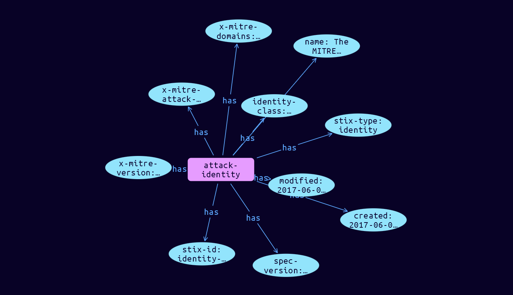

# Identity Domain Object

**Stix and TypeQL Object Type:**  `identity`

Identities can represent actual individuals, organizations, or groups (e.g., ACME, Inc.) as well as classes of individuals, organizations, systems or groups (e.g., the finance sector). The Mitre ATT&CK Identity is generally used to represent Mitre themselves, and contains additional properties not in the standard Identity.

The Identity SDO can capture basic identifying information, contact information, and the sectors that the Identity belongs to. Identity is used in STIX to represent, among other things, targets of attacks, information sources, object creators, and threat actor identities.

[Reference in Stix2.1 Standard](https://github.com/mitre-attack/attack-stix-data/blob/master/USAGE.md#groups )
## Stix 2.1 Properties Converted to TypeQL
Mapping of the Stix Attack Pattern Properties to TypeDB

|  Stix 2.1 Property    |           Schema Name             | Required  Optional  |      Schema Object        | Schema Parent  |
|:--------------------|:--------------------------------:|:------------------:|:------------------------:|:-------------:|
|  type                 |            stix-type              |      Required       |  stix-attribute-string    |   attribute    |
|  id                   |             stix-id               |      Required       |  stix-attribute-string    |   attribute    |
|  spec_version         |           spec-version            |      Required       |  stix-attribute-string    |   attribute    |
|  created              |             created               |      Required       | stix-attribute-timestamp  |   attribute    |
|  modified             |             modified              |      Required       | stix-attribute-timestamp  |   attribute    |
|  name                 |               name                |      Optional       |  stix-attribute-string    |   attribute    |
|  description          |           description             |      Optional       |  stix-attribute-string    |   attribute    |
| roles |roles |Optional |  stix-attribute-string    |   attribute    |
| identity_class |identity-class |Optional |  stix-attribute-string    |   attribute    |
| sectors |sectors |Optional |  stix-attribute-string    |attribute |
| contact_information |contact-information |Optional |  stix-attribute-string    |attribute |
|  created_by_ref       |        created-by:created         |      Optional       |   embedded     |relation |
| x_mitre_version |x-mitre-version |Required |  stix-attribute-string    |   attribute    |
| x_mitre_contributors |x-mitre-contributors |Required |  stix-attribute-string    |   attribute    |
| x_mitre_modified_by_ref |x-mitre-modified-by-ref:modified |Required |   embedded     |relation |
| x_mitre_domains |x-mitre-domains |Required |  stix-attribute-string    |   attribute    |
| x_mitre_attack_spec_version |x-mitre-attack-spec-version |Required |  stix-attribute-string    |   attribute    |
| x_mitre_deprecated |x-mitre-deprecated |Optonal |  stix-attribute-boolean   |   attribute    |
|  revoked              |             revoked               |      Optional       |  stix-attribute-boolean   |   attribute    |
|  labels               |              labels               |      Optional       |  stix-attribute-string    |   attribute    |
|  confidence           |            confidence             |      Optional       |  stix-attribute-integer   |   attribute    |
|  lang                 |               lang                |      Optional       |  stix-attribute-string    |   attribute    |
|  external_references  | external-references:referencing   |      Optional       |   embedded     |relation |
|  object_marking_refs  |      object-marking:marked        |      Optional       |   embedded     |relation |
|  granular_markings    |     granular-marking:marked       |      Optional       |   embedded     |relation |
|  extensions           |               n/a                 |        n/a          |           n/a             |      n/a       |

## The Example Identity in JSON
The original JSON, accessible in the Python environment
```json
{
    "type": "identity",
    "id": "identity--c78cb6e5-0c4b-4611-8297-d1b8b55e40b5",
    "identity_class": "organization",
    "modified": "2017-06-01T00:00:00.000Z",
    "created": "2017-06-01T00:00:00.000Z",
    "name": "The MITRE Corporation",
    "spec_version": "2.1",
    "x_mitre_attack_spec_version": "2.1.0",
    "x_mitre_domains": [
        "enterprise-attack"
    ],
    "x_mitre_version": "1.0"
}
```


## Inserting the Example Identity in TypeQL
The TypeQL insert statement
```typeql
 insert $attack-identity isa attack-identity,
 has stix-type $stix-type,
 has spec-version $spec-version,
 has stix-id $stix-id,
 has created $created,
 has modified $modified,
 has name $name,
 has x-mitre-version $x-mitre-version,
 has x-mitre-domains $x_mitre_domains0,
 has x-mitre-attack-spec-version $x-mitre-attack-spec-version,
 has identity-class $identity-class;

 $stix-type "identity";
 $spec-version "2.1";
 $stix-id "identity--c78cb6e5-0c4b-4611-8297-d1b8b55e40b5";
 $created 2017-06-01T00:00:00.000;
 $modified 2017-06-01T00:00:00.000;
 $name "The MITRE Corporation";
 $x-mitre-version "1.0";
 $x_mitre_domains0 "enterprise-attack";
 $x-mitre-attack-spec-version "2.1.0";
 $identity-class "organization";
```

## Retrieving the Example Identity in TypeQL
The typeQL match statement

```typeql
match 
   $a isa identity,
      has stix-id "identity--c78cb6e5-0c4b-4611-8297-d1b8b55e40b5",
      has $b;
```


will retrieve the example attack-pattern object in Vaticle Studio


## Retrieving the Example Identity  in Python
The Python retrieval statement

```python
from stixorm.module.typedb import TypeDBSink, TypeDBSource
connection = {
    "uri": "localhost",
    "port": "1729",
    "database": "stix",
    "user": None,
    "password": None
}

import_type = {
    "STIX21": True,
    "CVE": False,
    "identity": False,
    "location": False,
    "rules": False,
    "ATT&CK": False,
    "ATT&CK_Versions": ["12.0"],
    "ATT&CK_Domains": ["enterprise-attack", "mobile-attack", "ics-attack"],
    "CACAO": False
}

typedb = TypeDBSource(connection, import_type)
stix_obj = typedb.get( "identity--c78cb6e5-0c4b-4611-8297-d1b8b55e40b5")
```

 

[Back to MITRE ATT&CK Overview](../overview.md)
 

[Back to All Protocols Overview](../../overview.md)
 

[Back to Overview Doc](../../../overview.md)
