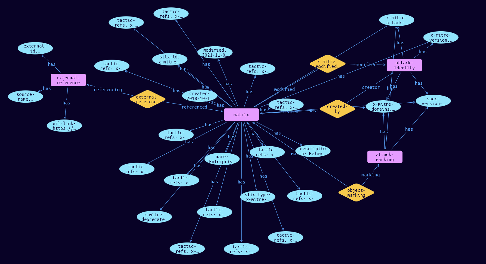

# Matrix Domain Object

**Stix and TypeQL Object Type:**  `x-mitre-matrix`

The overall layout of the ATT&CK Matrices is stored in x-mitre-matrix objects. As a custom STIX type they follow only the generic STIX Domain Object pattern.

[Reference in Stix2.1 Standard](https://github.com/mitre-attack/attack-stix-data/blob/master/USAGE.md#matrices )
## Stix 2.1 Properties Converted to TypeQL
Mapping of the Stix Attack Pattern Properties to TypeDB

|  Stix 2.1 Property    |           Schema Name             | Required  Optional  |      Schema Object  Type | Schema Parent  |
|:--------------------|:--------------------------------:|:------------------:|:------------------------:|:-------------:|
|  type                 |            stix-type              |      Required       |  stix-attribute-string    |   attribute    |
|  id                   |             stix-id               |      Required       |  stix-attribute-string    |   attribute    |
|  spec_version         |           spec-version            |      Required       |  stix-attribute-string    |   attribute    |
|  created              |             created               |      Required       | stix-attribute-timestamp  |   attribute    |
|  modified             |             modified              |      Required       | stix-attribute-timestamp  |   attribute    |
|  name                 |               name                |      Required       |  stix-attribute-string    |   attribute    |
|  description          |           description             |      Optional       |  stix-attribute-string    |   attribute    |
|  aliases              |            stix-role              |      Optional       |  stix-attribute-string    |   attribute    |
|  kill_chain_phases    | kill-chain-usage:kill-chain-used  |      Optional       |   embedded     |relation |
|  created_by_ref       |        created-by:created         |      Optional       |   embedded     |relation |
| x_mitre_version |x-mitre-version |Required |  stix-attribute-string    |   attribute    |
| x_mitre_contributors |x-mitre-contributors |Required |  stix-attribute-string    |   attribute    |
| x_mitre_modified_by_ref |x-mitre-modified-by-ref:modified |Required |   embedded     |relation |
| x_mitre_domains |x-mitre-domains |Required |  stix-attribute-string    |   attribute    |
| x_mitre_attack_spec_version |x-mitre-attack-spec-version |Required |  stix-attribute-string    |   attribute    |
| tactic_refs |tactic-refs |Required |  stix-attribute-string    |   attribute    |
| x_mitre_deprecated |x-mitre-deprecated |Optonal |  stix-attribute-boolean   |   attribute    |
|  revoked              |             revoked               |      Optional       |  stix-attribute-boolean   |   attribute    |
|  labels               |              labels               |      Optional       |  stix-attribute-string    |   attribute    |
|  confidence           |            confidence             |      Optional       |  stix-attribute-integer   |   attribute    |
|  lang                 |               lang                |      Optional       |  stix-attribute-string    |   attribute    |
|  external_references  | external-references:referencing   |      Optional       |   embedded     |relation |
|  object_marking_refs  |      object-marking:marked        |      Optional       |   embedded     |relation |
|  granular_markings    |     granular-marking:marked       |      Optional       |   embedded     |relation |
|  extensions           |               n/a                 |        n/a          |           n/a             |      n/a       |

## The Example Matrix in JSON
The original JSON, accessible in the Python environment
```json
{
    "object_marking_refs": [
        "marking-definition--fa42a846-8d90-4e51-bc29-71d5b4802168"
    ],
    "type": "x-mitre-matrix",
    "name": "Enterprise ATT&CK",
    "description": "Below are the tactics and technique representing the MITRE ATT&CK Matrix for Enterprise. The Matrix contains information for the following platforms: Windows, macOS, Linux, AWS, GCP, Azure, Azure AD, Office 365, SaaS.",
    "modified": "2021-11-03T20:11:51.915Z",
    "id": "x-mitre-matrix--eafc1b4c-5e56-4965-bd4e-66a6a89c88cc",
    "created": "2018-10-17T00:14:20.652Z",
    "tactic_refs": [
        "x-mitre-tactic--daa4cbb1-b4f4-4723-a824-7f1efd6e0592",
        "x-mitre-tactic--d679bca2-e57d-4935-8650-8031c87a4400",
        "x-mitre-tactic--ffd5bcee-6e16-4dd2-8eca-7b3beedf33ca",
        "x-mitre-tactic--4ca45d45-df4d-4613-8980-bac22d278fa5",
        "x-mitre-tactic--5bc1d813-693e-4823-9961-abf9af4b0e92",
        "x-mitre-tactic--5e29b093-294e-49e9-a803-dab3d73b77dd",
        "x-mitre-tactic--78b23412-0651-46d7-a540-170a1ce8bd5a",
        "x-mitre-tactic--2558fd61-8c75-4730-94c4-11926db2a263",
        "x-mitre-tactic--c17c5845-175e-4421-9713-829d0573dbc9",
        "x-mitre-tactic--7141578b-e50b-4dcc-bfa4-08a8dd689e9e",
        "x-mitre-tactic--d108ce10-2419-4cf9-a774-46161d6c6cfe",
        "x-mitre-tactic--f72804c5-f15a-449e-a5da-2eecd181f813",
        "x-mitre-tactic--9a4e74ab-5008-408c-84bf-a10dfbc53462",
        "x-mitre-tactic--5569339b-94c2-49ee-afb3-2222936582c8"
    ],
    "created_by_ref": "identity--c78cb6e5-0c4b-4611-8297-d1b8b55e40b5",
    "external_references": [
        {
            "url": "https://attack.mitre.org/matrices/enterprise",
            "external_id": "enterprise-attack",
            "source_name": "mitre-attack"
        }
    ],
    "spec_version": "2.1",
    "x_mitre_attack_spec_version": "2.1.0",
    "x_mitre_domains": [
        "enterprise-attack"
    ],
    "x_mitre_modified_by_ref": "identity--c78cb6e5-0c4b-4611-8297-d1b8b55e40b5",
    "x_mitre_version": "1.0"
}
```


## Inserting the Example Matrix in TypeQL
The TypeQL insert statement
```typeql
match  $identity0 isa identity, has stix-id "identity--c78cb6e5-0c4b-4611-8297-d1b8b55e40b5";
 $identity1 isa identity, has stix-id "identity--c78cb6e5-0c4b-4611-8297-d1b8b55e40b5";
 $attack-marking03 isa attack-marking, has stix-id "marking-definition--fa42a846-8d90-4e51-bc29-71d5b4802168";
 
insert $matrix isa matrix,
 has stix-type $stix-type,
 has spec-version $spec-version,
 has stix-id $stix-id,
 has created $created,
 has modified $modified,
 has name $name,
 has description $description,
 has x-mitre-version $x-mitre-version,
 has x-mitre-domains $x_mitre_domains0,
 has x-mitre-attack-spec-version $x-mitre-attack-spec-version,
 has x-mitre-deprecated $x-mitre-deprecated,
 has tactic-refs $tactic_refs0,
 has tactic-refs $tactic_refs1,
 has tactic-refs $tactic_refs2,
 has tactic-refs $tactic_refs3,
 has tactic-refs $tactic_refs4,
 has tactic-refs $tactic_refs5,
 has tactic-refs $tactic_refs6,
 has tactic-refs $tactic_refs7,
 has tactic-refs $tactic_refs8,
 has tactic-refs $tactic_refs9,
 has tactic-refs $tactic_refs10,
 has tactic-refs $tactic_refs11,
 has tactic-refs $tactic_refs12,
 has tactic-refs $tactic_refs13;

 $stix-type "x-mitre-matrix";
 $spec-version "2.1";
 $stix-id "x-mitre-matrix--eafc1b4c-5e56-4965-bd4e-66a6a89c88cc";
 $created 2018-10-17T00:14:20.652;
 $modified 2021-11-03T20:11:51.915;
 $name "Enterprise ATT&CK";
 $description "Below are the tactics and technique representing the MITRE ATT&CK Matrix for Enterprise. The Matrix contains information for the following platforms: Windows, macOS, Linux, AWS, GCP, Azure, Azure AD, Office 365, SaaS.";
 $x-mitre-version "1.0";
 $x_mitre_domains0 "enterprise-attack";
 $x-mitre-attack-spec-version "2.1.0";
 $x-mitre-deprecated false;
 $tactic_refs0 "x-mitre-tactic--daa4cbb1-b4f4-4723-a824-7f1efd6e0592";
 $tactic_refs1 "x-mitre-tactic--d679bca2-e57d-4935-8650-8031c87a4400";
 $tactic_refs2 "x-mitre-tactic--ffd5bcee-6e16-4dd2-8eca-7b3beedf33ca";
 $tactic_refs3 "x-mitre-tactic--4ca45d45-df4d-4613-8980-bac22d278fa5";
 $tactic_refs4 "x-mitre-tactic--5bc1d813-693e-4823-9961-abf9af4b0e92";
 $tactic_refs5 "x-mitre-tactic--5e29b093-294e-49e9-a803-dab3d73b77dd";
 $tactic_refs6 "x-mitre-tactic--78b23412-0651-46d7-a540-170a1ce8bd5a";
 $tactic_refs7 "x-mitre-tactic--2558fd61-8c75-4730-94c4-11926db2a263";
 $tactic_refs8 "x-mitre-tactic--c17c5845-175e-4421-9713-829d0573dbc9";
 $tactic_refs9 "x-mitre-tactic--7141578b-e50b-4dcc-bfa4-08a8dd689e9e";
 $tactic_refs10 "x-mitre-tactic--d108ce10-2419-4cf9-a774-46161d6c6cfe";
 $tactic_refs11 "x-mitre-tactic--f72804c5-f15a-449e-a5da-2eecd181f813";
 $tactic_refs12 "x-mitre-tactic--9a4e74ab-5008-408c-84bf-a10dfbc53462";
 $tactic_refs13 "x-mitre-tactic--5569339b-94c2-49ee-afb3-2222936582c8";


 $created-by0 (created:$matrix, creator:$identity0) isa created-by;

 $x-mitre-modified-by-ref1 (modified:$matrix, modifier:$identity1) isa x-mitre-modified-by-ref;
$external-reference0 isa external-reference,
 has source-name "mitre-attack",
 has url-link "https://attack.mitre.org/matrices/enterprise",
 has external-id "enterprise-attack";

 $external-references (referenced:$matrix, referencing:$external-reference0) isa external-references;

 $object-marking3 (marked:$matrix, marking:$attack-marking03) isa object-marking;
```

## Retrieving the Example Matrix in TypeQL
The typeQL match statement

```typeql
match  
   $a isa matrix,
      has stix-id   "x-mitre-matrix--eafc1b4c-5e56-4965-bd4e-66a6a89c88cc",
      has $b;
   $c isa stix-sub-object,
      has $d;
   $e (owner:$a, pointed-to:$c) isa embedded;
   $f (owner:$a, pointed-to:$g) isa embedded; 
```


will retrieve the example attack-pattern object in Vaticle Studio


## Retrieving the Example Matrix  in Python
The Python retrieval statement

```python
from stixorm.module.typedb import TypeDBSink, TypeDBSource
connection = {
    "uri": "localhost",
    "port": "1729",
    "database": "stix",
    "user": None,
    "password": None
}

import_type = {
    "STIX21": True,
    "CVE": False,
    "identity": False,
    "location": False,
    "rules": False,
    "ATT&CK": False,
    "ATT&CK_Versions": ["12.0"],
    "ATT&CK_Domains": ["enterprise-attack", "mobile-attack", "ics-attack"],
    "CACAO": False
}

typedb = TypeDBSource(connection, import_type)
stix_obj = typedb.get("x-mitre-matrix--eafc1b4c-5e56-4965-bd4e-66a6a89c88cc")
```

 

[Back to MITRE ATT&CK Overview](../overview.md)
 

[Back to All Protocols Overview](../../overview.md)
 

[Back to Overview Doc](../../../overview.md)
