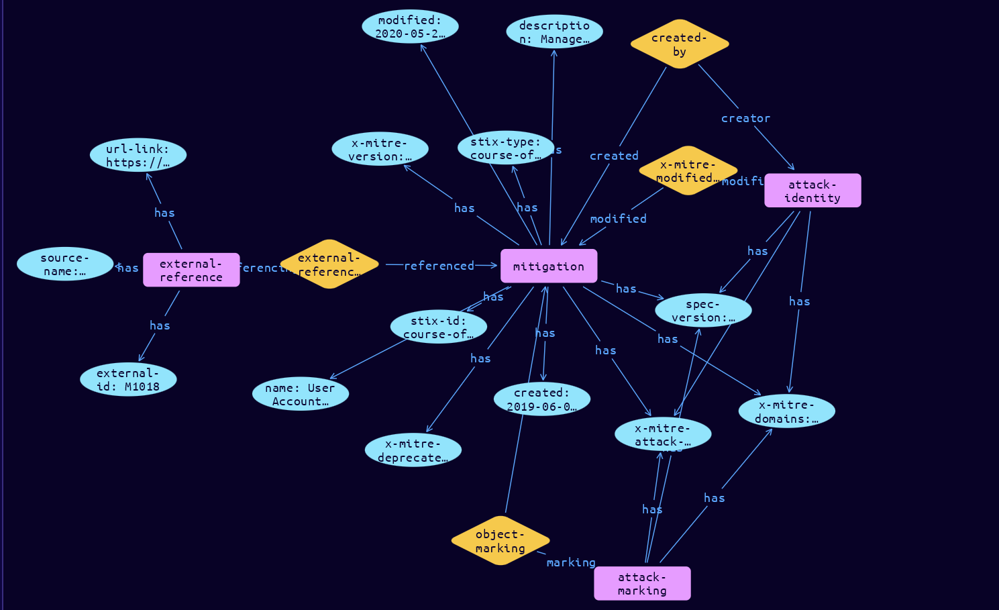

# Mitigation Domain Object

**Stix and TypeQL Object Type:**  `course-of-action`

A Mitigation in ATT&CK is defined as a course-of-action object. ATT&CK Mitigations do not depart from the STIX course-of-action spec.

[Reference in Stix2.1 Standard](https://github.com/mitre-attack/attack-stix-data/blob/master/USAGE.md#mitigations )
## Stix 2.1 Properties Converted to TypeQL
Mapping of the Stix Attack Pattern Properties to TypeDB

|  Stix 2.1 Property    |           Schema Name             | Required  Optional  |      Schema Object        | Schema Parent  |
|:--------------------|:--------------------------------:|:------------------:|:------------------------:|:-------------:|
|  type                 |            stix-type              |      Required       |  stix-attribute-string    |   attribute    |
|  id                   |             stix-id               |      Required       |  stix-attribute-string    |   attribute    |
|  spec_version         |           spec-version            |      Required       |  stix-attribute-string    |   attribute    |
|  created              |             created               |      Required       | stix-attribute-timestamp  |   attribute    |
|  modified             |             modified              |      Required       | stix-attribute-timestamp  |   attribute    |
|  name                 |               name                |      Required       |  stix-attribute-string    |   attribute    |
|  description          |           description             |      Optional       |  stix-attribute-string    |   attribute    |
|  aliases              | aliases              |      Optional       |  stix-attribute-string    |   attribute    |
| action |action |Reserved |  stix-attribute-string    |   attribute    |
|  created_by_ref       |        created-by:created         |      Optional       |   embedded     |relation |
| x_mitre_version |x-mitre-version |Required |  stix-attribute-string    |   attribute    |
| x_mitre_contributors |x-mitre-contributors |Required |  stix-attribute-string    |   attribute    |
| x_mitre_modified_by_ref |x-mitre-modified-by-ref:modified |Required |   embedded     |relation |
| x_mitre_domains |x-mitre-domains |Required |  stix-attribute-string    |   attribute    |
| x_mitre_attack_spec_version |x-mitre-attack-spec-version |Required |  stix-attribute-string    |   attribute    |
| x_mitre_deprecated |x-mitre-deprecated |Optonal |  stix-attribute-boolean   |   attribute    |
|  revoked              |             revoked               |      Optional       |  stix-attribute-boolean   |   attribute    |
|  labels               |              labels               |      Optional       |  stix-attribute-string    |   attribute    |
|  confidence           |            confidence             |      Optional       |  stix-attribute-integer   |   attribute    |
|  lang                 |               lang                |      Optional       |  stix-attribute-string    |   attribute    |
|  external_references  | external-references:referencing   |      Optional       |   embedded     |relation |
|  object_marking_refs  |      object-marking:marked        |      Optional       |   embedded     |relation |
|  granular_markings    |     granular-marking:marked       |      Optional       |   embedded     |relation |
|  extensions           |               n/a                 |        n/a          |           n/a             |      n/a       |

## The Example Mitigation in JSON
The original JSON, accessible in the Python environment
```json
{
    "object_marking_refs": [
        "marking-definition--fa42a846-8d90-4e51-bc29-71d5b4802168"
    ],
    "type": "course-of-action",
    "id": "course-of-action--93e7968a-9074-4eac-8ae9-9f5200ec3317",
    "description": "Manage the creation, modification, use, and permissions associated to user accounts.",
    "x_mitre_version": "1.1",
    "modified": "2020-05-20T13:49:12.270Z",
    "created": "2019-06-06T16:50:58.767Z",
    "name": "User Account Management",
    "created_by_ref": "identity--c78cb6e5-0c4b-4611-8297-d1b8b55e40b5",
    "external_references": [
        {
            "url": "https://attack.mitre.org/mitigations/M1018",
            "external_id": "M1018",
            "source_name": "mitre-attack"
        }
    ],
    "spec_version": "2.1",
    "x_mitre_attack_spec_version": "2.1.0",
    "x_mitre_domains": [
        "enterprise-attack"
    ],
    "x_mitre_modified_by_ref": "identity--c78cb6e5-0c4b-4611-8297-d1b8b55e40b5"
}
```


## Inserting the Example Mitigation in TypeQL
The TypeQL insert statement
```typeql
match  $identity0 isa identity, has stix-id "identity--c78cb6e5-0c4b-4611-8297-d1b8b55e40b5";
 $identity1 isa identity, has stix-id "identity--c78cb6e5-0c4b-4611-8297-d1b8b55e40b5";
 $attack-marking03 isa attack-marking, has stix-id "marking-definition--fa42a846-8d90-4e51-bc29-71d5b4802168";
 
insert $mitigation isa mitigation,
 has stix-type $stix-type,
 has spec-version $spec-version,
 has stix-id $stix-id,
 has created $created,
 has modified $modified,
 has name $name,
 has description $description,
 has x-mitre-version $x-mitre-version,
 has x-mitre-domains $x_mitre_domains0,
 has x-mitre-attack-spec-version $x-mitre-attack-spec-version,
 has x-mitre-deprecated $x-mitre-deprecated;

 $stix-type "course-of-action";
 $spec-version "2.1";
 $stix-id "course-of-action--93e7968a-9074-4eac-8ae9-9f5200ec3317";
 $created 2019-06-06T16:50:58.767;
 $modified 2020-05-20T13:49:12.270;
 $name "User Account Management";
 $description "Manage the creation, modification, use, and permissions associated to user accounts.";
 $x-mitre-version "1.1";
 $x_mitre_domains0 "enterprise-attack";
 $x-mitre-attack-spec-version "2.1.0";
 $x-mitre-deprecated false;

 $created-by0 (created:$mitigation, creator:$identity0) isa created-by;

 $x-mitre-modified-by-ref1 (modified:$mitigation, modifier:$identity1) isa x-mitre-modified-by-ref;
$external-reference0 isa external-reference,
 has source-name "mitre-attack",
 has url-link "https://attack.mitre.org/mitigations/M1018",
 has external-id "M1018";

 $external-references (referenced:$mitigation, referencing:$external-reference0) isa external-references;

 $object-marking3 (marked:$mitigation, marking:$attack-marking03) isa object-marking;
```

## Retrieving the Example Mitigation in TypeQL
The typeQL match statement

```typeql
match  
   $a isa mitigation,
      has stix-id   "course-of-action--93e7968a-9074-4eac-8ae9-9f5200ec3317",
      has $b;
   $c isa stix-sub-object,
      has $d;
   $e (owner:$a, pointed-to:$c) isa embedded;
   $f (owner:$a, pointed-to:$g) isa embedded; 
```


will retrieve the example attack-pattern object in Vaticle Studio


## Retrieving the Example Mitigation  in Python
The Python retrieval statement

```python
from stixorm.module.typedb import TypeDBSink, TypeDBSource
connection = {
    "uri": "localhost",
    "port": "1729",
    "database": "stix",
    "user": None,
    "password": None
}

import_type = {
    "STIX21": True,
    "CVE": False,
    "identity": False,
    "location": False,
    "rules": False,
    "ATT&CK": False,
    "ATT&CK_Versions": ["12.0"],
    "ATT&CK_Domains": ["enterprise-attack", "mobile-attack", "ics-attack"],
    "CACAO": False
}

typedb = TypeDBSource(connection, import_type)
stix_obj = typedb.get( "course-of-action--93e7968a-9074-4eac-8ae9-9f5200ec3317")
```

 

[Back to MITRE ATT&CK Overview](../overview.md)
 

[Back to All Protocols Overview](../../overview.md)
 

[Back to Overview Doc](../../../overview.md)
