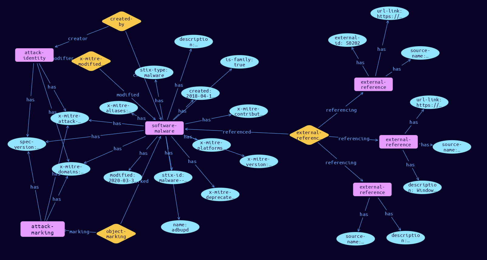

# Software-Malware Domain Object

**Stix and TypeQL Object Type:**  `malware`

Software in ATT&CK is the union of two distinct STIX types: malware and tool.

[Reference in Stix2.1 Standard](https://github.com/mitre-attack/attack-stix-data/blob/master/USAGE.md#software )
## Stix 2.1 Properties Converted to TypeQL
Mapping of the Stix Attack Pattern Properties to TypeDB

|  Stix 2.1 Property    |           Schema Name             | Required  Optional  |      Schema Object Type | Schema Parent  |
|:--------------------|:--------------------------------:|:------------------:|:------------------------:|:-------------:|
|  type                 |            stix-type              |      Required       |  stix-attribute-string    |   attribute    |
|  id                   |             stix-id               |      Required       |  stix-attribute-string    |   attribute    |
|  spec_version         |           spec-version            |      Required       |  stix-attribute-string    |   attribute    |
|  created              |             created               |      Required       | stix-attribute-timestamp  |   attribute    |
|  modified             |             modified              |      Required       | stix-attribute-timestamp  |   attribute    |
|  name                 |               name                |      Optional       |  stix-attribute-string    |   attribute    |
|  description          |           description             |      Optional       |  stix-attribute-string    |   attribute    |
| malware_types  |malware-types  |      Optional       |  stix-attribute-string    |   attribute    |
| is_family |is-family |      Optional       |  stix-attribute-string    |   attribute    |
| aliases |aliases |      Optional       |  stix-attribute-string    |   attribute    |
| kill_chain_phases |kill-chain-usage:kill-chain-used |      Optional       |   embedded     |relation |
| first_seen |first-seen |      Optional       | stix-attribute-timestamp  |   attribute    |
| last_seen |last-seen |      Optional       | stix-attribute-timestamp  |   attribute    |
| operating_system_refs |operating_system_refs |      Optional       |  stix-attribute-string    |   attribute    |
| architecture_execution_envs |architecture-execution-envs |      Optional       |  stix-attribute-string    |   attribute    |
| implementation_languages |implementation-languages |      Optional       |  stix-attribute-string    |   attribute    |
| capabilities |capabilities |      Optional       |  stix-attribute-string    |   attribute    |
| sample_refs |malware-sample:sample-for |      Optional       |   embedded     |relation |
| created_by_ref       |        created-by:created         |      Optional       |   embedded     |relation |
| x_mitre_platforms |x-mitre-platforms |Required |  stix-attribute-string    |   attribute    |
| x_mitre_aliases |x-mitre-aliases |Required |  stix-attribute-string    |   attribute    |
| x_mitre_version |x-mitre-version |Required |  stix-attribute-string    |   attribute    |
| x_mitre_contributors |x-mitre-contributors |Required |  stix-attribute-string    |   attribute    |
| x_mitre_modified_by_ref |x-mitre-modified-by-ref:modified |Required |   embedded     |relation |
| x_mitre_domains |x-mitre-domains |Required |  stix-attribute-string    |   attribute    |
| x_mitre_attack_spec_version |x-mitre-attack-spec-version |Required |  stix-attribute-string    |   attribute    |
| x_mitre_deprecated |x-mitre-deprecated |Optonal |  stix-attribute-boolean   |   attribute    |
|  revoked              |             revoked               |      Optional       |  stix-attribute-boolean   |   attribute    |
|  labels               |              labels               |      Optional       |  stix-attribute-string    |   attribute    |
|  confidence           |            confidence             |      Optional       |  stix-attribute-integer   |   attribute    |
|  lang                 |               lang                |      Optional       |  stix-attribute-string    |   attribute    |
|  external_references  | external-references:referencing   |      Optional       |   embedded     |relation |
|  object_marking_refs  |      object-marking:marked        |      Optional       |   embedded     |relation |
|  granular_markings    |     granular-marking:marked       |      Optional       |   embedded     |relation |
|  extensions           |               n/a                 |        n/a          |           n/a             |      n/a       |

## The Example Software-Malware in JSON
The original JSON, accessible in the Python environment
```json
{
    "object_marking_refs": [
        "marking-definition--fa42a846-8d90-4e51-bc29-71d5b4802168"
    ],
    "type": "malware",
    "name": "adbupd",
    "x_mitre_aliases": [
        "adbupd"
    ],
    "x_mitre_version": "1.1",
    "modified": "2020-03-30T18:33:31.623Z",
    "created": "2018-04-18T17:59:24.739Z",
    "x_mitre_platforms": [
        "Windows"
    ],
    "id": "malware--0f1ad2ef-41d4-4b7a-9304-ddae68ea3005",
    "description": "[adbupd](https://attack.mitre.org/software/S0202) is a backdoor used by [PLATINUM](https://attack.mitre.org/groups/G0068) that is similar to [Dipsind](https://attack.mitre.org/software/S0200). (Citation: Microsoft PLATINUM April 2016)",
    "x_mitre_contributors": [
        "Ryan Becwar"
    ],
    "created_by_ref": "identity--c78cb6e5-0c4b-4611-8297-d1b8b55e40b5",
    "external_references": [
        {
            "url": "https://attack.mitre.org/software/S0202",
            "external_id": "S0202",
            "source_name": "mitre-attack"
        },
        {
            "description": "(Citation: Microsoft PLATINUM April 2016)",
            "source_name": "adbupd"
        },
        {
            "source_name": "Microsoft PLATINUM April 2016",
            "description": "Windows Defender Advanced Threat Hunting Team. (2016, April 29). PLATINUM: Targeted attacks in South and Southeast Asia. Retrieved February 15, 2018.",
            "url": "https://download.microsoft.com/download/2/2/5/225BFE3E-E1DE-4F5B-A77B-71200928D209/Platinum%20feature%20article%20-%20Targeted%20attacks%20in%20South%20and%20Southeast%20Asia%20April%202016.pdf"
        }
    ],
    "spec_version": "2.1",
    "x_mitre_attack_spec_version": "2.1.0",
    "x_mitre_domains": [
        "enterprise-attack"
    ],
    "x_mitre_modified_by_ref": "identity--c78cb6e5-0c4b-4611-8297-d1b8b55e40b5",
    "is_family": true
}
```


## Inserting the Example Software-Malware in TypeQL
The TypeQL insert statement
```typeql
match  $identity0 isa identity, has stix-id "identity--c78cb6e5-0c4b-4611-8297-d1b8b55e40b5";
 $identity1 isa identity, has stix-id "identity--c78cb6e5-0c4b-4611-8297-d1b8b55e40b5";
 $attack-marking03 isa attack-marking, has stix-id "marking-definition--fa42a846-8d90-4e51-bc29-71d5b4802168";
 
 insert $software-malware isa software-malware,
 has stix-type $stix-type,
 has spec-version $spec-version,
 has stix-id $stix-id,
 has created $created,
 has modified $modified,
 has name $name,
 has description $description,
 has x-mitre-version $x-mitre-version,
 has x-mitre-contributors $x_mitre_contributors0,
 has x-mitre-domains $x_mitre_domains0,
 has x-mitre-attack-spec-version $x-mitre-attack-spec-version,
 has is-family $is-family,
 has x-mitre-deprecated $x-mitre-deprecated,
 has x-mitre-platforms $x_mitre_platforms0,
 has x-mitre-aliases $x_mitre_aliases0;

 $stix-type "malware";
 $spec-version "2.1";
 $stix-id "malware--0f1ad2ef-41d4-4b7a-9304-ddae68ea3005";
 $created 2018-04-18T17:59:24.739;
 $modified 2020-03-30T18:33:31.623;
 $name "adbupd";
 $description "[adbupd](https://attack.mitre.org/software/S0202) is a backdoor used by [PLATINUM](https://attack.mitre.org/groups/G0068) that is similar to [Dipsind](https://attack.mitre.org/software/S0200). (Citation: Microsoft PLATINUM April 2016)";
 $x-mitre-version "1.1";
 $x_mitre_contributors0 "Ryan Becwar";
 $x_mitre_domains0 "enterprise-attack";
 $x-mitre-attack-spec-version "2.1.0";
 $is-family true;
 $x-mitre-deprecated false;
 $x_mitre_platforms0 "Windows";
 $x_mitre_aliases0 "adbupd";


 $created-by0 (created:$software-malware, creator:$identity0) isa created-by;

 $x-mitre-modified-by-ref1 (modified:$software-malware, modifier:$identity1) isa x-mitre-modified-by-ref;
$external-reference0 isa external-reference,
 has source-name "mitre-attack",
 has url-link "https://attack.mitre.org/software/S0202",
 has external-id "S0202";
$external-reference1 isa external-reference,
 has source-name "adbupd",
 has description "(Citation: Microsoft PLATINUM April 2016)";
$external-reference2 isa external-reference,
 has source-name "Microsoft PLATINUM April 2016",
 has description "Windows Defender Advanced Threat Hunting Team. (2016, April 29). PLATINUM: Targeted attacks in South and Southeast Asia. Retrieved February 15, 2018.",
 has url-link "https://download.microsoft.com/download/2/2/5/225BFE3E-E1DE-4F5B-A77B-71200928D209/Platinum%20feature%20article%20-%20Targeted%20attacks%20in%20South%20and%20Southeast%20Asia%20April%202016.pdf";

 $external-references (referenced:$software-malware, referencing:$external-reference0, referencing:$external-reference1, referencing:$external-reference2) isa external-references;

 $object-marking3 (marked:$software-malware, marking:$attack-marking03) isa object-marking;
```

## Retrieving the Example Software-Malware in TypeQL
The typeQL match statement

```typeql
match  
   $a isa software-malware,
      has stix-id  "malware--0f1ad2ef-41d4-4b7a-9304-ddae68ea3005",
      has $b;
   $c isa stix-sub-object,
      has $d;
   $e (owner:$a, pointed-to:$c) isa embedded;
   $f (owner:$a, pointed-to:$g) isa embedded; 
```


will retrieve the example attack-pattern object in Vaticle Studio


## Retrieving the Example Software-Malware  in Python
The Python retrieval statement

```python
from stixorm.module.typedb import TypeDBSink, TypeDBSource
connection = {
    "uri": "localhost",
    "port": "1729",
    "database": "stix",
    "user": None,
    "password": None
}

import_type = {
    "STIX21": True,
    "CVE": False,
    "identity": False,
    "location": False,
    "rules": False,
    "ATT&CK": False,
    "ATT&CK_Versions": ["12.0"],
    "ATT&CK_Domains": ["enterprise-attack", "mobile-attack", "ics-attack"],
    "CACAO": False
}

typedb = TypeDBSource(connection, import_type)
stix_obj = typedb.get("malware--0f1ad2ef-41d4-4b7a-9304-ddae68ea3005")
```

 

[Back to MITRE ATT&CK Overview](../overview.md)
 

[Back to All Protocols Overview](../../overview.md)
 

[Back to Overview Doc](../../../overview.md)
