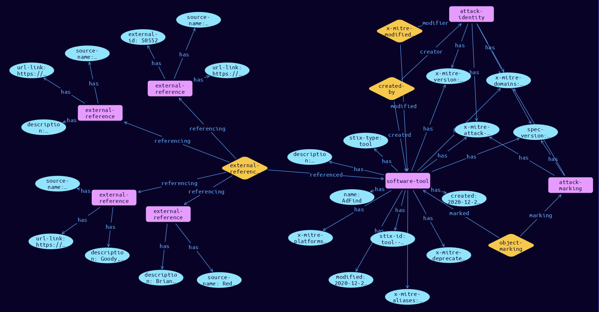

# Software-Tool Domain Object

**Stix and TypeQL Object Type:**  `tool`

Software in ATT&CK is the union of two distinct STIX types: malware and tool.

[Reference in Stix2.1 Standard](https://github.com/mitre-attack/attack-stix-data/blob/master/USAGE.md#software )
## Stix 2.1 Properties Converted to TypeQL
Mapping of the Stix Attack Pattern Properties to TypeDB

|  Stix 2.1 Property    |           Schema Name             | Required  Optional  |      Schema Object Type | Schema Parent  |
|:--------------------|:--------------------------------:|:------------------:|:------------------------:|:-------------:|
|  type                 |            stix-type              |      Required       |  stix-attribute-string    |   attribute    |
|  id                   |             stix-id               |      Required       |  stix-attribute-string    |   attribute    |
|  spec_version         |           spec-version            |      Required       |  stix-attribute-string    |   attribute    |
|  created              |             created               |      Required       | stix-attribute-timestamp  |   attribute    |
|  modified             |             modified              |      Required       | stix-attribute-timestamp  |   attribute    |
|  name                 |               name                |      Required       |  stix-attribute-string    |   attribute    |
|  description          |           description             |      Optional       |  stix-attribute-string    |   attribute    |
| tool_types |tool-type |      Optional       |  stix-attribute-string    |   attribute    |
| aliases |aliases |      Optional       |  stix-attribute-string    |   attribute    |
| kill_chain_phases |kill-chain-usage:kill-chain-using |      Optional       |   embedded     |relation |
| tool_version |tool-version |      Optional       |  stix-attribute-string    |   attribute    |
|  created_by_ref       |        created-by:created         |      Optional       |   embedded     |relation |
| x_mitre_platforms |x-mitre-platforms |Required |  stix-attribute-string    |   attribute    |
| x_mitre_aliases |x-mitre-aliases |Required |  stix-attribute-string    |   attribute    |
| x_mitre_version |x-mitre-version |Required |  stix-attribute-string    |   attribute    |
| x_mitre_contributors |x-mitre-contributors |Required |  stix-attribute-string    |   attribute    |
| x_mitre_modified_by_ref |x-mitre-modified-by-ref:modified |Required |   embedded     |relation |
| x_mitre_domains |x-mitre-domains |Required |  stix-attribute-string    |   attribute    |
| x_mitre_attack_spec_version |x-mitre-attack-spec-version |Required |  stix-attribute-string    |   attribute    |
| x_mitre_deprecated |x-mitre-deprecated |Optonal |  stix-attribute-boolean   |   attribute    |
|  revoked              |             revoked               |      Optional       |  stix-attribute-boolean   |   attribute    |
|  labels               |              labels               |      Optional       |  stix-attribute-string    |   attribute    |
|  confidence           |            confidence             |      Optional       |  stix-attribute-integer   |   attribute    |
|  lang                 |               lang                |      Optional       |  stix-attribute-string    |   attribute    |
|  external_references  | external-references:referencing   |      Optional       |   embedded     |relation |
|  object_marking_refs  |      object-marking:marked        |      Optional       |   embedded     |relation |
|  granular_markings    |     granular-marking:marked       |      Optional       |   embedded     |relation |
|  extensions           |               n/a                 |        n/a          |           n/a             |      n/a       |

## The Example Software-Tool in JSON
The original JSON, accessible in the Python environment
```json
{
    "object_marking_refs": [
        "marking-definition--fa42a846-8d90-4e51-bc29-71d5b4802168"
    ],
    "type": "tool",
    "name": "AdFind",
    "x_mitre_aliases": [
        "AdFind"
    ],
    "x_mitre_version": "1.0",
    "modified": "2020-12-29T18:04:33.254Z",
    "created": "2020-12-28T18:35:50.244Z",
    "x_mitre_platforms": [
        "Windows"
    ],
    "id": "tool--f59508a6-3615-47c3-b493-6676e1a39a87",
    "description": "[AdFind](https://attack.mitre.org/software/S0552) is a free command-line query tool that can be used for gathering information from Active Directory.(Citation: Red Canary Hospital Thwarted Ryuk October 2020)(Citation: FireEye FIN6 Apr 2019)(Citation: FireEye Ryuk and Trickbot January 2019)",
    "created_by_ref": "identity--c78cb6e5-0c4b-4611-8297-d1b8b55e40b5",
    "external_references": [
        {
            "url": "https://attack.mitre.org/software/S0552",
            "external_id": "S0552",
            "source_name": "mitre-attack"
        },
        {
            "url": "https://redcanary.com/blog/how-one-hospital-thwarted-a-ryuk-ransomware-outbreak/ ",
            "description": "Brian Donohue, Katie Nickels, Paul Michaud, Adina Bodkins, Taylor Chapman, Tony Lambert, Jeff Felling, Kyle Rainey, Mike Haag, Matt Graeber, Aaron Didier.. (2020, October 29). A Bazar start: How one hospital thwarted a Ryuk ransomware outbreak. Retrieved October 30, 2020.",
            "source_name": "Red Canary Hospital Thwarted Ryuk October 2020"
        },
        {
            "source_name": "FireEye FIN6 Apr 2019",
            "description": "McKeague, B. et al. (2019, April 5). Pick-Six: Intercepting a FIN6 Intrusion, an Actor Recently Tied to Ryuk and LockerGoga Ransomware. Retrieved April 17, 2019.",
            "url": "https://www.fireeye.com/blog/threat-research/2019/04/pick-six-intercepting-a-fin6-intrusion.html"
        },
        {
            "url": "https://www.fireeye.com/blog/threat-research/2019/01/a-nasty-trick-from-credential-theft-malware-to-business-disruption.html",
            "description": "Goody, K., et al (2019, January 11). A Nasty Trick: From Credential Theft Malware to Business Disruption. Retrieved May 12, 2020.",
            "source_name": "FireEye Ryuk and Trickbot January 2019"
        }
    ],
    "spec_version": "2.1",
    "x_mitre_attack_spec_version": "2.1.0",
    "x_mitre_domains": [
        "enterprise-attack"
    ],
    "x_mitre_modified_by_ref": "identity--c78cb6e5-0c4b-4611-8297-d1b8b55e40b5"
}
```


## Inserting the Example Software-Tool in TypeQL
The TypeQL insert statement
```typeql
match  $identity0 isa identity, has stix-id "identity--c78cb6e5-0c4b-4611-8297-d1b8b55e40b5";
 $identity1 isa identity, has stix-id "identity--c78cb6e5-0c4b-4611-8297-d1b8b55e40b5";
 $attack-marking03 isa attack-marking, has stix-id "marking-definition--fa42a846-8d90-4e51-bc29-71d5b4802168";
 
 insert $software-tool isa software-tool,
 has stix-type $stix-type,
 has spec-version $spec-version,
 has stix-id $stix-id,
 has created $created,
 has modified $modified,
 has name $name,
 has description $description,
 has x-mitre-version $x-mitre-version,
 has x-mitre-domains $x_mitre_domains0,
 has x-mitre-attack-spec-version $x-mitre-attack-spec-version,
 has x-mitre-deprecated $x-mitre-deprecated,
 has x-mitre-platforms $x_mitre_platforms0,
 has x-mitre-aliases $x_mitre_aliases0;

 $stix-type "tool";
 $spec-version "2.1";
 $stix-id "tool--f59508a6-3615-47c3-b493-6676e1a39a87";
 $created 2020-12-28T18:35:50.244;
 $modified 2020-12-29T18:04:33.254;
 $name "AdFind";
 $description "[AdFind](https://attack.mitre.org/software/S0552) is a free command-line query tool that can be used for gathering information from Active Directory.(Citation: Red Canary Hospital Thwarted Ryuk October 2020)(Citation: FireEye FIN6 Apr 2019)(Citation: FireEye Ryuk and Trickbot January 2019)";
 $x-mitre-version "1.0";
 $x_mitre_domains0 "enterprise-attack";
 $x-mitre-attack-spec-version "2.1.0";
 $x-mitre-deprecated false;
 $x_mitre_platforms0 "Windows";
 $x_mitre_aliases0 "AdFind";


 $created-by0 (created:$software-tool, creator:$identity0) isa created-by;

 $x-mitre-modified-by-ref1 (modified:$software-tool, modifier:$identity1) isa x-mitre-modified-by-ref;
$external-reference0 isa external-reference,
 has source-name "mitre-attack",
 has url-link "https://attack.mitre.org/software/S0552",
 has external-id "S0552";
$external-reference1 isa external-reference,
 has source-name "Red Canary Hospital Thwarted Ryuk October 2020",
 has description "Brian Donohue, Katie Nickels, Paul Michaud, Adina Bodkins, Taylor Chapman, Tony Lambert, Jeff Felling, Kyle Rainey, Mike Haag, Matt Graeber, Aaron Didier.. (2020, October 29). A Bazar start: How one hospital thwarted a Ryuk ransomware outbreak. Retrieved October 30, 2020.",
 has url-link "https://redcanary.com/blog/how-one-hospital-thwarted-a-ryuk-ransomware-outbreak/ ";
$external-reference2 isa external-reference,
 has source-name "FireEye FIN6 Apr 2019",
 has description "McKeague, B. et al. (2019, April 5). Pick-Six: Intercepting a FIN6 Intrusion, an Actor Recently Tied to Ryuk and LockerGoga Ransomware. Retrieved April 17, 2019.",
 has url-link "https://www.fireeye.com/blog/threat-research/2019/04/pick-six-intercepting-a-fin6-intrusion.html";
$external-reference3 isa external-reference,
 has source-name "FireEye Ryuk and Trickbot January 2019",
 has description "Goody, K., et al (2019, January 11). A Nasty Trick: From Credential Theft Malware to Business Disruption. Retrieved May 12, 2020.",
 has url-link "https://www.fireeye.com/blog/threat-research/2019/01/a-nasty-trick-from-credential-theft-malware-to-business-disruption.html";

 $external-references (referenced:$software-tool, referencing:$external-reference0, referencing:$external-reference1, referencing:$external-reference2, referencing:$external-reference3) isa external-references;

 $object-marking3 (marked:$software-tool, marking:$attack-marking03) isa object-marking;
```

## Retrieving the Example Software-Tool in TypeQL
The typeQL match statement

```typeql
match  
   $a isa software-tool,
      has stix-id  "tool--f59508a6-3615-47c3-b493-6676e1a39a87",
      has $b;
   $c isa stix-sub-object,
      has $d;
   $e (owner:$a, pointed-to:$c) isa embedded;
   $f (owner:$a, pointed-to:$g) isa embedded; 
```


will retrieve the example attack-pattern object in Vaticle Studio


## Retrieving the Example Software-Tool  in Python
The Python retrieval statement

```python
from stixorm.module.typedb import TypeDBSink, TypeDBSource
connection = {
    "uri": "localhost",
    "port": "1729",
    "database": "stix",
    "user": None,
    "password": None
}

import_type = {
    "STIX21": True,
    "CVE": False,
    "identity": False,
    "location": False,
    "rules": False,
    "ATT&CK": False,
    "ATT&CK_Versions": ["12.0"],
    "ATT&CK_Domains": ["enterprise-attack", "mobile-attack", "ics-attack"],
    "CACAO": False
}

typedb = TypeDBSource(connection, import_type)
stix_obj = typedb.get( "tool--f59508a6-3615-47c3-b493-6676e1a39a87")
```

 

[Back to MITRE ATT&CK Overview](../overview.md)
 

[Back to All Protocols Overview](../../overview.md)
 

[Back to Overview Doc](../../../overview.md)
