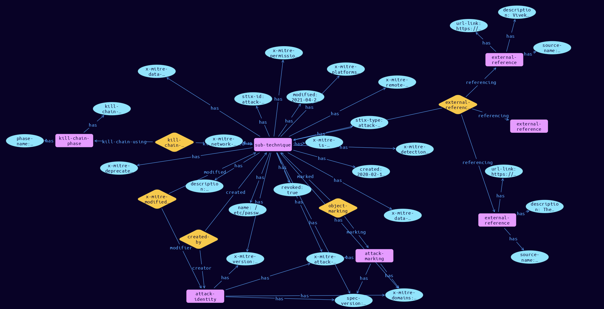

# Sub-Technique Domain Object

**Stix and TypeQL Object Type:**  `attack-pattern`

A sub-technique in ATT&CK is represented as an attack-pattern and follows the same format as techniques. They differ in that they have a boolean field (x_mitre_is_subtechnique) marking them as sub-techniques, and a relationship of the type subtechnique-of where the source_ref is the sub-technique and the target_ref is the parent technique. A sub-technique can only have 1 parent technique, but techniques can have multiple sub-techniques.

Additionally:
- Sub-technique ATT&CK IDs are a suffix of their parent IDs. For a given sub-technique ID Txxxx.yyy, Txxxx is the parent technique ID and yyy is the sub-technique ID. Sub-techniques have unique STIX IDs.
- Sub-techniques have the same tactics as their parent technique.
- Sub-techniques have a subset of their parent technique's platforms.
- Sub-techniques only exist in the Enterprise and Mobile domains.

[Reference in Stix2.1 Standard](https://github.com/mitre-attack/attack-stix-data/blob/master/USAGE.md#sub-techniques)
## Stix 2.1 Properties Converted to TypeQL
Mapping of the Stix Attack Pattern Properties to TypeDB

|  Stix 2.1 Property    |           Schema Name             | Required  Optional  |      Schema Object  Type | Schema Parent  |
|:--------------------|:--------------------------------:|:------------------:|:------------------------:|:-------------:|
|  type                 |            stix-type              |      Required       |  stix-attribute-string    |   attribute    |
|  id                   |             stix-id               |      Required       |  stix-attribute-string    |   attribute    |
|  spec_version         |           spec-version            |      Required       |  stix-attribute-string    |   attribute    |
|  created              |             created               |      Required       | stix-attribute-timestamp  |   attribute    |
|  modified             |             modified              |      Required       | stix-attribute-timestamp  |   attribute    |
|  name                 |               name                |      Required       |  stix-attribute-string    |   attribute    |
|  description          |           description             |      Optional       |  stix-attribute-string    |   attribute    |
|  aliases              |            stix-role              |      Optional       |  stix-attribute-string    |   attribute    |
|  kill_chain_phases    | kill-chain-usage:kill-chain-used  |      Optional       |   embedded     |relation |
|  created_by_ref       |        created-by:created         |      Optional       |   embedded     |relation |
| x_mitre_version |x-mitre-version |Required |  stix-attribute-string    |   attribute    |
| x_mitre_contributors |x-mitre-contributors |Required |  stix-attribute-string    |   attribute    |
| x_mitre_modified_by_ref |x-mitre-modified-by-ref:modified |Required |   embedded     |relation |
| x_mitre_domains |x-mitre-domains |Required |  stix-attribute-string    |   attribute    |
| x_mitre_attack_spec_version |x-mitre-attack-spec-version |Required |  stix-attribute-string    |   attribute    |
| x_mitre_detection |x-mitre-detection |Required |  stix-attribute-string    |   attribute    |
| x_mitre_platforms |x-mitre-platforms |Required |  stix-attribute-string    |   attribute    |
| x_mitre_data_sources |x-mitre-data-sources |Required |  stix-attribute-string    |   attribute    |
| x_mitre_is_subtechnique |x-mitre-is-subtechnique |Required |  stix-attribute-boolean   |   attribute    |
| x_mitre_system_requirements |x-mitre-system-requirements |Required |  stix-attribute-string    |   attribute    |
| x_mitre_tactic_type |x-mitre-system-requirements |Required |  stix-attribute-string    |   attribute    |
| x_mitre_permissions_required |x-mitre-permissions-required |Required |  stix-attribute-string    |   attribute    |
| x_mitre_network_requirements |x-mitre-network-requirements |Optional |  stix-attribute-string    |   attribute    |
| x_mitre_effective_permissions |x-mitre-effective-permissions |Required |  stix-attribute-string    |   attribute    |
| x_mitre_defense_bypassed |x-mitre-defense-bypassed |Required |  stix-attribute-string    |   attribute    |
| x_mitre_remote_support |x-mitre-remote-support |Required |  stix-attribute-boolean   |   attribute    |
| x_mitre_impact_type |x-mitre-impact-type |Required |  stix-attribute-string    |   attribute    |
| x_mitre_deprecated |x-mitre-deprecated |Optonal |  stix-attribute-boolean   |   attribute    |
|  revoked              |             revoked               |      Optional       |  stix-attribute-boolean   |   attribute    |
|  labels               |              labels               |      Optional       |  stix-attribute-string    |   attribute    |
|  confidence           |            confidence             |      Optional       |  stix-attribute-integer   |   attribute    |
|  lang                 |               lang                |      Optional       |  stix-attribute-string    |   attribute    |
|  external_references  | external-references:referencing   |      Optional       |   embedded     |relation |
|  object_marking_refs  |      object-marking:marked        |      Optional       |   embedded     |relation |
|  granular_markings    |     granular-marking:marked       |      Optional       |   embedded     |relation |
|  extensions           |               n/a                 |        n/a          |           n/a             |      n/a       |

## The Example Sub-Technique in JSON
The original JSON, accessible in the Python environment
```json
{
        "type": "attack-pattern",
        "modified": "2021-04-29T14:49:39.188Z",
        "name": "/etc/passwd and /etc/shadow",
        "x_mitre_data_sources": [
            "Command: Command Execution",
            "File: File Access"
        ],
        "x_mitre_version": "1.0",
        "created": "2020-02-11T18:46:56.263Z",
        "x_mitre_permissions_required": [
            "root"
        ],
        "x_mitre_platforms": [
            "Linux"
        ],
        "x_mitre_is_subtechnique": true,
        "id": "attack-pattern--d0b4fcdb-d67d-4ed2-99ce-788b12f8c0f4",
        "description": "Adversaries may attempt to dump the contents of <code>/etc/passwd</code> and <code>/etc/shadow</code> to enable offline password cracking. Most modern Linux operating systems use a combination of <code>/etc/passwd</code> and <code>/etc/shadow</code> to store user account information including password hashes in <code>/etc/shadow</code>. By default, <code>/etc/shadow</code> is only readable by the root user.(Citation: Linux Password and Shadow File Formats)\n\nThe Linux utility, unshadow, can be used to combine the two files in a format suited for password cracking utilities such as John the Ripper:(Citation: nixCraft - John the Ripper) <code># /usr/bin/unshadow /etc/passwd /etc/shadow > /tmp/crack.password.db</code>\n",
        "object_marking_refs": [
            "marking-definition--fa42a846-8d90-4e51-bc29-71d5b4802168"
        ],
        "kill_chain_phases": [
            {
                "kill_chain_name": "mitre-attack",
                "phase_name": "credential-access"
            }
        ],
        "x_mitre_detection": "The AuditD monitoring tool, which ships stock in many Linux distributions, can be used to watch for hostile processes attempting to access <code>/etc/passwd</code> and <code>/etc/shadow</code>, alerting on the pid, process name, and arguments of such programs.",
        "created_by_ref": "identity--c78cb6e5-0c4b-4611-8297-d1b8b55e40b5",
        "external_references": [
            {
                "source_name": "mitre-attack",
                "external_id": "T1003.008",
                "url": "https://attack.mitre.org/techniques/T1003/008"
            },
            {
                "source_name": "Linux Password and Shadow File Formats",
                "description": "The Linux Documentation Project. (n.d.). Linux Password and Shadow File Formats. Retrieved February 19, 2020.",
                "url": "https://www.tldp.org/LDP/lame/LAME/linux-admin-made-easy/shadow-file-formats.html"
            },
            {
                "source_name": "nixCraft - John the Ripper",
                "description": "Vivek Gite. (2014, September 17). Linux Password Cracking: Explain unshadow and john Commands (John the Ripper Tool). Retrieved February 19, 2020.",
                "url": "https://www.cyberciti.biz/faq/unix-linux-password-cracking-john-the-ripper/"
            }
        ],
        "spec_version": "2.1",
        "x_mitre_attack_spec_version": "2.1.0",
        "x_mitre_domains": [
            "enterprise-attack"
        ],
        "x_mitre_modified_by_ref": "identity--c78cb6e5-0c4b-4611-8297-d1b8b55e40b5"
    }
```


## Inserting the Example Sub-Technique in TypeQL
The TypeQL insert statement
```typeql
match  
 $identity0 isa identity, has stix-id "identity--c78cb6e5-0c4b-4611-8297-d1b8b55e40b5";
 $identity1 isa identity, has stix-id "identity--c78cb6e5-0c4b-4611-8297-d1b8b55e40b5";
 $attack-marking04 isa attack-marking, has stix-id "marking-definition--fa42a846-8d90-4e51-bc29-71d5b4802168";
 
insert
 $sub-technique isa sub-technique,
 has stix-type $stix-type,
 has spec-version $spec-version,
 has stix-id $stix-id,
 has created $created,
 has modified $modified,
 has name $name,
 has description $description,
 has x-mitre-version $x-mitre-version,
 has x-mitre-domains $x_mitre_domains0,
 has x-mitre-attack-spec-version $x-mitre-attack-spec-version,
 has x-mitre-network-requirements $x-mitre-network-requirements,
 has revoked $revoked,
 has x-mitre-deprecated $x-mitre-deprecated,
 has x-mitre-detection $x-mitre-detection,
 has x-mitre-platforms $x_mitre_platforms0,
 has x-mitre-data-sources $x_mitre_data_sources0,
 has x-mitre-data-sources $x_mitre_data_sources1,
 has x-mitre-is-subtechnique $x-mitre-is-subtechnique,
 has x-mitre-permissions-required $x_mitre_permissions_required0,
 has x-mitre-remote-support $x-mitre-remote-support;

 $stix-type "attack-pattern";
 $spec-version "2.1";
 $stix-id "attack-pattern--d0b4fcdb-d67d-4ed2-99ce-788b12f8c0f4";
 $created 2020-02-11T18:46:56.263;
 $modified 2021-04-29T14:49:39.188;
 $name "/etc/passwd and /etc/shadow";
 $description "Adversaries may attempt to dump the contents of <code>/etc/passwd</code> and <code>/etc/shadow</code> to enable offline password cracking. Most modern Linux operating systems use a combination of <code>/etc/passwd</code> and <code>/etc/shadow</code> to store user account information including password hashes in <code>/etc/shadow</code>. By default, <code>/etc/shadow</code> is only readable by the root user.(Citation: Linux Password and Shadow File Formats)

The Linux utility, unshadow, can be used to combine the two files in a format suited for password cracking utilities such as John the Ripper:(Citation: nixCraft - John the Ripper) <code># /usr/bin/unshadow /etc/passwd /etc/shadow > /tmp/crack.password.db</code>
";
 $x-mitre-version "1.0";
 $x_mitre_domains0 "enterprise-attack";
 $x-mitre-attack-spec-version "2.1.0";
 $x-mitre-network-requirements false;
 $revoked true;
 $x-mitre-deprecated false;
 $x-mitre-detection "The AuditD monitoring tool, which ships stock in many Linux distributions, can be used to watch for hostile processes attempting to access <code>/etc/passwd</code> and <code>/etc/shadow</code>, alerting on the pid, process name, and arguments of such programs.";
 $x_mitre_platforms0 "Linux";
 $x_mitre_data_sources0 "Command: Command Execution";
 $x_mitre_data_sources1 "File: File Access";
 $x-mitre-is-subtechnique true;
 $x_mitre_permissions_required0 "root";
 $x-mitre-remote-support false;
 
  $created-by0 (created:$sub-technique, creator:$identity0) isa created-by;

 $x-mitre-modified-by-ref1 (modified:$sub-technique, modifier:$identity1) isa x-mitre-modified-by-ref;
$kill-chain-phase0 isa kill-chain-phase,
 has kill-chain-name "mitre-attack",
 has phase-name "credential-access";

 $kill-chain-usage (kill-chain-used:$sub-technique, kill-chain-using:$kill-chain-phase0) isa kill-chain-usage;
$external-reference0 isa external-reference,
 has source-name "mitre-attack",
 has url-link "https://attack.mitre.org/techniques/T1003/008",
 has external-id "T1003.008";
$external-reference1 isa external-reference,
 has source-name "Linux Password and Shadow File Formats",
 has description "The Linux Documentation Project. (n.d.). Linux Password and Shadow File Formats. Retrieved February 19, 2020.",
 has url-link "https://www.tldp.org/LDP/lame/LAME/linux-admin-made-easy/shadow-file-formats.html";
$external-reference2 isa external-reference,
 has source-name "nixCraft - John the Ripper",
 has description "Vivek Gite. (2014, September 17). Linux Password Cracking: Explain unshadow and john Commands (John the Ripper Tool). Retrieved February 19, 2020.",
 has url-link "https://www.cyberciti.biz/faq/unix-linux-password-cracking-john-the-ripper/";

 $external-references (referenced:$sub-technique, referencing:$external-reference0, referencing:$external-reference1, referencing:$external-reference2) isa external-references;

 $object-marking4 (marked:$sub-technique, marking:$attack-marking04) isa object-marking;
```

## Retrieving the Example Sub-Technique in TypeQL
The typeQL match statement

```typeql
match  
   $a isa technique,
      has stix-id "attack-pattern--d0b4fcdb-d67d-4ed2-99ce-788b12f8c0f4",
      has $b;
   $c isa stix-sub-object,
      has $d;
   $e (owner:$a, pointed-to:$c) isa embedded;
   $f (owner:$a, pointed-to:$g) isa embedded; 
```


will retrieve the example attack-pattern object in Vaticle Studio


## Retrieving the Example Sub-Technique  in Python
The Python retrieval statement

```python
from stixorm.module.typedb import TypeDBSink, TypeDBSource
connection = {
    "uri": "localhost",
    "port": "1729",
    "database": "stix",
    "user": None,
    "password": None
}

import_type = {
    "STIX21": True,
    "CVE": False,
    "identity": False,
    "location": False,
    "rules": False,
    "ATT&CK": False,
    "ATT&CK_Versions": ["12.0"],
    "ATT&CK_Domains": ["enterprise-attack", "mobile-attack", "ics-attack"],
    "CACAO": False
}

typedb = TypeDBSource(connection, import_type)
stix_obj = typedb.get("attack-pattern--67720091-eee3-4d2d-ae16-8264567f6f5b")
```

 

[Back to MITRE ATT&CK Overview](../overview.md)
 

[Back to All Protocols Overview](../../overview.md)
 

[Back to Overview Doc](../../../overview.md)
