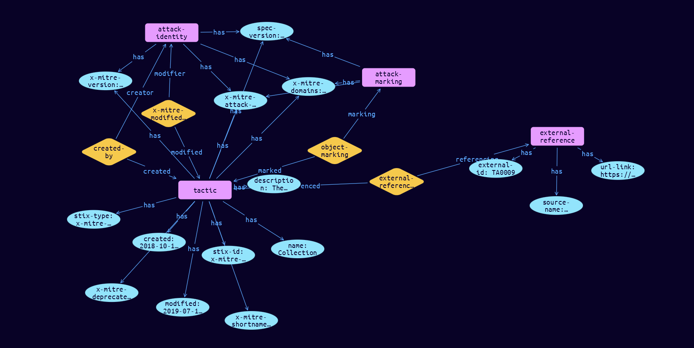

# Tactic Domain Object

**Stix and TypeQL Object Type:**  `x-mitre-tactic`

A Tactic in ATT&CK is defined by an x-mitre-tactic object. As a custom STIX type they follow only the generic STIX Domain Object pattern.

 

[Reference in Stix2.1 Standard](https://github.com/mitre-attack/attack-stix-data/blob/master/USAGE.md#tactics)
## Stix 2.1 Properties Converted to TypeQL
Mapping of the Stix Attack Pattern Properties to TypeDB

|  Stix 2.1 Property    |           Schema Name             | Required  Optional  |      Schema Object  Type | Schema Parent  |
|:--------------------|:--------------------------------:|:------------------:|:------------------------:|:-------------:|
|  type                 |            stix-type              |      Required       |  stix-attribute-string    |   attribute    |
|  id                   |             stix-id               |      Required       |  stix-attribute-string    |   attribute    |
|  spec_version         |           spec-version            |      Required       |  stix-attribute-string    |   attribute    |
|  created              |             created               |      Required       | stix-attribute-timestamp  |   attribute    |
|  modified             |             modified              |      Required       | stix-attribute-timestamp  |   attribute    |
|  name                 |               name                |      Required       |  stix-attribute-string    |   attribute    |
|  description          |           description             |      Optional       |  stix-attribute-string    |   attribute    |
|  aliases              |            stix-role              |      Optional       |  stix-attribute-string    |   attribute    |
|  kill_chain_phases    | kill-chain-usage:kill-chain-used  |      Optional       |   embedded     |relation |
|  created_by_ref       |        created-by:created         |      Optional       |   embedded     |relation |
| x_mitre_version |x-mitre-version |Required |  stix-attribute-string    |   attribute    |
| x_mitre_contributors |x-mitre-contributors |Required |  stix-attribute-string    |   attribute    |
| x_mitre_modified_by_ref |x-mitre-modified-by-ref:modified |Required |   embedded     |relation |
| x_mitre_domains |x-mitre-domains |Required |  stix-attribute-string    |   attribute    |
| x_mitre_attack_spec_version |x-mitre-attack-spec-version |Required |  stix-attribute-string    |   attribute    |
| x_mitre_shortname |tactic-refs |Required |  stix-attribute-string    |   attribute    |
| x_mitre_deprecated |x-mitre-deprecated |Optonal |  stix-attribute-boolean   |   attribute    |
|  revoked              |             revoked               |      Optional       |  stix-attribute-boolean   |   attribute    |
|  labels               |              labels               |      Optional       |  stix-attribute-string    |   attribute    |
|  confidence           |            confidence             |      Optional       |  stix-attribute-integer   |   attribute    |
|  lang                 |               lang                |      Optional       |  stix-attribute-string    |   attribute    |
|  external_references  | external-references:referencing   |      Optional       |   embedded     |relation |
|  object_marking_refs  |      object-marking:marked        |      Optional       |   embedded     |relation |
|  granular_markings    |     granular-marking:marked       |      Optional       |   embedded     |relation |
|  extensions           |               n/a                 |        n/a          |           n/a             |      n/a       |

## The Example Tactic in JSON
The original JSON, accessible in the Python environment
```json
{
        "object_marking_refs": [
            "marking-definition--fa42a846-8d90-4e51-bc29-71d5b4802168"
        ],
        "type": "x-mitre-tactic",
        "name": "Collection",
        "description": "The adversary is trying to gather data of interest to their goal.\n\nCollection consists of techniques adversaries may use to gather information and the sources information is collected from that are relevant to following through on the adversary's objectives. Frequently, the next goal after collecting data is to steal (exfiltrate) the data. Common target sources include various drive types, browsers, audio, video, and email. Common collection methods include capturing screenshots and keyboard input.",
        "x_mitre_shortname": "collection",
        "modified": "2019-07-19T17:44:53.176Z",
        "id": "x-mitre-tactic--d108ce10-2419-4cf9-a774-46161d6c6cfe",
        "created": "2018-10-17T00:14:20.652Z",
        "created_by_ref": "identity--c78cb6e5-0c4b-4611-8297-d1b8b55e40b5",
        "external_references": [
            {
                "source_name": "mitre-attack",
                "external_id": "TA0009",
                "url": "https://attack.mitre.org/tactics/TA0009"
            }
        ],
        "spec_version": "2.1",
        "x_mitre_attack_spec_version": "2.1.0",
        "x_mitre_domains": [
            "enterprise-attack"
        ],
        "x_mitre_modified_by_ref": "identity--c78cb6e5-0c4b-4611-8297-d1b8b55e40b5",
        "x_mitre_version": "1.0"
    }
```


## Inserting the Example Tactic in TypeQL
The TypeQL insert statement
```typeql
match
 $identity0 isa identity, has stix-id "identity--c78cb6e5-0c4b-4611-8297-d1b8b55e40b5";
 $identity1 isa identity, has stix-id "identity--c78cb6e5-0c4b-4611-8297-d1b8b55e40b5";
 $attack-marking03 isa attack-marking, has stix-id "marking-definition--fa42a846-8d90-4e51-bc29-71d5b4802168";
 
 insert
 $tactic isa tactic,
 has stix-type $stix-type,
 has spec-version $spec-version,
 has stix-id $stix-id,
 has created $created,
 has modified $modified,
 has name $name,
 has description $description,
 has x-mitre-version $x-mitre-version,
 has x-mitre-domains $x_mitre_domains0,
 has x-mitre-attack-spec-version $x-mitre-attack-spec-version,
 has x-mitre-deprecated $x-mitre-deprecated,
 has x-mitre-shortname $x-mitre-shortname;

 $stix-type "x-mitre-tactic";
 $spec-version "2.1";
 $stix-id "x-mitre-tactic--d108ce10-2419-4cf9-a774-46161d6c6cfe";
 $created 2018-10-17T00:14:20.652;
 $modified 2019-07-19T17:44:53.176;
 $name "Collection";
 $description "The adversary is trying to gather data of interest to their goal.

Collection consists of techniques adversaries may use to gather information and the sources information is collected from that are relevant to following through on the adversary's objectives. Frequently, the next goal after collecting data is to steal (exfiltrate) the data. Common target sources include various drive types, browsers, audio, video, and email. Common collection methods include capturing screenshots and keyboard input.";
 $x-mitre-version "1.0";
 $x_mitre_domains0 "enterprise-attack";
 $x-mitre-attack-spec-version "2.1.0";
 $x-mitre-deprecated false;
 $x-mitre-shortname "collection";

  $created-by0 (created:$tactic, creator:$identity0) isa created-by;

 $x-mitre-modified-by-ref1 (modified:$tactic, modifier:$identity1) isa x-mitre-modified-by-ref;
$external-reference0 isa external-reference,
 has source-name "mitre-attack",
 has url-link "https://attack.mitre.org/tactics/TA0009",
 has external-id "TA0009";

 $external-references (referenced:$tactic, referencing:$external-reference0) isa external-references;

 $object-marking3 (marked:$tactic, marking:$attack-marking03) isa object-marking;
```

## Retrieving the Example Tactic in TypeQL
The typeQL match statement

```typeql
match  
   $a isa tactic,
      has stix-id  "x-mitre-tactic--d108ce10-2419-4cf9-a774-46161d6c6cfe",
      has $b;
   $c isa stix-sub-object,
      has $d;
   $e (owner:$a, pointed-to:$c) isa embedded;
   $f (owner:$a, pointed-to:$g) isa embedded; 
```


will retrieve the example attack-pattern object in Vaticle Studio


## Retrieving the Example Tactic  in Python
The Python retrieval statement

```python
from stixorm.module.typedb import TypeDBSink, TypeDBSource
connection = {
    "uri": "localhost",
    "port": "1729",
    "database": "stix",
    "user": None,
    "password": None
}

import_type = {
    "STIX21": True,
    "CVE": False,
    "identity": False,
    "location": False,
    "rules": False,
    "ATT&CK": False,
    "ATT&CK_Versions": ["12.0"],
    "ATT&CK_Domains": ["enterprise-attack", "mobile-attack", "ics-attack"],
    "CACAO": False
}

typedb = TypeDBSource(connection, import_type)
stix_obj = typedb.get( "x-mitre-tactic--d108ce10-2419-4cf9-a774-46161d6c6cfe")
```

 

[Back to MITRE ATT&CK Overview](../overview.md)
 

[Back to All Protocols Overview](../../overview.md)
 

[Back to Overview Doc](../../../overview.md)
