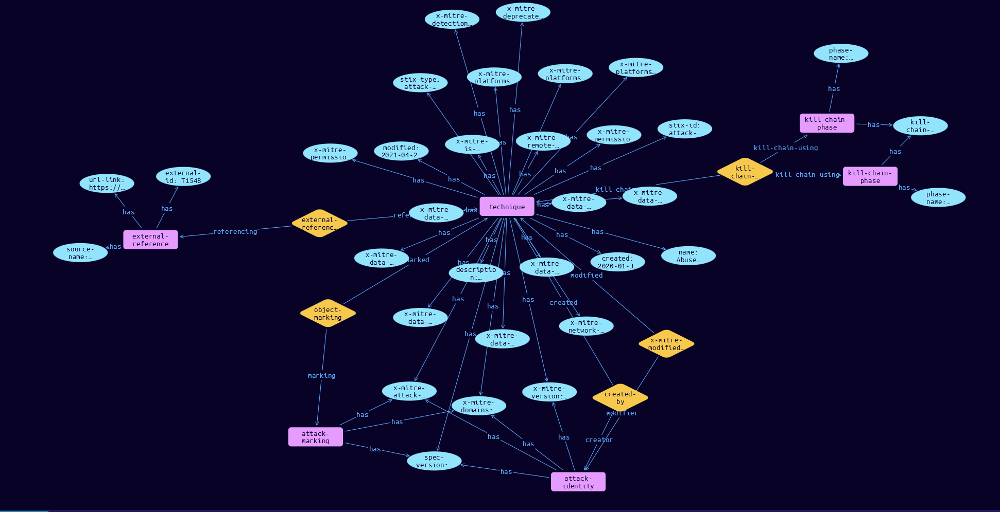

# Technique Domain Object

**Stix and TypeQL Object Type:**  `attack-pattern`

A Technique in ATT&CK is defined as an attack-pattern object.Techniques map into tactics by use of their kill_chain_phases property. Where the kill_chain_name is mitre-attack, mitre-mobile-attack, or mitre-ics-attack (for enterprise, mobile, and ics domains respectively), the phase_name corresponds to the x_mitre_shortname property of an x-mitre-tactic object.

 

[Reference in Stix2.1 Standard](https://github.com/mitre-attack/attack-stix-data/blob/master/USAGE.md#techniques)
## Stix 2.1 Properties Converted to TypeQL
Mapping of the Stix Attack Pattern Properties to TypeDB

|  Stix 2.1 Property    |           Schema Name             | Required  Optional  |      Schema Object  Type | Schema Parent  |
|:--------------------|:--------------------------------:|:------------------:|:------------------------:|:-------------:|
|  type                 |            stix-type              |      Required       |  stix-attribute-string    |   attribute    |
|  id                   |             stix-id               |      Required       |  stix-attribute-string    |   attribute    |
|  spec_version         |           spec-version            |      Required       |  stix-attribute-string    |   attribute    |
|  created              |             created               |      Required       | stix-attribute-timestamp  |   attribute    |
|  modified             |             modified              |      Required       | stix-attribute-timestamp  |   attribute    |
|  name                 |               name                |      Required       |  stix-attribute-string    |   attribute    |
|  description          |           description             |      Optional       |  stix-attribute-string    |   attribute    |
|  aliases              |            stix-role              |      Optional       |  stix-attribute-string    |   attribute    |
|  kill_chain_phases    | kill-chain-usage:kill-chain-used  |      Optional       |   embedded     |relation |
|  created_by_ref       |        created-by:created         |      Optional       |   embedded     |relation |
| x_mitre_version |x-mitre-version |Required |  stix-attribute-string    |   attribute    |
| x_mitre_contributors |x-mitre-contributors |Required |  stix-attribute-string    |   attribute    |
| x_mitre_modified_by_ref |x-mitre-modified-by-ref:modified |Required |   embedded     |relation |
| x_mitre_domains |x-mitre-domains |Required |  stix-attribute-string    |   attribute    |
| x_mitre_attack_spec_version |x-mitre-attack-spec-version |Required |  stix-attribute-string    |   attribute    |
| x_mitre_detection |x-mitre-detection |Required |  stix-attribute-string    |   attribute    |
| x_mitre_platforms |x-mitre-platforms |Required |  stix-attribute-string    |   attribute    |
| x_mitre_data_sources |x-mitre-data-sources |Required |  stix-attribute-string    |   attribute    |
| x_mitre_is_subtechnique |x-mitre-is-subtechnique |Required |  stix-attribute-boolean   |   attribute    |
| x_mitre_system_requirements |x-mitre-system-requirements |Required |  stix-attribute-string    |   attribute    |
| x_mitre_tactic_type |x-mitre-system-requirements |Required |  stix-attribute-string    |   attribute    |
| x_mitre_permissions_required |x-mitre-permissions-required |Required |  stix-attribute-string    |   attribute    |
| x_mitre_network_requirements |x-mitre-network-requirements |Optional |  stix-attribute-string    |   attribute    |
| x_mitre_effective_permissions |x-mitre-effective-permissions |Required |  stix-attribute-string    |   attribute    |
| x_mitre_defense_bypassed |x-mitre-defense-bypassed |Required |  stix-attribute-string    |   attribute    |
| x_mitre_remote_support |x-mitre-remote-support |Required |  stix-attribute-boolean   |   attribute    |
| x_mitre_impact_type |x-mitre-impact-type |Required |  stix-attribute-string    |   attribute    |
| x_mitre_deprecated |x-mitre-deprecated |Optonal |  stix-attribute-boolean   |   attribute    |
|  revoked              |             revoked               |      Optional       |  stix-attribute-boolean   |   attribute    |
|  labels               |              labels               |      Optional       |  stix-attribute-string    |   attribute    |
|  confidence           |            confidence             |      Optional       |  stix-attribute-integer   |   attribute    |
|  lang                 |               lang                |      Optional       |  stix-attribute-string    |   attribute    |
|  external_references  | external-references:referencing   |      Optional       |   embedded     |relation |
|  object_marking_refs  |      object-marking:marked        |      Optional       |   embedded     |relation |
|  granular_markings    |     granular-marking:marked       |      Optional       |   embedded     |relation |
|  extensions           |               n/a                 |        n/a          |           n/a             |      n/a       |

## The Example Technique in JSON
The original JSON, accessible in the Python environment
```json
{
        "object_marking_refs": [
            "marking-definition--fa42a846-8d90-4e51-bc29-71d5b4802168"
        ],
        "type": "attack-pattern",
        "name": "Abuse Elevation Control Mechanism",
        "x_mitre_data_sources": [
            "Process: Process Metadata",
            "Process: Process Creation",
            "Windows Registry: Windows Registry Key Modification",
            "Command: Command Execution",
            "File: File Metadata",
            "File: File Modification",
            "Process: OS API Execution"
        ],
        "x_mitre_version": "1.0",
        "modified": "2021-04-29T14:49:39.188Z",
        "created": "2020-01-30T13:58:14.373Z",
        "x_mitre_permissions_required": [
            "Administrator",
            "User"
        ],
        "x_mitre_platforms": [
            "Linux",
            "macOS",
            "Windows"
        ],
        "x_mitre_is_subtechnique": false,
        "id": "attack-pattern--67720091-eee3-4d2d-ae16-8264567f6f5b",
        "description": "Adversaries may circumvent mechanisms designed to control elevate privileges to gain higher-level permissions. Most modern systems contain native elevation control mechanisms that are intended to limit privileges that a user can perform on a machine. Authorization has to be granted to specific users in order to perform tasks that can be considered of higher risk. An adversary can perform several methods to take advantage of built-in control mechanisms in order to escalate privileges on a system.",
        "kill_chain_phases": [
            {
                "kill_chain_name": "mitre-attack",
                "phase_name": "privilege-escalation"
            },
            {
                "kill_chain_name": "mitre-attack",
                "phase_name": "defense-evasion"
            }
        ],
        "x_mitre_detection": "Monitor the file system for files that have the setuid or setgid bits set. Also look for any process API calls for behavior that may be indicative of [Process Injection](https://attack.mitre.org/techniques/T1055) and unusual loaded DLLs through [DLL Search Order Hijacking](https://attack.mitre.org/techniques/T1574/001), which indicate attempts to gain access to higher privileged processes. On Linux, auditd can alert every time a user's actual ID and effective ID are different (this is what happens when you sudo).\n\nConsider monitoring for <code>/usr/libexec/security_authtrampoline</code> executions which may indicate that AuthorizationExecuteWithPrivileges is being executed. MacOS system logs may also indicate when AuthorizationExecuteWithPrivileges is being called. Monitoring OS API callbacks for the execution can also be a way to detect this behavior but requires specialized security tooling.\n\nOn Linux, auditd can alert every time a user's actual ID and effective ID are different (this is what happens when you sudo). This technique is abusing normal functionality in macOS and Linux systems, but sudo has the ability to log all input and output based on the <code>LOG_INPUT</code> and <code>LOG_OUTPUT</code> directives in the <code>/etc/sudoers</code> file.\n\nThere are many ways to perform UAC bypasses when a user is in the local administrator group on a system, so it may be difficult to target detection on all variations. Efforts should likely be placed on mitigation and collecting enough information on process launches and actions that could be performed before and after a UAC bypass is performed. Some UAC bypass methods rely on modifying specific, user-accessible Registry settings. Analysts should monitor Registry settings for unauthorized changes.",
        "created_by_ref": "identity--c78cb6e5-0c4b-4611-8297-d1b8b55e40b5",
        "external_references": [
            {
                "url": "https://attack.mitre.org/techniques/T1548",
                "external_id": "T1548",
                "source_name": "mitre-attack"
            }
        ],
        "spec_version": "2.1",
        "x_mitre_attack_spec_version": "2.1.0",
        "x_mitre_domains": [
            "enterprise-attack"
        ],
        "x_mitre_modified_by_ref": "identity--c78cb6e5-0c4b-4611-8297-d1b8b55e40b5"
    }
```


## Inserting the Example Technique in TypeQL
The TypeQL insert statement
```typeql
match  $identity0 isa identity, has stix-id "identity--c78cb6e5-0c4b-4611-8297-d1b8b55e40b5";
 $identity1 isa identity, has stix-id "identity--c78cb6e5-0c4b-4611-8297-d1b8b55e40b5";
 $attack-marking04 isa attack-marking, has stix-id "marking-definition--fa42a846-8d90-4e51-bc29-71d5b4802168";
 
insert
 $technique isa technique,
 has stix-type $stix-type,
 has spec-version $spec-version,
 has stix-id $stix-id,
 has created $created,
 has modified $modified,
 has name $name,
 has description $description,
 has x-mitre-version $x-mitre-version,
 has x-mitre-domains $x_mitre_domains0,
 has x-mitre-attack-spec-version $x-mitre-attack-spec-version,
 has x-mitre-deprecated $x-mitre-deprecated,
 has x-mitre-network-requirements $x-mitre-network-requirements,
 has x-mitre-detection $x-mitre-detection,
 has x-mitre-platforms $x_mitre_platforms0,
 has x-mitre-platforms $x_mitre_platforms1,
 has x-mitre-platforms $x_mitre_platforms2,
 has x-mitre-data-sources $x_mitre_data_sources0,
 has x-mitre-data-sources $x_mitre_data_sources1,
 has x-mitre-data-sources $x_mitre_data_sources2,
 has x-mitre-data-sources $x_mitre_data_sources3,
 has x-mitre-data-sources $x_mitre_data_sources4,
 has x-mitre-data-sources $x_mitre_data_sources5,
 has x-mitre-data-sources $x_mitre_data_sources6,
 has x-mitre-is-subtechnique $x-mitre-is-subtechnique,
 has x-mitre-permissions-required $x_mitre_permissions_required0,
 has x-mitre-permissions-required $x_mitre_permissions_required1,
 has x-mitre-remote-support $x-mitre-remote-support;

 $stix-type "attack-pattern";
 $spec-version "2.1";
 $stix-id "attack-pattern--67720091-eee3-4d2d-ae16-8264567f6f5b";
 $created 2020-01-30T13:58:14.373;
 $modified 2021-04-29T14:49:39.188;
 $name "Abuse Elevation Control Mechanism";
 $description "Adversaries may circumvent mechanisms designed to control elevate privileges to gain higher-level permissions. Most modern systems contain native elevation control mechanisms that are intended to limit privileges that a user can perform on a machine. Authorization has to be granted to specific users in order to perform tasks that can be considered of higher risk. An adversary can perform several methods to take advantage of built-in control mechanisms in order to escalate privileges on a system.";
 $x-mitre-version "1.0";
 $x_mitre_domains0 "enterprise-attack";
 $x-mitre-attack-spec-version "2.1.0";
 $x-mitre-deprecated false;
 $x-mitre-network-requirements false;
 $x-mitre-detection "Monitor the file system for files that have the setuid or setgid bits set. Also look for any process API calls for behavior that may be indicative of [Process Injection](https://attack.mitre.org/techniques/T1055) and unusual loaded DLLs through [DLL Search Order Hijacking](https://attack.mitre.org/techniques/T1574/001), which indicate attempts to gain access to higher privileged processes. On Linux, auditd can alert every time a user's actual ID and effective ID are different (this is what happens when you sudo).

Consider monitoring for <code>/usr/libexec/security_authtrampoline</code> executions which may indicate that AuthorizationExecuteWithPrivileges is being executed. MacOS system logs may also indicate when AuthorizationExecuteWithPrivileges is being called. Monitoring OS API callbacks for the execution can also be a way to detect this behavior but requires specialized security tooling.

On Linux, auditd can alert every time a user's actual ID and effective ID are different (this is what happens when you sudo). This technique is abusing normal functionality in macOS and Linux systems, but sudo has the ability to log all input and output based on the <code>LOG_INPUT</code> and <code>LOG_OUTPUT</code> directives in the <code>/etc/sudoers</code> file.

There are many ways to perform UAC bypasses when a user is in the local administrator group on a system, so it may be difficult to target detection on all variations. Efforts should likely be placed on mitigation and collecting enough information on process launches and actions that could be performed before and after a UAC bypass is performed. Some UAC bypass methods rely on modifying specific, user-accessible Registry settings. Analysts should monitor Registry settings for unauthorized changes.";
 $x_mitre_platforms0 "Linux";
 $x_mitre_platforms1 "macOS";
 $x_mitre_platforms2 "Windows";
 $x_mitre_data_sources0 "Process: Process Metadata";
 $x_mitre_data_sources1 "Process: Process Creation";
 $x_mitre_data_sources2 "Windows Registry: Windows Registry Key Modification";
 $x_mitre_data_sources3 "Command: Command Execution";
 $x_mitre_data_sources4 "File: File Metadata";
 $x_mitre_data_sources5 "File: File Modification";
 $x_mitre_data_sources6 "Process: OS API Execution";
 $x-mitre-is-subtechnique false;
 $x_mitre_permissions_required0 "Administrator";
 $x_mitre_permissions_required1 "User";
 $x-mitre-remote-support false;

 $created-by0 (created:$technique, creator:$identity0) isa created-by;

 $x-mitre-modified-by-ref1 (modified:$technique, modifier:$identity1) isa x-mitre-modified-by-ref;
$kill-chain-phase0 isa kill-chain-phase,
 has kill-chain-name "mitre-attack",
 has phase-name "privilege-escalation";
$kill-chain-phase1 isa kill-chain-phase,
 has kill-chain-name "mitre-attack",
 has phase-name "defense-evasion";

 $kill-chain-usage (kill-chain-used:$technique, kill-chain-using:$kill-chain-phase0, kill-chain-using:$kill-chain-phase1) isa kill-chain-usage;
$external-reference0 isa external-reference,
 has source-name "mitre-attack",
 has url-link "https://attack.mitre.org/techniques/T1548",
 has external-id "T1548";

 $external-references (referenced:$technique, referencing:$external-reference0) isa external-references;

 $object-marking4 (marked:$technique, marking:$attack-marking04) isa object-marking;
```

## Retrieving the Example Technique in TypeQL
The typeQL match statement

```typeql
match  
   $a isa technique,
      has stix-id "attack-pattern--67720091-eee3-4d2d-ae16-8264567f6f5b",
      has $b;
   $c isa stix-sub-object,
      has $d;
   $e (owner:$a, pointed-to:$c) isa embedded;
   $f (owner:$a, pointed-to:$g) isa embedded; 
```


will retrieve the example attack-pattern object in Vaticle Studio


## Retrieving the Example Technique  in Python
The Python retrieval statement

```python
from stixorm.module.typedb import TypeDBSink, TypeDBSource
connection = {
    "uri": "localhost",
    "port": "1729",
    "database": "stix",
    "user": None,
    "password": None
}

import_type = {
    "STIX21": True,
    "CVE": False,
    "identity": False,
    "location": False,
    "rules": False,
    "ATT&CK": False,
    "ATT&CK_Versions": ["12.0"],
    "ATT&CK_Domains": ["enterprise-attack", "mobile-attack", "ics-attack"],
    "CACAO": False
}

typedb = TypeDBSource(connection, import_type)
stix_obj = typedb.get("attack-pattern--d0b4fcdb-d67d-4ed2-99ce-788b12f8c0f4")
```

 

[Back to MITRE ATT&CK Overview](../overview.md)
 

[Back to All Protocols Overview](../../overview.md)
 

[Back to Overview Doc](../../../overview.md)
