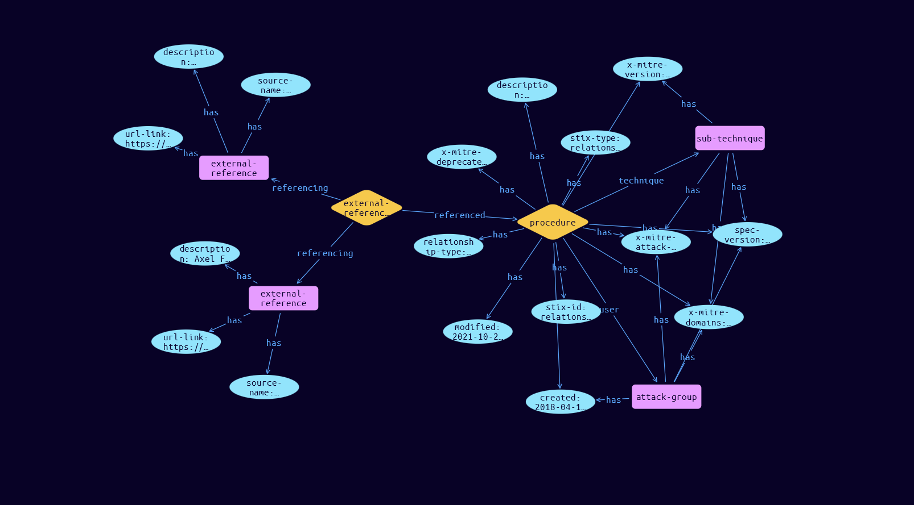

# Procedure Relationship Object

**Stix and TypeQL Object Type:**  `relationship`

ATT&CK does not represent procedures under their own STIX type. Instead, procedures are represented as relationships of type uses where the target_ref is a technique. This means that procedures can stem from usage by both groups (intrusion-sets) and software (malware or tools). The content of the procedure is described in the relationship description.

[Reference in Stix2.1 Standard](https://github.com/mitre-attack/attack-stix-data/blob/master/USAGE.md#procedures)
## Stix 2.1 Properties Converted to TypeQL
Mapping of the Stix Attack Pattern Properties to TypeDB

|  Stix 2.1 Property    |           Schema Name             | Required  Optional  |      Schema Object  Type | Schema Parent  |
|:--------------------|:--------------------------------:|:------------------:|:------------------------:|:-------------:|
|  type                 |            stix-type              |      Required       |  stix-attribute-string    |   attribute    |
|  id                   |             stix-id               |      Required       |  stix-attribute-string    |   attribute    |
|  spec_version         |           spec-version            |      Required       |  stix-attribute-string    |   attribute    |
|  created              |             created               |      Required       | stix-attribute-timestamp  |   attribute    |
|  modified             |             modified              |      Required       | stix-attribute-timestamp  |   attribute    |
|  relationship_type                 |relationship-type |      Required       |  stix-attribute-string    |   attribute    |
|  description          |           description             |      Optional       |  stix-attribute-string    |   attribute    |
| source_ref |source (role) |      Required       |   embedded     |relation |
| target_ref |target (role) |      Required       |   embedded     |relation |
| start_time      |start-time |      Optional       | stix-attribute-timestamp  |   attribute    |
| stop_time |stop-time |      Optional       | stix-attribute-timestamp  |   attribute    |
|  created_by_ref       |        created-by:created         |      Optional       |   embedded     |relation |
| x_mitre_version |x-mitre-version |Required |  stix-attribute-string    |   attribute    |
| x_mitre_contributors |x-mitre-contributors |Required |  stix-attribute-string    |   attribute    |
| x_mitre_modified_by_ref |x-mitre-modified-by-ref:modified |Required |   embedded     |relation |
| x_mitre_domains |x-mitre-domains |Required |  stix-attribute-string    |   attribute    |
| x_mitre_attack_spec_version |x-mitre-attack-spec-version |Required |  stix-attribute-string    |   attribute    |
| x_mitre_deprecated |x-mitre-deprecated |Optonal |  stix-attribute-boolean   |   attribute    |
|  revoked              |             revoked               |      Optional       |  stix-attribute-boolean   |   attribute    |
|  labels               |              labels               |      Optional       |  stix-attribute-string    |   attribute    |
|  confidence           |            confidence             |      Optional       |  stix-attribute-integer   |   attribute    |
|  lang                 |               lang                |      Optional       |  stix-attribute-string    |   attribute    |
|  external_references  | external-references:referencing   |      Optional       |   embedded     |relation |
|  object_marking_refs  |      object-marking:marked        |      Optional       |   embedded     |relation |
|  granular_markings    |     granular-marking:marked       |      Optional       |   embedded     |relation |
|  extensions           |               n/a                 |        n/a          |           n/a             |      n/a       |

## The Example Procedure in JSON
The original JSON, accessible in the Python environment
```json
{
    "id": "relationship--b427e519-8ec0-4ae3-9dda-273cc71f00eb",
    "created_by_ref": "identity--c78cb6e5-0c4b-4611-8297-d1b8b55e40b5",
    "description": "[Leviathan](https://attack.mitre.org/groups/G0065) uses a backdoor known as BADFLICK that is is capable of generating a reverse shell, and has used multiple types of scripting for execution, including JavaScript and JavaScript Scriptlets in XML.(Citation: Proofpoint Leviathan Oct 2017).(Citation: FireEye Periscope March 2018)",
    "object_marking_refs": [
        "marking-definition--fa42a846-8d90-4e51-bc29-71d5b4802168"
    ],
    "external_references": [
        {
            "source_name": "Proofpoint Leviathan Oct 2017",
            "description": "Axel F, Pierre T. (2017, October 16). Leviathan: Espionage actor spearphishes maritime and defense targets. Retrieved February 15, 2018.",
            "url": "https://www.proofpoint.com/us/threat-insight/post/leviathan-espionage-actor-spearphishes-maritime-and-defense-targets"
        },
        {
            "source_name": "FireEye Periscope March 2018",
            "description": "FireEye. (2018, March 16). Suspected Chinese Cyber Espionage Group (TEMP.Periscope) Targeting U.S. Engineering and Maritime Industries. Retrieved April 11, 2018.",
            "url": "https://www.fireeye.com/blog/threat-research/2018/03/suspected-chinese-espionage-group-targeting-maritime-and-engineering-industries.html"
        }
    ],
    "source_ref": "intrusion-set--7113eaa5-ba79-4fb3-b68a-398ee9cd698e",
    "relationship_type": "uses",
    "target_ref": "attack-pattern--d0b4fcdb-d67d-4ed2-99ce-788b12f8c0f4",
    "type": "relationship",
    "modified": "2021-10-21T14:00:00.188Z",
    "created": "2018-04-18T17:59:24.739Z",
    "spec_version": "2.1",
    "x_mitre_attack_spec_version": "2.1.0",
    "x_mitre_domains": [
        "enterprise-attack"
    ],
    "x_mitre_modified_by_ref": "identity--c78cb6e5-0c4b-4611-8297-d1b8b55e40b5",
    "x_mitre_version": "1.0",
    "x_mitre_deprecated": true
}
```


## Inserting the Example Procedure in TypeQL
The TypeQL insert statement
```typeql
match  $attack-group0 isa attack-group, has stix-id "intrusion-set--7113eaa5-ba79-4fb3-b68a-398ee9cd698e";
 $technique1 isa technique, has stix-id "attack-pattern--d0b4fcdb-d67d-4ed2-99ce-788b12f8c0f4";
 $identity0 isa identity, has stix-id "identity--c78cb6e5-0c4b-4611-8297-d1b8b55e40b5";
 $identity1 isa identity, has stix-id "identity--c78cb6e5-0c4b-4611-8297-d1b8b55e40b5";
 $attack-marking05 isa attack-marking, has stix-id "marking-definition--fa42a846-8d90-4e51-bc29-71d5b4802168";
 
insert
 $procedure (user:$attack-group0, technique:$technique1) isa procedure,
 has stix-type $stix-type,
 has spec-version $spec-version,
 has stix-id $stix-id,
 has created $created,
 has modified $modified,
 has relationship-type $relationship-type,
 has description $description,
 has x-mitre-version $x-mitre-version,
 has x-mitre-domains $x_mitre_domains0,
 has x-mitre-attack-spec-version $x-mitre-attack-spec-version,
 has x-mitre-deprecated $x-mitre-deprecated;

 $stix-type "relationship";
 $spec-version "2.1";
 $stix-id "relationship--b427e519-8ec0-4ae3-9dda-273cc71f00eb";
 $created 2018-04-18T17:59:24.739;
 $modified 2021-10-21T14:00:00.188;
 $relationship-type "uses";
 $description "[Leviathan](https://attack.mitre.org/groups/G0065) uses a backdoor known as BADFLICK that is is capable of generating a reverse shell, and has used multiple types of scripting for execution, including JavaScript and JavaScript Scriptlets in XML.(Citation: Proofpoint Leviathan Oct 2017).(Citation: FireEye Periscope March 2018)";
 $x-mitre-version "1.0";
 $x_mitre_domains0 "enterprise-attack";
 $x-mitre-attack-spec-version "2.1.0";
 $x-mitre-deprecated true;


 $created-by0 (created:$procedure, creator:$identity0) isa created-by;

 $x-mitre-modified-by-ref1 (modified:$procedure, modifier:$identity1) isa x-mitre-modified-by-ref;
$external-reference0 isa external-reference,
 has source-name "Proofpoint Leviathan Oct 2017",
 has description "Axel F, Pierre T. (2017, October 16). Leviathan: Espionage actor spearphishes maritime and defense targets. Retrieved February 15, 2018.",
 has url-link "https://www.proofpoint.com/us/threat-insight/post/leviathan-espionage-actor-spearphishes-maritime-and-defense-targets";
$external-reference1 isa external-reference,
 has source-name "FireEye Periscope March 2018",
 has description "FireEye. (2018, March 16). Suspected Chinese Cyber Espionage Group (TEMP.Periscope) Targeting U.S. Engineering and Maritime Industries. Retrieved April 11, 2018.",
 has url-link "https://www.fireeye.com/blog/threat-research/2018/03/suspected-chinese-espionage-group-targeting-maritime-and-engineering-industries.html";

 $external-references (referenced:$procedure, referencing:$external-reference0, referencing:$external-reference1) isa external-references;

 $object-marking5 (marked:$procedure, marking:$attack-marking05) isa object-marking;
```

## Retrieving the Example Procedure in TypeQL
The typeQL match statement

```typeql
match 
   $a (source:$b, target:$c) isa stix-core-relationship,
      has stix-id  "relationship--1e553d88-92c2-48fa-aad2-00c55cb27648",
      has $d;
```


will retrieve the example attack-pattern object in Vaticle Studio


## Retrieving the Example Procedure  in Python
The Python retrieval statement

```python
from stixorm.module.typedb import TypeDBSink, TypeDBSource
connection = {
    "uri": "localhost",
    "port": "1729",
    "database": "stix",
    "user": None,
    "password": None
}

import_type = {
    "STIX21": True,
    "CVE": False,
    "identity": False,
    "location": False,
    "rules": False,
    "ATT&CK": False,
    "ATT&CK_Versions": ["12.0"],
    "ATT&CK_Domains": ["enterprise-attack", "mobile-attack", "ics-attack"],
    "CACAO": False
}

typedb = TypeDBSource(connection, import_type)
stix_obj = typedb.get("relationship--1e553d88-92c2-48fa-aad2-00c55cb27648")
```

 

[Back to MITRE ATT&CK Overview](../overview.md)
 

[Back to All Protocols Overview](../../overview.md)
 

[Back to Overview Doc](../../../overview.md)
