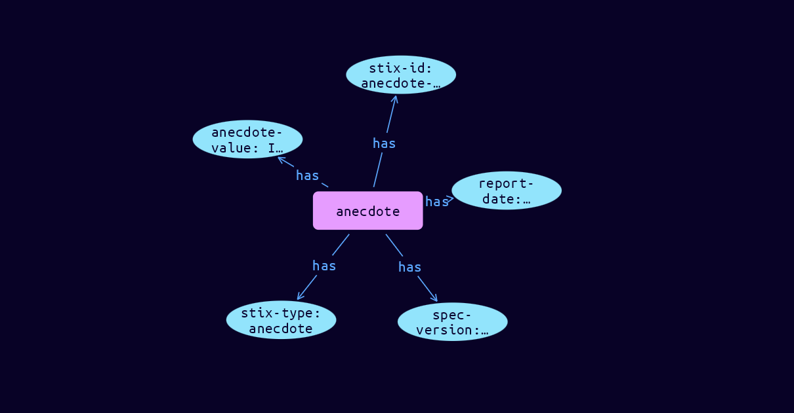

# Anecdote Cyber Observable Object

**Stix and TypeQL Object Type:**  `anecdote`

Anecdotes are reports provided by people that can relate to Events or Impacts. Anecdote SCO's record these details, connecting the identity of the reporter, the date of the report and the text provided.

The Anecdote SCO must be accompanied by a definition extension, which MUST use extension-definition--23676abf-481e-4fee-ac8c-e3d0947287a4 as its extension ID. The definition extension Python class name is AnecdoteExt.

[Reference in Stix2.1 Standard](https://github.com/os-threat/cti-stix-common-objects/blob/main/extension-definition-specifications/incident-core/Incident%20Extension%20Suite.adoc)
## Stix 2.1 Properties Converted to TypeQL
Mapping of the Stix Attack Pattern Properties to TypeDB

|  Stix 2.1 Property    |           Schema Name             | Required  Optional  |      Schema Object Type | Schema Parent  |
|:--------------------|:--------------------------------:|:------------------:|:------------------------:|:-------------:|
|  type                 |            stix-type              |      Required       |  stix-attribute-string    |   attribute    |
|  id                   |             stix-id               |      Required       |  stix-attribute-string    |   attribute    |
|  spec_version         |           spec-version            |      Optional       |  stix-attribute-string    |   attribute    |
| value |anecdote-value |      Optional       |  stix-attribute-string    |   attribute    |
| report_date |report-date |      Optional       |  stix-attribute-timestring    |   attribute    |
| provided_by_ref |provided-by:ancdote |      Optional       |   embedded     |relation |
|  object_marking_refs  |      object-marking:marked        |      Optional       |   embedded     |relation |
|  granular_markings    |     granular-marking:marked       |      Optional       |   embedded     |relation |
| defanged |defanged |      Optional       |stix-attribute-boolean |   attribute    |
|  extensions           |               n/a                 |        n/a          |           n/a             |      n/a       |

## The Example Anecdote in JSON
The original JSON, accessible in the Python environment
```json
{
    "type": "anecdote",
    "spec_version": "2.1",
    "id": "anecdote--e1298bc0-818e-5cdb-9154-eac37c8e260f",
    "value": "I clicked on the link, and my laptop screen went weird",
    "report_date": "2023-11-11T08:45:49.830466Z",
    "provided_by_ref": "identity--c4c6142e-8abe-475c-b71f-7b16b26b6607"
}
```


## Inserting the Example Anecdote in TypeQL
The TypeQL insert statement
```typeql
insert $anecdote isa anecdote,
 has stix-type $stix-type,
 has spec-version $spec-version,
 has stix-id $stix-id,
 has anecdote-value $anecdote-value,
 has report-date $report-date;

 $stix-type "anecdote";
 $spec-version "2.1";
 $stix-id "anecdote--e1298bc0-818e-5cdb-9154-eac37c8e260f";
 $anecdote-value "I clicked on the link, and my laptop screen went weird";
 $report-date 2023-11-11T08:45:49.830;
```

## Retrieving the Example Anecdote in TypeQL
The typeQL match statement

```typeql
match 
   $a isa event, 
      has stix-id  "event--4d721ce9-5c74-4c02-9f7d-7c393dd302cd",
      has $b;
   $c isa sighting;
   $d (owner:$a, pointed-to:$c) isa embedded;
   $e isa stix-sub-object,
      has $f;
   $g (owner:$a, pointed-to:$e) isa embedded;
```


will retrieve the example attack-pattern object in Vaticle Studio


## Retrieving the Example Anecdote  in Python
The Python retrieval statement

```python
from stixorm.module.typedb import TypeDBSink, TypeDBSource
connection = {
    "uri": "localhost",
    "port": "1729",
    "database": "stix",
    "user": None,
    "password": None
}

import_type = {
    "STIX21": True,
    "CVE": False,
    "identity": False,
    "location": False,
    "rules": False,
    "ATT&CK": False,
    "ATT&CK_Versions": ["12.0"],
    "ATT&CK_Domains": ["enterprise-attack", "mobile-attack", "ics-attack"],
    "CACAO": False
}

typedb = TypeDBSource(connection, import_type)
stix_obj = typedb.get("anecdote--e1298bc0-818e-5cdb-9154-eac37c8e260f")
```

 

[Back to OS-Threat Stix Extensions Overview](../overview.md)
 

[Back to All Protocols Overview](../../overview.md)
 

[Back to Overview Doc](../../../overview.md)
