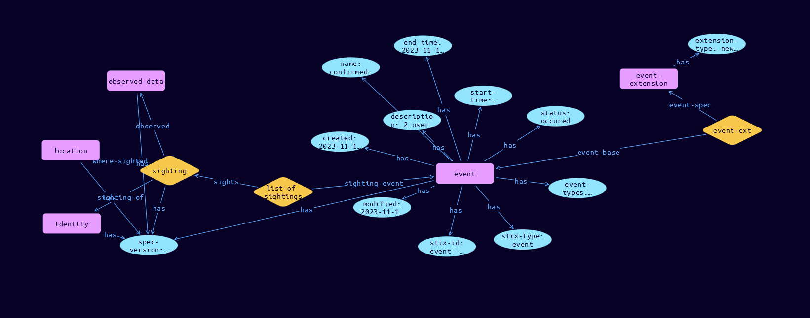

# Event Domain Object

**Stix and TypeQL Object Type:**  `event`

Events are created by Sightings of suspicious or malicious activity on systems. Sightings are the footprint of malicious activity, whereas Events are the occurrence. Events integrate the start and end time, the number and type of changed objects, the goal and description to the Sightings.

The Event SDO are organised in serial, and parallel sequences by the Sequence SDO. The Event SDO must be accompanied by a definition extension, which MUST use extension-definition—?4ca6de00-5b0d-45ef-a1dc-ea7279ea910e as its extension ID. The definition extension Python class name is EventCoreExt.

[Reference in Stix2.1 Standard](https://github.com/os-threat/cti-stix-common-objects/blob/main/extension-definition-specifications/incident-core/Incident%20Extension%20Suite.adoc)
## Stix 2.1 Properties Converted to TypeQL
Mapping of the Stix Attack Pattern Properties to TypeDB

|  Stix 2.1 Property    |           Schema Name             | Required  Optional  |      Schema Object  Type | Schema Parent  |
|:--------------------|:--------------------------------:|:------------------:|:------------------------:|:-------------:|
|  type                 |            stix-type              |      Required       |  stix-attribute-string    |   attribute    |
|  id                   |             stix-id               |      Required       |  stix-attribute-string    |   attribute    |
|  spec_version         |           spec-version            |      Required       |  stix-attribute-string    |   attribute    |
|  created              |             created               |      Required       | stix-attribute-timestamp  |   attribute    |
|  modified             |             modified              |      Required       | stix-attribute-timestamp  |   attribute    |
| name |               name                |      Required       |  stix-attribute-string    |   attribute    |
|  description          |           description             |      Optional       |  stix-attribute-string    |   attribute    |
| changed_objects |objects-changed:change-driver |      Optional       |embedded |relation |
| end_time |end-time |      Optional       | stix-attribute-timestamp  |   attribute    |
| end_time_fidelity |end-time-fidelity |      Optional       |  stix-attribute-string    |   attribute    |
| event_types |event-types |      Optional       |  stix-attribute-string    |   attribute    |
| goal |goal |      Optional       |  stix-attribute-string    |   attribute    |
| status |status |Required |  stix-attribute-string    |   attribute    |
| sighting_refs |list-of-sightings:sighting-event |      Optional       |embedded |relation |
| start_time |start-time |      Optional       | stix-attribute-timestamp  |   attribute    |
| start_time_fidelity |start-time-fidelity |      Optional       |  stix-attribute-string    |   attribute    |
|  kill_chain_phases    | kill-chain-usage:kill-chain-used  |      Optional       |   embedded     |relation |
|  created_by_ref       |        created-by:created         |      Optional       |   embedded     |relation |
|  revoked              |             revoked               |      Optional       |  stix-attribute-boolean   |   attribute    |
|  labels               |              labels               |      Optional       |  stix-attribute-string    |   attribute    |
|  confidence           |            confidence             |      Optional       |  stix-attribute-integer   |   attribute    |
|  lang                 |               lang                |      Optional       |  stix-attribute-string    |   attribute    |
|  external_references  | external-references:referencing   |      Optional       |   embedded     |relation |
|  object_marking_refs  |      object-marking:marked        |      Optional       |   embedded     |relation |
|  granular_markings    |     granular-marking:marked       |      Optional       |   embedded     |relation |
|  extensions           |               n/a                 |        n/a          |           n/a             |      n/a       |

## The Example Event in JSON
The original JSON, accessible in the Python environment
```json
{
    "type": "event",
    "spec_version": "2.1",
    "id": "event--4d721ce9-5c74-4c02-9f7d-7c393dd302cd",
    "created": "2023-11-11T08:45:49.891973Z",
    "modified": "2023-11-11T08:45:49.891973Z",
    "status": "occured",
    "description": "2 users clicked on the email and destroyed their laptops",
    "end_time": "2023-11-11T08:45:49.891973Z",
    "event_types": [
          "dissemination-phishing-emails"
    ],
    "name": "confirmed impact",
    "sighting_refs": [
          "sighting--6a371768-38f7-4e78-8f8b-f2bf2c61124d"
    ],
    "start_time": "2023-11-11T08:45:49.891973Z",
    "extensions": {
          "extension-definition--4ca6de00-5b0d-45ef-a1dc-ea7279ea910e": {
                "extension_type": "new-sdo"
          }
    }
}
```


## Inserting the Example Event in TypeQL
The TypeQL insert statement
```typeql
match  $sighting00 isa sighting, has stix-id "sighting--6a371768-38f7-4e78-8f8b-f2bf2c61124d";
insert $event isa event,
 has stix-type $stix-type,
 has spec-version $spec-version,
 has stix-id $stix-id,
 has created $created,
 has modified $modified,
 has status $status,
 has description $description,
 has end-time $end-time,
 has event-types $event_types0,
 has name $name,
 has start-time $start-time;

 $stix-type "event";
 $spec-version "2.1";
 $stix-id "event--4d721ce9-5c74-4c02-9f7d-7c393dd302cd";
 $created 2023-11-11T08:45:49.891;
 $modified 2023-11-11T08:45:49.891;
 $status "occured";
 $description "2 users clicked on the email and destroyed their laptops";
 $end-time 2023-11-11T08:45:49.891;
 $event_types0 "dissemination-phishing-emails";
 $name "confirmed impact";
 $start-time 2023-11-11T08:45:49.891;


 $list-of-sightings0 (sighting-event:$event, sights:$sighting00) isa list-of-sightings;
 $event-extension isa event-extension,
 has extension-type $extension-type;

 $extension-type "new-sdo";

 $event-ext0 (event-base:$event, event-spec:$event-extension) isa event-ext;
```

## Retrieving the Example Event in TypeQL
The typeQL match statement

```typeql
match 
   $a isa event, 
      has stix-id  "event--4d721ce9-5c74-4c02-9f7d-7c393dd302cd",
      has $b;
   $c isa sighting;
   $d (owner:$a, pointed-to:$c) isa embedded;
   $e isa stix-sub-object,
      has $f;
   $g (owner:$a, pointed-to:$e) isa embedded;
```


will retrieve the example attack-pattern object in Vaticle Studio


## Retrieving the Example Event  in Python
The Python retrieval statement

```python
from stixorm.module.typedb import TypeDBSink, TypeDBSource
connection = {
    "uri": "localhost",
    "port": "1729",
    "database": "stix",
    "user": None,
    "password": None
}

import_type = {
    "STIX21": True,
    "CVE": False,
    "identity": False,
    "location": False,
    "rules": False,
    "ATT&CK": False,
    "ATT&CK_Versions": ["12.0"],
    "ATT&CK_Domains": ["enterprise-attack", "mobile-attack", "ics-attack"],
    "CACAO": False
}

typedb = TypeDBSource(connection, import_type)
stix_obj = typedb.get("event--4d721ce9-5c74-4c02-9f7d-7c393dd302cd")
```

 

[Back to OS-Threat Stix Extensions Overview](../overview.md)
 

[Back to All Protocols Overview](../../overview.md)
 

[Back to Overview Doc](../../../overview.md)
