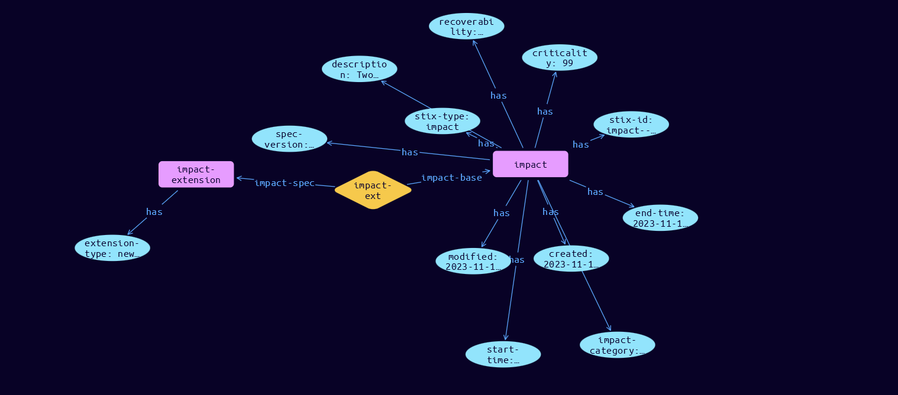

# Impact Domain Object

**Stix and TypeQL Object Type:**  `impact`

Incidents have Impacts that change over time. Events can cause or influence these Impacts which are in turn mitigated and potentially resolved by tasks performed as part of the incident response process.Change in Impacts over time is recorded in state-change sub-objects within Tasks or Event definitions

The Impact SDO is currently an extension, but as there are many specific types of impacts with their own unique properties it emulates the File SCO through the use of STIX Extensions to provide the granular details of specific categories of impacts. As such every Impact MUST have an extension that has the same value of the impact_category property (Availability, Confidentiality, External, Integrity, Monetary, Physical or Traceability). This allows consumers to quickly validate their ability to process this category of impact and then load all of its specific details. The Impact SDO must be accopanied by its definition extension, which MUST use extension-definition—?7cc33dd6-f6a1-489b-98ea-522d351d71b9 as its extension ID. The definition extension Python class name is ImpactCoreExt.

[Reference in Stix2.1 Standard](https://github.com/os-threat/cti-stix-common-objects/blob/main/extension-definition-specifications/incident-core/Incident%20Extension%20Suite.adoc)
## Stix 2.1 Properties Converted to TypeQL
Mapping of the Stix Attack Pattern Properties to TypeDB

|  Stix 2.1 Property    |           Schema Name             | Required  Optional  |      Schema Object  Type | Schema Parent  |
|:--------------------|:--------------------------------:|:------------------:|:------------------------:|:-------------:|
|  type                 |            stix-type              |      Required       |  stix-attribute-string    |   attribute    |
|  id                   |             stix-id               |      Required       |  stix-attribute-string    |   attribute    |
|  spec_version         |           spec-version            |      Required       |  stix-attribute-string    |   attribute    |
|  created              |             created               |      Required       | stix-attribute-timestamp  |   attribute    |
|  modified             |             modified              |      Required       | stix-attribute-timestamp  |   attribute    |
| impact_category |               impact-category                |      Required       |  stix-attribute-string    |   attribute    |
| criticality |criticality |      Optional       |  stix-attribute-integer    |   attribute    |
| end_time |end-time |      Optional       | stix-attribute-timestamp  |   attribute    |
| end_time_fidelity |end-time-fidelity |      Optional       |  stix-attribute-string    |   attribute    |
| impacted_entity_counts |impact-counter:impact-driver |      Optional       |embedded |relation |
| impacted_refs |impacted-refs:the-impact |      Optional       |embedded |relation |
| recoverability |recoverability |      Optional       |  stix-attribute-integer    |   attribute    |
| start_time |start-time |      Optional       | stix-attribute-timestamp  |   attribute    |
| start_time_fidelity |start-time-fidelity |      Optional       |  stix-attribute-string    |   attribute    |
|  kill_chain_phases    | kill-chain-usage:kill-chain-used  |      Optional       |   embedded     |relation |
|  created_by_ref       |        created-by:created         |      Optional       |   embedded     |relation |
|  revoked              |             revoked               |      Optional       |  stix-attribute-boolean   |   attribute    |
|  labels               |              labels               |      Optional       |  stix-attribute-string    |   attribute    |
|  confidence           |            confidence             |      Optional       |  stix-attribute-integer   |   attribute    |
|  lang                 |               lang                |      Optional       |  stix-attribute-string    |   attribute    |
|  external_references  | external-references:referencing   |      Optional       |   embedded     |relation |
|  object_marking_refs  |      object-marking:marked        |      Optional       |   embedded     |relation |
|  granular_markings    |     granular-marking:marked       |      Optional       |   embedded     |relation |
|  extensions           |               n/a                 |        n/a          |           n/a             |      n/a       |

## The Example Impact in JSON
The original JSON, accessible in the Python environment
```json
{
    "type": "impact",
    "spec_version": "2.1",
    "id": "impact--22f44c3f-7af8-4bdd-9ce8-eda54209acc9",
    "created": "2023-11-11T08:45:49.902967Z",
    "modified": "2023-11-11T08:45:49.902967Z",
    "impact_category": "availability",
    "criticality": 99,
    "description": "Two Laptops and 3 Servers are stuffed",
    "end_time": "2023-11-11T08:45:49.902967Z",
    "impacted_entity_counts": {
          "computers-personal": 2,
          "computers-server": 3
    },
    "recoverability": "regular",
    "start_time": "2023-11-11T08:45:49.902967Z",
    "extensions": {
          "extension-definition--7cc33dd6-f6a1-489b-98ea-522d351d71b9": {
                "extension_type": "new-sdo"
          }
    }
}
```


## Inserting the Example Impact in TypeQL
The TypeQL insert statement
```typeql
insert $impact isa impact,
 has stix-type $stix-type,
 has spec-version $spec-version,
 has stix-id $stix-id,
 has created $created,
 has modified $modified,
 has impact-category $impact-category,
 has criticality $criticality,
 has description $description,
 has end-time $end-time,
 has recoverability $recoverability,
 has start-time $start-time;

 $stix-type "impact";
 $spec-version "2.1";
 $stix-id "impact--22f44c3f-7af8-4bdd-9ce8-eda54209acc9";
 $created 2023-11-11T08:45:49.902;
 $modified 2023-11-11T08:45:49.902;
 $impact-category "availability";
 $criticality 99;
 $description "Two Laptops and 3 Servers are stuffed";
 $end-time 2023-11-11T08:45:49.902;
 $recoverability "regular";
 $start-time 2023-11-11T08:45:49.902;


 $entity-key0 isa entity-key;  $entity-key0 "computers-personal";
 $entity-key0 has entity-value 2;
 $entity-key1 isa entity-key;  $entity-key1 "computers-server";
 $entity-key1 has entity-value 3;
 $impact-counter (impact-driver:$impact, counters: $entity-key0, counters: $entity-key1) isa impact-counter;

 $impact-extension isa impact-extension,
 has extension-type $extension-type;

 $extension-type "new-sdo";

 $impact-ext0 (impact-base:$impact, impact-spec:$impact-extension) isa impact-ext;
```

## Retrieving the Example Impact in TypeQL
The typeQL match statement

```typeql
match 
   $a isa impact, 
      has stix-id  "impact--22f44c3f-7af8-4bdd-9ce8-eda54209acc9",
      has $b;
   $c isa stix-sub-object,
      has extension-type $d;
   $e (owner:$a, pointed-to:$c) isa embedded;
```


will retrieve the example attack-pattern object in Vaticle Studio


## Retrieving the Example Impact  in Python
The Python retrieval statement

```python
from stixorm.module.typedb import TypeDBSink, TypeDBSource
connection = {
    "uri": "localhost",
    "port": "1729",
    "database": "stix",
    "user": None,
    "password": None
}

import_type = {
    "STIX21": True,
    "CVE": False,
    "identity": False,
    "location": False,
    "rules": False,
    "ATT&CK": False,
    "ATT&CK_Versions": ["12.0"],
    "ATT&CK_Domains": ["enterprise-attack", "mobile-attack", "ics-attack"],
    "CACAO": False
}

typedb = TypeDBSource(connection, import_type)
stix_obj = typedb.get("impact--22f44c3f-7af8-4bdd-9ce8-eda54209acc9")
```

 

[Back to OS-Threat Stix Extensions Overview](../overview.md)
 

[Back to All Protocols Overview](../../overview.md)
 

[Back to Overview Doc](../../../overview.md)
