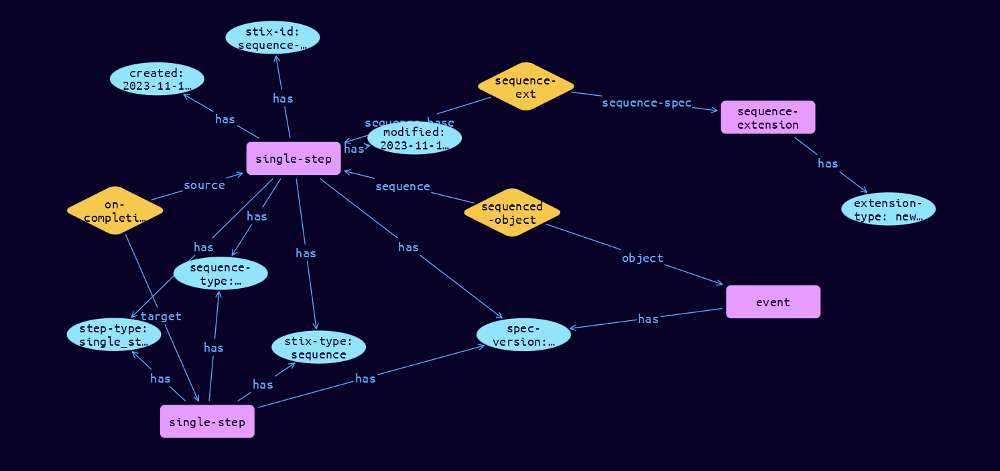

# Sequence Domain Object

**Stix and TypeQL Object Type:**  `sequence`

The Sequence SDO representes the sequencing of Events or Tasks, using the CACAO approach. Each Sequence object must be of a specific sequence_type (event or task) and step_type (start_step, single-step, parallel_step, end_step). Then the usage of the on_completion, on_succes/on_failure, or next_steps fields are the same as CACAO. Single-step Sequences then link to an event or task viz the sequenced_object field.

The Sequence SDO is represented in TypeDB by four different types, with an automatic conversion.

[Reference in Stix2.1 Standard](https://github.com/os-threat/cti-stix-common-objects/blob/main/extension-definition-specifications/incident-core/Incident%20Extension%20Suite.adoc)
## Stix 2.1 Properties Converted to TypeQL
Mapping of the Stix Attack Pattern Properties to TypeDB

|  Stix 2.1 Property    |           Schema Name             | Required  Optional  |      Schema Object  Type | Schema Parent  |
|:--------------------|:--------------------------------:|:------------------:|:------------------------:|:-------------:|
|  type                 |            stix-type              |      Required       |  stix-attribute-string    |   attribute    |
|  id                   |             stix-id               |      Required       |  stix-attribute-string    |   attribute    |
|  spec_version         |           spec-version            |      Required       |  stix-attribute-string    |   attribute    |
|  created              |             created               |      Required       | stix-attribute-timestamp  |   attribute    |
|  modified             |             modified              |      Required       | stix-attribute-timestamp  |   attribute    |
| sequence_type |          sequence-type        |      Required       |  stix-attribute-string    |   attribute    |
| step_type |step-type |      Optional       |  stix-attribute-string    |   attribute    |
| on_completion |on-completion:source, on-completion:target |      Optional       |embedded |relation |
| on_success |on-success:source, on-success:target |      Optional       |embedded |relation |
| on_failure |on-failure:source, on-failure:target |      Optional       |embedded |relation |
| next_steps |next-steps:source, next-steps:target |      Optional       |embedded |relation |
|  kill_chain_phases    | kill-chain-usage:kill-chain-used  |      Optional       |   embedded     |relation |
|  created_by_ref       |        created-by:created         |      Optional       |   embedded     |relation |
|  revoked              |             revoked               |      Optional       |  stix-attribute-boolean   |   attribute    |
|  labels               |              labels               |      Optional       |  stix-attribute-string    |   attribute    |
|  confidence           |            confidence             |      Optional       |  stix-attribute-integer   |   attribute    |
|  lang                 |               lang                |      Optional       |  stix-attribute-string    |   attribute    |
|  external_references  | external-references:referencing   |      Optional       |   embedded     |relation |
|  object_marking_refs  |      object-marking:marked        |      Optional       |   embedded     |relation |
|  granular_markings    |     granular-marking:marked       |      Optional       |   embedded     |relation |
|  extensions           |               n/a                 |        n/a          |           n/a             |      n/a       |

## The Example Sequence in JSON
The original JSON, accessible in the Python environment
```json
{
    "type": "sequence",
    "spec_version": "2.1",
    "id": "sequence--4e3f8028-8c05-437b-b8e7-dfe2aa381b25",
    "created": "2023-11-11T08:45:49.815448Z",
    "modified": "2023-11-11T08:45:49.815448Z",
    "sequenced_object": "event--033a2353-d23e-462c-810e-8d88a36386c6",
    "sequence_type": "event",
    "step_type": "single_step",
    "extensions": {
          "extension-definition--be0c7c79-1961-43db-afde-637066a87a64": {
                "extension_type": "new-sdo"
          }
    },
    "on_completion": "sequence--13d9271c-d96b-40e4-bb66-a2f297c03c07"
}
```


## Inserting the Example Sequence in TypeQL
The TypeQL insert statement
```typeql
match  $event0 isa event, has stix-id "event--033a2353-d23e-462c-810e-8d88a36386c6";
 $sequence1 isa sequence, has stix-id "sequence--13d9271c-d96b-40e4-bb66-a2f297c03c07";
insert $single-step isa single-step,
 has stix-type $stix-type,
 has spec-version $spec-version,
 has stix-id $stix-id,
 has created $created,
 has modified $modified,
 has sequence-type $sequence-type,
 has step-type $step-type;

 $stix-type "sequence";
 $spec-version "2.1";
 $stix-id "sequence--4e3f8028-8c05-437b-b8e7-dfe2aa381b25";
 $created 2023-11-11T08:45:49.815;
 $modified 2023-11-11T08:45:49.815;
 $sequence-type "event";
 $step-type "single_step";


 $sequenced-object0 (sequence:$single-step, object:$event0) isa sequenced-object;

 $on-completion1 (source:$single-step, target:$sequence1) isa on-completion;
 $sequence-extension isa sequence-extension,
 has extension-type $extension-type;

 $extension-type "new-sdo";

 $sequence-ext0 (sequence-base:$single-step, sequence-spec:$sequence-extension) isa sequence-ext;
```

## Retrieving the Example Sequence in TypeQL
The typeQL match statement

```typeql
match 
   $a isa sequence, 
      has stix-id  "sequence--4e3f8028-8c05-437b-b8e7-dfe2aa381b25",
      has $b;
   $c isa stix-sub-object,
      has $d;
   $e (owner:$a, pointed-to:$c) isa embedded;
   $f isa stix-domain-object;
   $g (owner:$a, pointed-to:$f) isa embedded;
```


will retrieve the example attack-pattern object in Vaticle Studio


## Retrieving the Example Sequence  in Python
The Python retrieval statement

```python
from stixorm.module.typedb import TypeDBSink, TypeDBSource
connection = {
    "uri": "localhost",
    "port": "1729",
    "database": "stix",
    "user": None,
    "password": None
}

import_type = {
    "STIX21": True,
    "CVE": False,
    "identity": False,
    "location": False,
    "rules": False,
    "ATT&CK": False,
    "ATT&CK_Versions": ["12.0"],
    "ATT&CK_Domains": ["enterprise-attack", "mobile-attack", "ics-attack"],
    "CACAO": False
}

typedb = TypeDBSource(connection, import_type)
stix_obj = typedb.get("sequence--4e3f8028-8c05-437b-b8e7-dfe2aa381b25")
```

 

[Back to OS-Threat Stix Extensions Overview](../overview.md)
 

[Back to All Protocols Overview](../../overview.md)
 

[Back to Overview Doc](../../../overview.md)
