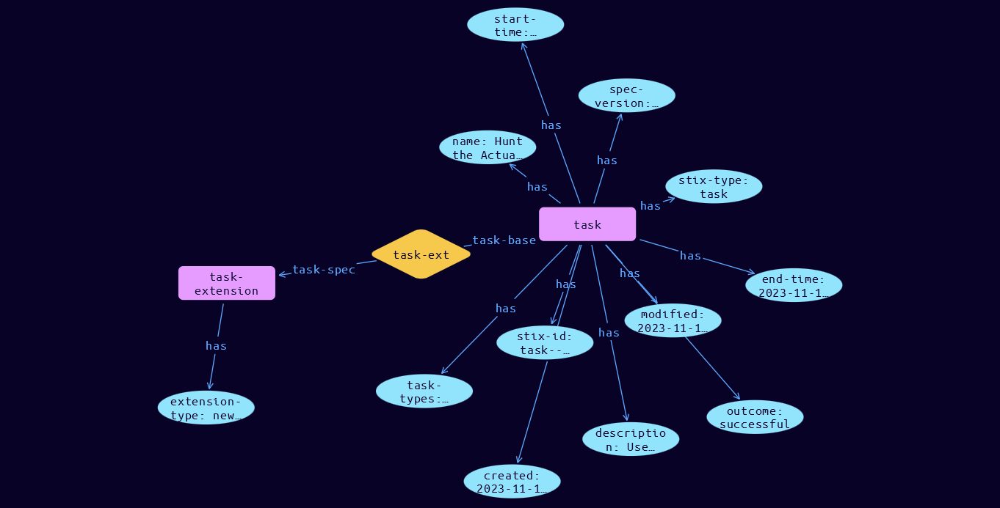

# Task Domain Object

**Stix and TypeQL Object Type:**  `task`

Tasks represent the work element needed to respond to, qualify and remediate Events and Impacts within an Incident

The Task SDO's can be arranged in serial or parallel sequences, which enable chaining to be either on-completion, or on-success/on-failure (XOR), or in next-steps (parallel AND). The Task SDO must be accompanied by its definition extension MUST use extension-definition—?2074a052-8be4-4932-849e-f5e7798e0030 as its extension ID. The definition extension Python class name is TaskCoreExt.

[Reference in Stix2.1 Standard](https://github.com/os-threat/cti-stix-common-objects/blob/main/extension-definition-specifications/incident-core/Incident%20Extension%20Suite.adoc)
## Stix 2.1 Properties Converted to TypeQL
Mapping of the Stix Attack Pattern Properties to TypeDB

|  Stix 2.1 Property    |           Schema Name             | Required  Optional  |      Schema Object  Type | Schema Parent  |
|:--------------------|:--------------------------------:|:------------------:|:------------------------:|:-------------:|
|  type                 |            stix-type              |      Required       |  stix-attribute-string    |   attribute    |
|  id                   |             stix-id               |      Required       |  stix-attribute-string    |   attribute    |
|  spec_version         |           spec-version            |      Required       |  stix-attribute-string    |   attribute    |
|  created              |             created               |      Required       | stix-attribute-timestamp  |   attribute    |
|  modified             |             modified              |      Required       | stix-attribute-timestamp  |   attribute    |
|                name                |               name                |      Required       |  stix-attribute-string    |   attribute    |
| task_types |task-types |      Optional       |  stix-attribute-string    |   attribute    |
|  description          |           description             |      Optional       |  stix-attribute-string    |   attribute    |
| changed_objects |objects-changed:change-driver |      Optional       |embedded |relation |
| end_time |end-time |      Optional       | stix-attribute-timestamp  |   attribute    |
| end_time_fidelity |end-time-fidelity |      Optional       |  stix-attribute-string    |   attribute    |
| error |error |      Optional       |  stix-attribute-string    |   attribute    |
| impacted_entity_counts |impact-counter:impact-driver |      Optional       |embedded |relation |
| priority |int-priority |      Optional       |  stix-attribute-integer    |   attribute    |
| owner |owned-by:owned |Required |embedded |relation |
| start_time |start-time |      Optional       | stix-attribute-timestamp  |   attribute    |
| start_time_fidelity |start-time-fidelity |      Optional       |  stix-attribute-string    |   attribute    |
|  kill_chain_phases    | kill-chain-usage:kill-chain-used  |      Optional       |   embedded     |relation |
|  created_by_ref       |        created-by:created         |      Optional       |   embedded     |relation |
|  revoked              |             revoked               |      Optional       |  stix-attribute-boolean   |   attribute    |
|  labels               |              labels               |      Optional       |  stix-attribute-string    |   attribute    |
|  confidence           |            confidence             |      Optional       |  stix-attribute-integer   |   attribute    |
|  lang                 |               lang                |      Optional       |  stix-attribute-string    |   attribute    |
|  external_references  | external-references:referencing   |      Optional       |   embedded     |relation |
|  object_marking_refs  |      object-marking:marked        |      Optional       |   embedded     |relation |
|  granular_markings    |     granular-marking:marked       |      Optional       |   embedded     |relation |
|  extensions           |               n/a                 |        n/a          |           n/a             |      n/a       |

## The Example Task in JSON
The original JSON, accessible in the Python environment
```json
{
    "type": "task",
    "spec_version": "2.1",
    "id": "task--1bf67e27-9601-4125-8202-36f9212274d1",
    "created": "2023-11-11T08:45:49.875973Z",
    "modified": "2023-11-11T08:45:49.875973Z",
    "task_types": [
          "investigation"
    ],
    "outcome": "successful",
    "description": "Use Hunting to determine how many clicked the link, and what impact it caused",
    "end_time": "2023-11-11T08:45:49.875973Z",
    "name": "Hunt the Actual Impact",
    "start_time": "2023-11-11T08:45:49.875973Z",
    "owner": "identity--ed339e4e-7514-4684-ad80-e4256b40980d",
    "extensions": {
          "extension-definition--2074a052-8be4-4932-849e-f5e7798e0030": {
                "extension_type": "new-sdo"
          }
    }
}
```


## Inserting the Example Task in TypeQL
The TypeQL insert statement
```typeql
match  $identity0 isa identity, has stix-id "identity--ed339e4e-7514-4684-ad80-e4256b40980d";
insert $task isa task,
 has stix-type $stix-type,
 has spec-version $spec-version,
 has stix-id $stix-id,
 has created $created,
 has modified $modified,
 has task-types $task_types0,
 has outcome $outcome,
 has description $description,
 has end-time $end-time,
 has name $name,
 has start-time $start-time;

 $stix-type "task";
 $spec-version "2.1";
 $stix-id "task--1bf67e27-9601-4125-8202-36f9212274d1";
 $created 2023-11-11T08:45:49.875;
 $modified 2023-11-11T08:45:49.875;
 $task_types0 "investigation";
 $outcome "successful";
 $description "Use Hunting to determine how many clicked the link, and what impact it caused";
 $end-time 2023-11-11T08:45:49.875;
 $name "Hunt the Actual Impact";
 $start-time 2023-11-11T08:45:49.875;


 $owned-by0 (owned:$task, who:$identity0) isa owned-by;
 $task-extension isa task-extension,
 has extension-type $extension-type;

 $extension-type "new-sdo";

 $task-ext0 (task-base:$task, task-spec:$task-extension) isa task-ext;
```

## Retrieving the Example Task in TypeQL
The typeQL match statement

```typeql
match 
   $a isa task, 
      has stix-id  "task--1bf67e27-9601-4125-8202-36f9212274d1",
      has $b;
   $c isa stix-sub-object,
      has $d;
   $e (owner:$a, pointed-to:$c) isa embedded;
```


will retrieve the example attack-pattern object in Vaticle Studio


## Retrieving the Example Task  in Python
The Python retrieval statement

```python
from stixorm.module.typedb import TypeDBSink, TypeDBSource
connection = {
    "uri": "localhost",
    "port": "1729",
    "database": "stix",
    "user": None,
    "password": None
}

import_type = {
    "STIX21": True,
    "CVE": False,
    "identity": False,
    "location": False,
    "rules": False,
    "ATT&CK": False,
    "ATT&CK_Versions": ["12.0"],
    "ATT&CK_Domains": ["enterprise-attack", "mobile-attack", "ics-attack"],
    "CACAO": False
}

typedb = TypeDBSource(connection, import_type)
stix_obj = typedb.get("task--1bf67e27-9601-4125-8202-36f9212274d1")
```

 

[Back to OS-Threat Stix Extensions Overview](../overview.md)
 

[Back to All Protocols Overview](../../overview.md)
 

[Back to Overview Doc](../../../overview.md)
