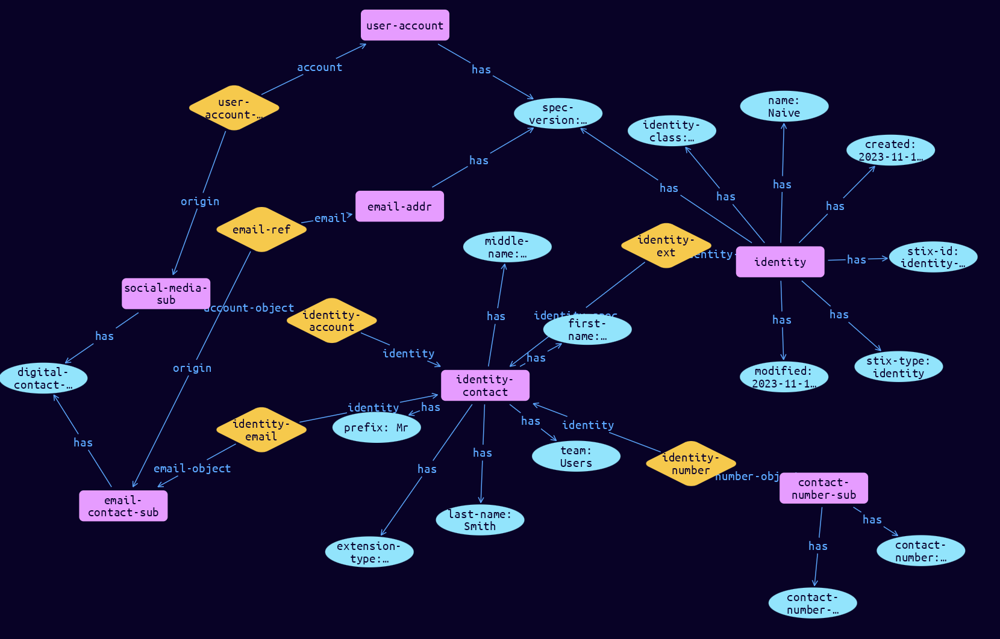

# Identity-Contact Extension Object

**Stix and TypeQL Object Type:**  `extension-definition--66e2492a-bbd3-4be6-88f5-cc91a017a498`

The current STIX 2.1 Identity object only contains a single text field for contact information. This is insufficient to effectively move contact information for individuals between automated systems. This extension adds more granular tracking so that this can be effectively communicated between systems.

The properties and additional types within the Identity Contact Information Extension are defined below.The Python class name is IdentityContact.  As this is not a top-level object, fields such as identifier are not present. This extension should be mapped to extension-definition--66e2492a-bbd3-4be6-88f5-cc91a017a498

[Reference in Stix2.1 Standard](https://github.com/os-threat/cti-stix-common-objects/tree/main/extension-definition-specifications/identity-contact-information)
## Stix 2.1 Properties Converted to TypeQL
Mapping of the Stix Attack Pattern Properties to TypeDB

|  Stix 2.1 Property    |           Schema Name             | Required  Optional  |      Schema Object Type | Schema Parent  |
|:--------------------|:--------------------------------:|:------------------:|:------------------------:|:-------------:|
| extension_type |extension-type |Required |  stix-attribute-string    |   attribute    |
| contact_numbers |identity-number:identity |Optional |embedded |relation |
| email_addresses |identity-email:identity |Optional |embedded |relation |
| first_name |first-name |Optional |  stix-attribute-string    |   attribute    |
| last_name |last-name |Optional |  stix-attribute-string    |   attribute    |
| middle_name |middle-name |Optional |  stix-attribute-string    |   attribute    |
| prefix |prefix |Optional |  stix-attribute-string    |   attribute    |
| social_media_accounts |identity-account:identity |Optional |embedded |relation |
| suffix |suffix |Optional |  stix-attribute-string    |   attribute    |
| team |team |Optional |  stix-attribute-string    |   attribute    |

## The Example Identity-Contact in JSON
The original JSON, accessible in the Python environment
```json
{
    "type": "identity",
    "spec_version": "2.1",
    "id": "identity--27c2fdc0-bf9c-46d8-aab1-658948cd2ed6",
    "created": "2023-11-12T13:19:14.244241Z",
    "modified": "2023-11-12T13:19:14.244241Z",
    "name": "Naive",
    "identity_class": "individual",
    "extensions": {
          "extension-definition--66e2492a-bbd3-4be6-88f5-cc91a017a498": {
                "extension_type": "property-extension",
                "contact_numbers": [
                      {
                            "contact_number_type": "work-phone",
                            "contact_number": "0499-999-109"
                      }
                ],
                "email_addresses": [
                      {
                            "digital_contact_type": "work",
                            "email_address_ref": "email-addr--df33039b-3a3c-5653-9cd1-13923a63fcba"
                      }
                ],
                "first_name": "Naive",
                "last_name": "Smith",
                "middle_name": "Weakling",
                "prefix": "Mr",
                "social_media_accounts": [
                      {
                            "digital_contact_type": "work",
                            "user_account_ref": "user-account--41b2b7c4-6950-5d22-88e0-b376c93097d0"
                      }
                ],
                "team": "Users"
          }
    }
}
```


## Inserting the Example Identity-Contact in TypeQL
The TypeQL insert statement
```typeql
match  $email-addr0 isa email-addr, has stix-id "email-addr--df33039b-3a3c-5653-9cd1-13923a63fcba";
 $user-account0 isa user-account, has stix-id "user-account--41b2b7c4-6950-5d22-88e0-b376c93097d0";
insert $identity isa identity,
 has stix-type $stix-type,
 has spec-version $spec-version,
 has stix-id $stix-id,
 has created $created,
 has modified $modified,
 has name $name,
 has identity-class $identity-class;

 $stix-type "identity";
 $spec-version "2.1";
 $stix-id "identity--27c2fdc0-bf9c-46d8-aab1-658948cd2ed6";
 $created 2023-11-12T13:19:14.244;
 $modified 2023-11-12T13:19:14.244;
 $name "Naive";
 $identity-class "individual";

 $identity-contact isa identity-contact,
 has extension-type $extension-type,
 has first-name $first-name,
 has last-name $last-name,
 has middle-name $middle-name,
 has prefix $prefix,
 has team $team;

 $extension-type "property-extension";
 $first-name "Naive";
 $last-name "Smith";
 $middle-name "Weakling";
 $prefix "Mr";
 $team "Users";

 $identity-ext0 (identity-base:$identity, identity-spec:$identity-contact) isa identity-ext;


$contact-number-sub0 isa contact-number-sub,
 has contact-number "work-phone",
 has contact-number-type "0499-999-109";

 $identity-number (identity:$identity-contact, number-object:$contact-number-sub0) isa identity-number;

$email-contact-sub0 isa email-contact-sub,
 has digital-contact-type "work";

 $identity-email (identity:$identity-contact, email-object:$email-contact-sub0) isa identity-email;

 $email-ref0 (origin:$email-contact-sub0, email:$email-addr0) isa email-ref;

$social-media-sub0 isa social-media-sub,
 has digital-contact-type "work";

 $identity-account (identity:$identity-contact, account-object:$social-media-sub0) isa identity-account;

 $user-account-ref0 (origin:$social-media-sub0, account:$user-account0) isa user-account-ref;
```

## Retrieving the Example Identity-Contact in TypeQL
The typeQL match statement

```typeql
match
   $a isa identity,
      has stix-id "identity--27c2fdc0-bf9c-46d8-aab1-658948cd2ed6",
      has $b;
   $c isa stix-sub-object,
      has $d;
   $e (owner:$a, pointed-to:$c) isa embedded;
   $f isa stix-sub-object, 
      has $g;
   $h (owner:$c, pointed-to:$f) isa embedded;
   $i isa stix-sub-object,
      has $j;
   $k (owner:$c, pointed-to:$i) isa embedded;
   $l (owner:$i, pointed-to:$m) isa embedded;
   
```


will retrieve the example attack-pattern object in Vaticle Studio


## Retrieving the Example Identity-Contact  in Python
The Python retrieval statement

```python
from stixorm.module.typedb import TypeDBSink, TypeDBSource
connection = {
    "uri": "localhost",
    "port": "1729",
    "database": "stix",
    "user": None,
    "password": None
}

import_type = {
    "STIX21": True,
    "CVE": False,
    "identity": False,
    "location": False,
    "rules": False,
    "ATT&CK": False,
    "ATT&CK_Versions": ["12.0"],
    "ATT&CK_Domains": ["enterprise-attack", "mobile-attack", "ics-attack"],
    "CACAO": False
}

typedb = TypeDBSource(connection, import_type)
stix_obj = typedb.get("identity--27c2fdc0-bf9c-46d8-aab1-658948cd2ed6")
```

 

[Back to OS-Threat Stix Extensions Overview](../overview.md)
 

[Back to All Protocols Overview](../../overview.md)
 

[Back to Overview Doc](../../../overview.md)
