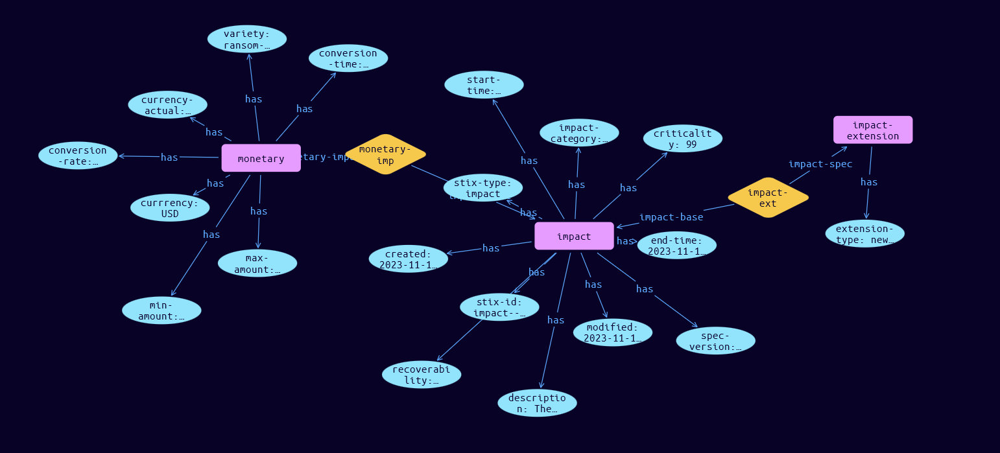

# Impact-Monetary Extension Object

**Stix and TypeQL Object Type:**  `monetary`

Every Impact MUST have an extension that has the same value of the impact_category. The Monetary Extension tracks the monetary impact, for example ransom amounts.

The Python class name for the Monetary Extension is Monetary. The Monetary extension MUST be accompanied by the extension-definition—?7cc33dd6-f6a1-489b-98ea-522d351d71b9 as its extension ID, with the Python class name of ImpactCoreExt..

[Reference in Stix2.1 Standard](https://github.com/os-threat/cti-stix-common-objects/blob/main/extension-definition-specifications/incident-core/Incident%20Extension%20Suite.adoc)
## Stix 2.1 Properties Converted to TypeQL
Mapping of the Stix Attack Pattern Properties to TypeDB

|  Stix 2.1 Property    |           Schema Name             | Required  Optional  |      Schema Object Type | Schema Parent  |
|:--------------------|:--------------------------------:|:------------------:|:------------------------:|:-------------:|
| variety |variety |Required |  stix-attribute-string    |   attribute    |
| conversion_rate |conversion-rate |Required |  stix-attribute-double    |   attribute    |
| conversion_time |conversion_time |Optional |  stix-attribute-timestamp    |   attribute    |
| currency |currency |Optional |  stix-attribute-string    |   attribute    |
| currency_actual |currency-actual |Optional |  stix-attribute-string    |   attribute    |
| max_amount |max-amount |Optional |  stix-attribute-double    |   attribute    |
| min_amount |min-amount |Optional |  stix-attribute-double    |   attribute    |

## The Example Impact-Monetary in JSON
The original JSON, accessible in the Python environment
```json
{
    "type": "impact",
    "spec_version": "2.1",
    "id": "impact--28106fd0-1952-4f76-9a5a-5e98a9eb6e7c",
    "created": "2023-11-11T08:45:49.919967Z",
    "modified": "2023-11-11T08:45:49.919967Z",
    "impact_category": "monetary",
    "criticality": 99,
    "description": "The ransom demands were significant",
    "end_time": "2023-11-11T08:45:49.919967Z",
    "impacted_entity_counts": {
          "computers-personal": 2
    },
    "recoverability": "regular",
    "start_time": "2023-11-11T08:45:49.919967Z",
    "extensions": {
          "extension-definition--7cc33dd6-f6a1-489b-98ea-522d351d71b9": {
                "extension_type": "new-sdo"
          },
          "monetary": {
                "variety": "ransom-demand",
                "conversion_rate": 1.538,
                "conversion_time": "2023-11-07T08:53:15.645995Z",
                "currency": "USD",
                "currency_actual": "AUD",
                "max_amount": 100000.0,
                "min_amount": 10000.0
          }
    }
}
```


## Inserting the Example Impact-Monetary in TypeQL
The TypeQL insert statement
```typeql
insert $impact isa impact,
 has stix-type $stix-type,
 has spec-version $spec-version,
 has stix-id $stix-id,
 has created $created,
 has modified $modified,
 has impact-category $impact-category,
 has criticality $criticality,
 has description $description,
 has end-time $end-time,
 has recoverability $recoverability,
 has start-time $start-time;

 $stix-type "impact";
 $spec-version "2.1";
 $stix-id "impact--28106fd0-1952-4f76-9a5a-5e98a9eb6e7c";
 $created 2023-11-11T08:45:49.919;
 $modified 2023-11-11T08:45:49.919;
 $impact-category "monetary";
 $criticality 99;
 $description "The ransom demands were significant";
 $end-time 2023-11-11T08:45:49.919;
 $recoverability "regular";
 $start-time 2023-11-11T08:45:49.919;


 $entity-key0 isa entity-key;  $entity-key0 "computers-personal";
 $entity-key0 has entity-value 2;
 $impact-counter (impact-driver:$impact, counters: $entity-key0) isa impact-counter;

 $impact-extension isa impact-extension,
 has extension-type $extension-type;

 $extension-type "new-sdo";

 $impact-ext0 (impact-base:$impact, impact-spec:$impact-extension) isa impact-ext;

 $monetary isa monetary,
 has variety $variety,
 has conversion-rate $conversion-rate,
 has conversion-time $conversion-time,
 has currrency $currrency,
 has currency-actual $currency-actual,
 has max-amount $max-amount,
 has min-amount $min-amount;

 $variety "ransom-demand";
 $conversion-rate 1.538;
 $conversion-time 2023-11-07T08:53:15.645;
 $currrency "USD";
 $currency-actual "AUD";
 $max-amount 100000.0;
 $min-amount 10000.0;

 $monetary-imp1 (impact-base:$impact, monetary-impact:$monetary) isa monetary-imp;
```

## Retrieving the Example Impact-Monetary in TypeQL
The typeQL match statement

```typeql
match 
   $a isa impact, 
      has stix-id  "impact--28106fd0-1952-4f76-9a5a-5e98a9eb6e7c",
      has $b;
   $c isa stix-sub-object,
      has $d;
   $e (owner:$a, pointed-to:$c) isa embedded;
```


will retrieve the example attack-pattern object in Vaticle Studio


## Retrieving the Example Impact-Monetary  in Python
The Python retrieval statement

```python
from stixorm.module.typedb import TypeDBSink, TypeDBSource
connection = {
    "uri": "localhost",
    "port": "1729",
    "database": "stix",
    "user": None,
    "password": None
}

import_type = {
    "STIX21": True,
    "CVE": False,
    "identity": False,
    "location": False,
    "rules": False,
    "ATT&CK": False,
    "ATT&CK_Versions": ["12.0"],
    "ATT&CK_Domains": ["enterprise-attack", "mobile-attack", "ics-attack"],
    "CACAO": False
}

typedb = TypeDBSource(connection, import_type)
stix_obj = typedb.get("impact--28106fd0-1952-4f76-9a5a-5e98a9eb6e7c")
```

 

[Back to OS-Threat Stix Extensions Overview](../overview.md)
 

[Back to All Protocols Overview](../../overview.md)
 

[Back to Overview Doc](../../../overview.md)
