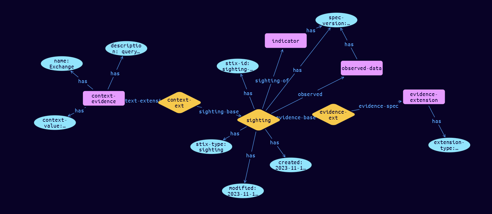

# Sighting-Context Extension Object

**Stix and TypeQL Object Type:**  `sighting-context`

The Sighting object is used for connecting Observed Data objects to SDO’s, such as Indicators, Malware and Threat Actors, based on Locations. Observations and Sightings have different evidentiary weightings based on their type (what they are) and provenance (how they were derived). Context data is based on querying of internal systems and has 100% confidence It can be of two types: Non-SCO: Historical or narrative data that would be contained in a Note, and is not an Event. The Note can attach to different objects, depending on the Inicdent type. SCO: For example a list of other user accounts that received the same email, queried from Exchange server, and is an Event. This example is shown to the right

Weightings cannot be established as provenance data is not collected for each observation, and confidence cannot be established. At present, Observations and Sightings cannot be added together as evidence, as they are different in nature. Sighting Extensions are used to collect the provenance for each type of data source.

Non-SCO Context data is not an observation, nor a sighting, but it is Evidence. Different Context sources (e.g. SAP, SalesForce etc.) will probably have different provenance formats. The Python class name is SightingContext.  It MUST be accompanied by the extension definition with extension-definition—?0d76d6d9-16ca-43fd-bd41-4f800ba8fc43 as its extension ID. The Python class name is SightingEvidence.

[Reference in Stix2.1 Standard](https://github.com/os-threat/cti-stix-common-objects/blob/main/extension-definition-specifications/incident-core/Incident%20Extension%20Suite.adoc)
## Stix 2.1 Properties Converted to TypeQL
Mapping of the Stix Attack Pattern Properties to TypeDB

|  Stix 2.1 Property    |           Schema Name             | Required  Optional  |      Schema Object Type | Schema Parent  |
|:--------------------|:--------------------------------:|:------------------:|:------------------------:|:-------------:|
| name |name |Required |  stix-attribute-string    |   attribute    |
| description |description |Required |  stix-attribute-string    |   attribute    |
| value |context-value |Required |  stix-attribute-string    |   attribute    |

## The Example Sighting-Context in JSON
The original JSON, accessible in the Python environment
```json
{
    "type": "sighting",
    "spec_version": "2.1",
    "id": "sighting--f782ed66-86ce-463f-a014-c79400f1b79f",
    "created": "2023-11-12T13:19:14.262269Z",
    "modified": "2023-11-12T13:19:14.262269Z",
    "sighting_of_ref": "indicator--277f623c-3468-4ba3-9b83-165f3b3827c1",
    "observed_data_refs": [
          "observed-data--a85f23d2-2bf7-46ea-be6c-dbb7dc05eebf"
    ],
    "extensions": {
          "extension-definition--0d76d6d9-16ca-43fd-bd41-4f800ba8fc43": {
                "extension_type": "property-extension"
          },
          "sighting-context": {
                "name": "Exchange",
                "description": "query from:evil@northkorea.com, subject:we are coming for you",
                "value": "[silly@mycompany.com, strange@mycompany.com, dumbo@mycompany.com]"
          }
    }
}
```


## Inserting the Example Sighting-Context in TypeQL
The TypeQL insert statement
```typeql
match
 $indicator0 isa indicator, has stix-id "indicator--277f623c-3468-4ba3-9b83-165f3b3827c1";
 $observed-data0 isa observed-data, has stix-id "observed-data--a85f23d2-2bf7-46ea-be6c-dbb7dc05eebf";
insert
$sighting (sighting-of:$indicator0, observed:$observed-data0) isa sighting,
 has stix-type $stix-type,
 has spec-version $spec-version,
 has stix-id $stix-id,
 has created $created,
 has modified $modified;

 $stix-type "sighting";
 $spec-version "2.1";
 $stix-id "sighting--f782ed66-86ce-463f-a014-c79400f1b79f";
 $created 2023-11-12T13:19:14.262;
 $modified 2023-11-12T13:19:14.262;

 $evidence-extension isa evidence-extension,
 has extension-type $extension-type;

 $extension-type "property-extension";

 $evidence-ext0 (evidence-base:$sighting, evidence-spec:$evidence-extension) isa evidence-ext;

 $context-evidence isa context-evidence,
 has name $name,
 has description $description,
 has context-value $context-value;

 $name "Exchange";
 $description "query from:evil@northkorea.com, subject:we are coming for you";
 $context-value "[silly@mycompany.com, strange@mycompany.com, dumbo@mycompany.com]";

 $context-ext1 (sighting-base:$sighting, context-extension:$context-evidence) isa context-ext;
```

## Retrieving the Example Sighting-Context in TypeQL
The typeQL match statement

```typeql
match 
   $a ($role:$b) isa sighting,
      has stix-id  "sighting--f782ed66-86ce-463f-a014-c79400f1b79f",
      has $c;
   $d isa stix-sub-object, 
      has $e;
   $f (owner:$a, pointed-to:$d) isa embedded;
```


will retrieve the example attack-pattern object in Vaticle Studio


## Retrieving the Example Sighting-Context  in Python
The Python retrieval statement

```python
from stixorm.module.typedb import TypeDBSink, TypeDBSource
connection = {
    "uri": "localhost",
    "port": "1729",
    "database": "stix",
    "user": None,
    "password": None
}

import_type = {
    "STIX21": True,
    "CVE": False,
    "identity": False,
    "location": False,
    "rules": False,
    "ATT&CK": False,
    "ATT&CK_Versions": ["12.0"],
    "ATT&CK_Domains": ["enterprise-attack", "mobile-attack", "ics-attack"],
    "CACAO": False
}

typedb = TypeDBSource(connection, import_type)
stix_obj = typedb.get("sighting--f782ed66-86ce-463f-a014-c79400f1b79f")
```

 

[Back to OS-Threat Stix Extensions Overview](../overview.md)
 

[Back to All Protocols Overview](../../overview.md)
 

[Back to Overview Doc](../../../overview.md)
