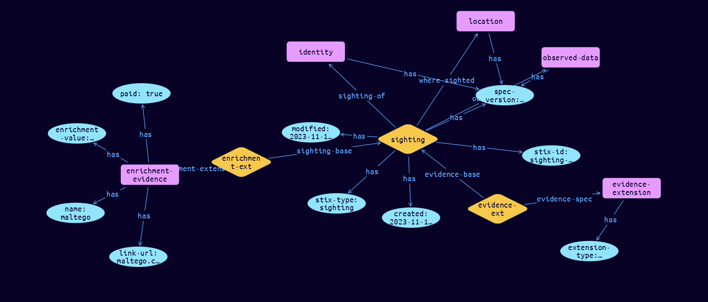

# Sighting-Enrichment Extension Object

**Stix and TypeQL Object Type:**  `sighting-enrichment`

The Sighting object is used for connecting Observed Data objects to SDO’s, such as Indicators, Malware and Threat Actors, based on Locations. Observations and Sightings have different evidentiary weightings based on their type (what they are) and provenance (how they were derived). An Enrichment is an expansion in the evidence, by leveraging existing data and querying paid or free intel sources to return observables. The results of an Enrichment will generally be an SCO, although SDO’s can also be returned. Note observables may not be in the current SCO list.

Weightings cannot be established as provenance data is not collected for each observation, and confidence cannot be established. At present, Observations and Sightings cannot be added together as evidence, as they are different in nature. Sighting Extensions are used to collect the provenance for each type of data source.  The Python class name is SightingEnrichment. It MUST be accompanied by the extension definition with extension-definition—?0d76d6d9-16ca-43fd-bd41-4f800ba8fc43 as its extension ID. The Python class name is SightingEvidence.

[Reference in Stix2.1 Standard](https://github.com/os-threat/cti-stix-common-objects/blob/main/extension-definition-specifications/incident-core/Incident%20Extension%20Suite.adoc)
## Stix 2.1 Properties Converted to TypeQL
Mapping of the Stix Attack Pattern Properties to TypeDB

|  Stix 2.1 Property    |           Schema Name             | Required  Optional  |      Schema Object Type | Schema Parent  |
|:--------------------|:--------------------------------:|:------------------:|:------------------------:|:-------------:|
| name |name |Required |  stix-attribute-string    |   attribute    |
| url |link-url |Required |  stix-attribute-string    |   attribute    |
| paid |paid |Required |  stix-attribute-boolean    |   attribute    |
| value |enrichment-value |Required |  stix-attribute-string    |   attribute    |

## The Example Sighting-Enrichment in JSON
The original JSON, accessible in the Python environment
```json
{
    "type": "sighting",
    "spec_version": "2.1",
    "id": "sighting--5397e885-4812-4384-83c7-5bde065ff45d",
    "created": "2023-11-12T13:19:14.282084Z",
    "modified": "2023-11-12T13:19:14.282084Z",
    "sighting_of_ref": "identity--6f410bea-0221-4041-8599-f20905a67519",
    "observed_data_refs": [
          "observed-data--452d0645-4592-405e-aebc-887992e26739"
    ],
    "where_sighted_refs": [
          "location--b1cd3da8-d53f-445b-816e-c1ec520ad5db"
    ],
    "extensions": {
          "extension-definition--0d76d6d9-16ca-43fd-bd41-4f800ba8fc43": {
                "extension_type": "property-extension"
          },
          "sighting-enrichment": {
                "name": "maltego",
                "url": "maltego.com",
                "paid": true,
                "value": "Evil Incarnate Ltd, 666 Infection St, Whyme, NK, lat/long = 39.03385, 125.75432"
          }
    }
}
```


## Inserting the Example Sighting-Enrichment in TypeQL
The TypeQL insert statement
```typeql
match
 $identity0 isa identity, has stix-id "identity--6f410bea-0221-4041-8599-f20905a67519";
 $observed-data0 isa observed-data, has stix-id "observed-data--452d0645-4592-405e-aebc-887992e26739";
 $location1 isa location, has stix-id "location--b1cd3da8-d53f-445b-816e-c1ec520ad5db";
insert
$sighting (sighting-of:$identity0, observed:$observed-data0, where-sighted:$location1) isa sighting,
 has stix-type $stix-type,
 has spec-version $spec-version,
 has stix-id $stix-id,
 has created $created,
 has modified $modified;

 $stix-type "sighting";
 $spec-version "2.1";
 $stix-id "sighting--5397e885-4812-4384-83c7-5bde065ff45d";
 $created 2023-11-12T13:19:14.282;
 $modified 2023-11-12T13:19:14.282;

 $evidence-extension isa evidence-extension,
 has extension-type $extension-type;

 $extension-type "property-extension";

 $evidence-ext0 (evidence-base:$sighting, evidence-spec:$evidence-extension) isa evidence-ext;

 $enrichment-evidence isa enrichment-evidence,
 has name $name,
 has link-url $link-url,
 has paid $paid,
 has enrichment-value $enrichment-value;

 $name "maltego";
 $link-url "maltego.com";
 $paid true;
 $enrichment-value "Evil Incarnate Ltd, 666 Infection St, Whyme, NK, lat/long = 39.03385, 125.75432";

 $enrichment-ext1 (sighting-base:$sighting, enrichment-extension:$enrichment-evidence) isa enrichment-ext;
```

## Retrieving the Example Sighting-Enrichment in TypeQL
The typeQL match statement

```typeql
match 
   $a ($role:$b) isa sighting,
      has stix-id  "sighting--5397e885-4812-4384-83c7-5bde065ff45d",
      has $c;
   $d isa stix-sub-object, 
      has $e;
   $f (owner:$a, pointed-to:$d) isa embedded;
```


will retrieve the example attack-pattern object in Vaticle Studio


## Retrieving the Example Sighting-Enrichment  in Python
The Python retrieval statement

```python
from stixorm.module.typedb import TypeDBSink, TypeDBSource
connection = {
    "uri": "localhost",
    "port": "1729",
    "database": "stix",
    "user": None,
    "password": None
}

import_type = {
    "STIX21": True,
    "CVE": False,
    "identity": False,
    "location": False,
    "rules": False,
    "ATT&CK": False,
    "ATT&CK_Versions": ["12.0"],
    "ATT&CK_Domains": ["enterprise-attack", "mobile-attack", "ics-attack"],
    "CACAO": False
}

typedb = TypeDBSource(connection, import_type)
stix_obj = typedb.get("sighting--5397e885-4812-4384-83c7-5bde065ff45d")
```

 

[Back to OS-Threat Stix Extensions Overview](../overview.md)
 

[Back to All Protocols Overview](../../overview.md)
 

[Back to Overview Doc](../../../overview.md)
