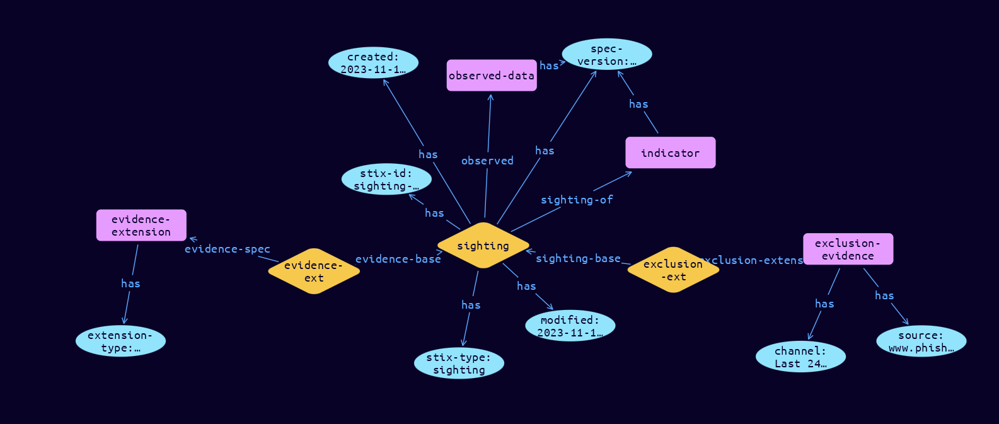

# Sighting-Exclusion Extension Object

**Stix and TypeQL Object Type:**  `sighting-exclusion`

The Sighting object is used for connecting Observed Data objects to SDO’s, such as Indicators, Malware and Threat Actors, based on Locations. Observations and Sightings have different evidentiary weightings based on their type (what they are) and provenance (how they were derived). An Exclusion List is a source that provides a list of entities that have been shown by their processes (?) to be nefarious. Generally Exclusion lists are focused on specific approaches, such as phshing etc. There are often multiple sources covering the same approach, and it is to be expected that if an entity is found in multiple sources, then it has more confidence than if it is found in one out of many sources. A search on an Exclusion List can result in a sighting, but not an event, as it adds to the data available about.

Weightings cannot be established as provenance data is not collected for each observation, and confidence cannot be established. At present, Observations and Sightings cannot be added together as evidence, as they are different in nature. Sighting Extensions are used to collect the provenance for each type of data source. The Python class name is SightingExclusion. It MUST be accompanied by the extension definition with extension-definition—?0d76d6d9-16ca-43fd-bd41-4f800ba8fc43 as its extension ID. The Python class name is SightingEvidence.

[Reference in Stix2.1 Standard](https://github.com/os-threat/cti-stix-common-objects/blob/main/extension-definition-specifications/incident-core/Incident%20Extension%20Suite.adoc)
## Stix 2.1 Properties Converted to TypeQL
Mapping of the Stix Attack Pattern Properties to TypeDB

|  Stix 2.1 Property    |           Schema Name             | Required  Optional  |      Schema Object Type | Schema Parent  |
|:--------------------|:--------------------------------:|:------------------:|:------------------------:|:-------------:|
| source |source |Required |  stix-attribute-string    |   attribute    |
| channel |channel |Required |  stix-attribute-string    |   attribute    |

## The Example Sighting-Exclusion in JSON
The original JSON, accessible in the Python environment
```json
{
    "type": "sighting",
    "spec_version": "2.1",
    "id": "sighting--5a37c821-b62a-4bb5-b2ea-02abcc6342e8",
    "created": "2023-11-12T13:19:14.273322Z",
    "modified": "2023-11-12T13:19:14.273322Z",
    "sighting_of_ref": "indicator--246ca844-3b6a-441a-a276-3c0120498f3f",
    "observed_data_refs": [
          "observed-data--452d0645-4592-405e-aebc-887992e26739"
    ],
    "extensions": {
          "extension-definition--0d76d6d9-16ca-43fd-bd41-4f800ba8fc43": {
                "extension_type": "property-extension"
          },
          "sighting-exclusion": {
                "source": "www.phishdb.com",
                "channel": "Last 24 hours"
          }
    }
}
```


## Inserting the Example Sighting-Exclusion in TypeQL
The TypeQL insert statement
```typeql
match
 $indicator0 isa indicator, has stix-id "indicator--246ca844-3b6a-441a-a276-3c0120498f3f";
 $observed-data0 isa observed-data, has stix-id "observed-data--452d0645-4592-405e-aebc-887992e26739";
insert
$sighting (sighting-of:$indicator0, observed:$observed-data0) isa sighting,
 has stix-type $stix-type,
 has spec-version $spec-version,
 has stix-id $stix-id,
 has created $created,
 has modified $modified;

 $stix-type "sighting";
 $spec-version "2.1";
 $stix-id "sighting--5a37c821-b62a-4bb5-b2ea-02abcc6342e8";
 $created 2023-11-12T13:19:14.273;
 $modified 2023-11-12T13:19:14.273;

 $evidence-extension isa evidence-extension,
 has extension-type $extension-type;

 $extension-type "property-extension";

 $evidence-ext0 (evidence-base:$sighting, evidence-spec:$evidence-extension) isa evidence-ext;

 $exclusion-evidence isa exclusion-evidence,
 has source $source,
 has channel $channel;

 $source "www.phishdb.com";
 $channel "Last 24 hours";

 $exclusion-ext1 (sighting-base:$sighting, exclusion-extension:$exclusion-evidence) isa exclusion-ext;
```

## Retrieving the Example Sighting-Exclusion in TypeQL
The typeQL match statement

```typeql
match 
   $a ($role:$b) isa sighting,
      has stix-id  "sighting--5a37c821-b62a-4bb5-b2ea-02abcc6342e8",
      has $c;
   $d isa stix-sub-object, 
      has $e;
   $f (owner:$a, pointed-to:$d) isa embedded;
```


will retrieve the example attack-pattern object in Vaticle Studio


## Retrieving the Example Sighting-Exclusion  in Python
The Python retrieval statement

```python
from stixorm.module.typedb import TypeDBSink, TypeDBSource
connection = {
    "uri": "localhost",
    "port": "1729",
    "database": "stix",
    "user": None,
    "password": None
}

import_type = {
    "STIX21": True,
    "CVE": False,
    "identity": False,
    "location": False,
    "rules": False,
    "ATT&CK": False,
    "ATT&CK_Versions": ["12.0"],
    "ATT&CK_Domains": ["enterprise-attack", "mobile-attack", "ics-attack"],
    "CACAO": False
}

typedb = TypeDBSource(connection, import_type)
stix_obj = typedb.get("sighting--5a37c821-b62a-4bb5-b2ea-02abcc6342e8")
```

 

[Back to OS-Threat Stix Extensions Overview](../overview.md)
 

[Back to All Protocols Overview](../../overview.md)
 

[Back to Overview Doc](../../../overview.md)
