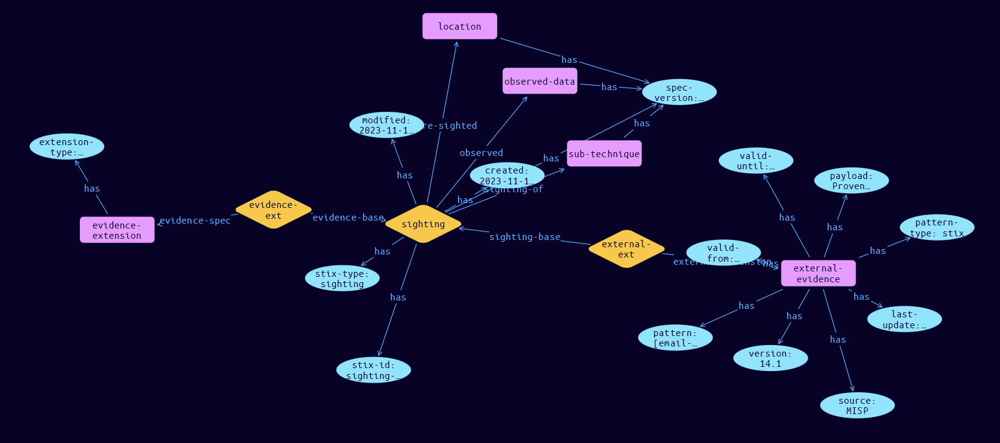

# Sighting-External Extension Object

**Stix and TypeQL Object Type:**  `sighting-external`

The Sighting object is used for connecting Observed Data objects to SDO’s, such as Indicators, Malware and Threat Actors, based on Locations. Observations and Sightings have different evidentiary weightings based on their type (what they are) and provenance (how they were derived). Weightings cannot be established as provenance data is not collected for each observation, and confidence cannot be established. At present, Observations and Sightings cannot be added together as evidence, as they are different in nature. Sighting Extensions are used to collect the provenance for each type of data source.

Threat Reports are posted by researchers on free and paid services, such as MISP. This is one method of confirming that an unknown Indicator is actually malicious. However, reliability of a threat report is a concern, and confidence needs to be established for each individual provider in a channel such as MISP. The Python class name is SightingExternal. It MUST be accompanied by the extension definition with extension-definition—?0d76d6d9-16ca-43fd-bd41-4f800ba8fc43 as its extension ID. The Python class name is SightingEvidence.

[Reference in Stix2.1 Standard](https://github.com/os-threat/cti-stix-common-objects/blob/main/extension-definition-specifications/incident-core/Incident%20Extension%20Suite.adoc)
## Stix 2.1 Properties Converted to TypeQL
Mapping of the Stix Attack Pattern Properties to TypeDB

|  Stix 2.1 Property    |           Schema Name             | Required  Optional  |      Schema Object Type | Schema Parent  |
|:--------------------|:--------------------------------:|:------------------:|:------------------------:|:-------------:|
| source |source |Required |  stix-attribute-string    |   attribute    |
| version |version |Required |  stix-attribute-string    |   attribute    |
| last_update |last-update |Required |  stix-attribute-timestamp    |   attribute    |
| pattern |pattern |Required |  stix-attribute-string    |   attribute    |
| pattern_type |pattern-type |Required |  stix-attribute-string    |   attribute    |
| payload |payload |Required |  stix-attribute-string    |   attribute    |
| valid_from |valid-from |Required |  stix-attribute-timestamp    |   attribute    |
| valid_until |valid_until |Required |  stix-attribute-timestamp    |   attribute    |

## The Example Sighting-External in JSON
The original JSON, accessible in the Python environment
```json
{
    "type": "sighting",
    "spec_version": "2.1",
    "id": "sighting--5e72168a-e37d-4cf3-a429-15c06bd3abf6",
    "created": "2023-11-12T13:19:14.343786Z",
    "modified": "2023-11-12T13:19:14.343786Z",
    "sighting_of_ref": "attack-pattern--2b742742-28c3-4e1b-bab7-8350d6300fa7",
    "observed_data_refs": [
          "observed-data--2d2311be-b85c-4c34-9953-b8e0edf07f3b"
    ],
    "where_sighted_refs": [
          "location--b1cd3da8-d53f-445b-816e-c1ec520ad5db"
    ],
    "extensions": {
          "extension-definition--0d76d6d9-16ca-43fd-bd41-4f800ba8fc43": {
                "extension_type": "property-extension"
          },
          "sighting-external": {
                "source": "MISP",
                "version": "14.1",
                "last_update": "2023-11-12T13:19:14.343786Z",
                "pattern": "[email-addr:value = 'evil@northkorea.com' AND email:subject = 'we are coming for you']",
                "pattern_type": "stix",
                "payload": "Proven Malicious Phishing Source",
                "valid_from": "2023-09-07T08:53:15.645995Z",
                "valid_until": "2023-11-07T08:53:15.645995Z"
          }
    }
}
```


## Inserting the Example Sighting-External in TypeQL
The TypeQL insert statement
```typeql
match
 $attack-pattern0 isa attack-pattern, has stix-id "attack-pattern--2b742742-28c3-4e1b-bab7-8350d6300fa7";
 $observed-data0 isa observed-data, has stix-id "observed-data--2d2311be-b85c-4c34-9953-b8e0edf07f3b";
 $location1 isa location, has stix-id "location--b1cd3da8-d53f-445b-816e-c1ec520ad5db";
insert
$sighting (sighting-of:$attack-pattern0, observed:$observed-data0, where-sighted:$location1) isa sighting,
 has stix-type $stix-type,
 has spec-version $spec-version,
 has stix-id $stix-id,
 has created $created,
 has modified $modified;

 $stix-type "sighting";
 $spec-version "2.1";
 $stix-id "sighting--5e72168a-e37d-4cf3-a429-15c06bd3abf6";
 $created 2023-11-12T13:19:14.343;
 $modified 2023-11-12T13:19:14.343;

 $evidence-extension isa evidence-extension,
 has extension-type $extension-type;

 $extension-type "property-extension";

 $evidence-ext0 (evidence-base:$sighting, evidence-spec:$evidence-extension) isa evidence-ext;

 $external-evidence isa external-evidence,
 has source $source,
 has version $version,
 has last-update $last-update,
 has pattern $pattern,
 has pattern-type $pattern-type,
 has payload $payload,
 has valid-from $valid-from,
 has valid-until $valid-until;

 $source "MISP";
 $version "14.1";
 $last-update 2023-11-12T13:19:14.343;
 $pattern "[email-addr:value = 'evil@northkorea.com' AND email:subject = 'we are coming for you']";
 $pattern-type "stix";
 $payload "Proven Malicious Phishing Source";
 $valid-from 2023-09-07T08:53:15.645;
 $valid-until 2023-11-07T08:53:15.645;

 $external-ext1 (sighting-base:$sighting, external-extension:$external-evidence) isa external-ext;
```

## Retrieving the Example Sighting-External in TypeQL
The typeQL match statement

```typeql
match 
   $a ($role:$b) isa sighting,
      has stix-id  "sighting--5e72168a-e37d-4cf3-a429-15c06bd3abf6",
      has $c;
   $d isa stix-sub-object, 
      has $e;
   $f (owner:$a, pointed-to:$d) isa embedded;
```


will retrieve the example attack-pattern object in Vaticle Studio


## Retrieving the Example Sighting-External  in Python
The Python retrieval statement

```python
from stixorm.module.typedb import TypeDBSink, TypeDBSource
connection = {
    "uri": "localhost",
    "port": "1729",
    "database": "stix",
    "user": None,
    "password": None
}

import_type = {
    "STIX21": True,
    "CVE": False,
    "identity": False,
    "location": False,
    "rules": False,
    "ATT&CK": False,
    "ATT&CK_Versions": ["12.0"],
    "ATT&CK_Domains": ["enterprise-attack", "mobile-attack", "ics-attack"],
    "CACAO": False
}

typedb = TypeDBSource(connection, import_type)
stix_obj = typedb.get("sighting--5e72168a-e37d-4cf3-a429-15c06bd3abf6")
```

 

[Back to OS-Threat Stix Extensions Overview](../overview.md)
 

[Back to All Protocols Overview](../../overview.md)
 

[Back to Overview Doc](../../../overview.md)
