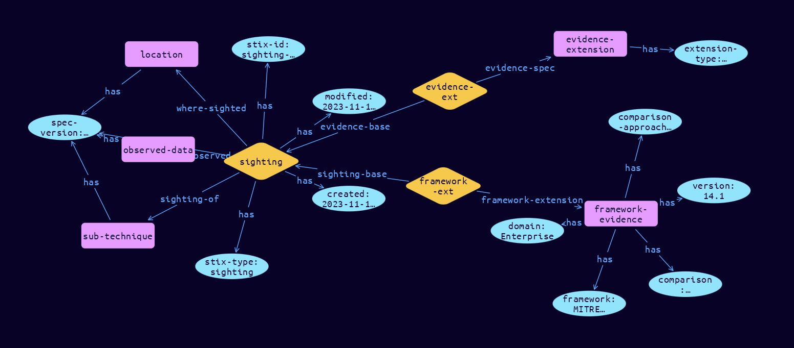

# Sighting-Framework Extension Object

**Stix and TypeQL Object Type:**  `sighting-framework`

The Sighting object is used for connecting Observed Data objects to SDO’s, such as Indicators, Malware and Threat Actors, based on Locations. Observations and Sightings have different evidentiary weightings based on their type (what they are) and provenance (how they were derived). Weightings cannot be established as provenance data is not collected for each observation, and confidence cannot be established. At present, Observations and Sightings cannot be added together as evidence, as they are different in nature. Sighting Extensions are used to collect the provenance for each type of data source.

Since SCO’s are ephemeral, the desire is to move up the Pyramid of Pain to more abstract characterisations, which are harder for attackers to evade. Frameworks, such as Mitre ATT&CK and DISARM are commonly used. Assignment of a Framework Component requires a judgement, or a correlation from a knowledge base, and thereby has subjectivity. The Python class name is SightingFramework. It MUST be accompanied by the extension definition with extension-definition—?0d76d6d9-16ca-43fd-bd41-4f800ba8fc43 as its extension ID. The Python class name is SightingEvidence.

[Reference in Stix2.1 Standard](https://github.com/os-threat/cti-stix-common-objects/blob/main/extension-definition-specifications/incident-core/Incident%20Extension%20Suite.adoc)
## Stix 2.1 Properties Converted to TypeQL
Mapping of the Stix Attack Pattern Properties to TypeDB

|  Stix 2.1 Property    |           Schema Name             | Required  Optional  |      Schema Object Type | Schema Parent  |
|:--------------------|:--------------------------------:|:------------------:|:------------------------:|:-------------:|
| framework |framework |Required |  stix-attribute-string    |   attribute    |
| version |version |Required |  stix-attribute-string    |   attribute    |
| domain |domain |Required |  stix-attribute-boolean    |   attribute    |
| comparison_approach |comparison-approach |Required |  stix-attribute-boolean    |   attribute    |

## The Example Sighting-Framework in JSON
The original JSON, accessible in the Python environment
```json
{
    "type": "sighting",
    "spec_version": "2.1",
    "id": "sighting--dae5afc5-022d-4000-b8d7-a71747f96f0d",
    "created": "2023-11-12T13:19:14.337269Z",
    "modified": "2023-11-12T13:19:14.337269Z",
    "sighting_of_ref": "attack-pattern--2b742742-28c3-4e1b-bab7-8350d6300fa7",
    "observed_data_refs": [
          "observed-data--2d2311be-b85c-4c34-9953-b8e0edf07f3b"
    ],
    "where_sighted_refs": [
          "location--b1cd3da8-d53f-445b-816e-c1ec520ad5db"
    ],
    "extensions": {
          "extension-definition--0d76d6d9-16ca-43fd-bd41-4f800ba8fc43": {
                "extension_type": "property-extension"
          },
          "sighting-framework": {
                "framework": "MITRE ATT&CK",
                "version": "14.1",
                "domain": "Enterprise",
                "comparison": "exclusion list and hunt",
                "comparison_approach": "The Exclusion List confirmed the email was previously sighted and the Hunt confirmed that processes had been started"
          }
    }
}
```


## Inserting the Example Sighting-Framework in TypeQL
The TypeQL insert statement
```typeql
match
 $attack-pattern0 isa attack-pattern, has stix-id "attack-pattern--2b742742-28c3-4e1b-bab7-8350d6300fa7";
 $observed-data0 isa observed-data, has stix-id "observed-data--2d2311be-b85c-4c34-9953-b8e0edf07f3b";
 $location1 isa location, has stix-id "location--b1cd3da8-d53f-445b-816e-c1ec520ad5db";
insert
$sighting (sighting-of:$attack-pattern0, observed:$observed-data0, where-sighted:$location1) isa sighting,
 has stix-type $stix-type,
 has spec-version $spec-version,
 has stix-id $stix-id,
 has created $created,
 has modified $modified;

 $stix-type "sighting";
 $spec-version "2.1";
 $stix-id "sighting--dae5afc5-022d-4000-b8d7-a71747f96f0d";
 $created 2023-11-12T13:19:14.337;
 $modified 2023-11-12T13:19:14.337;

 $evidence-extension isa evidence-extension,
 has extension-type $extension-type;

 $extension-type "property-extension";

 $evidence-ext0 (evidence-base:$sighting, evidence-spec:$evidence-extension) isa evidence-ext;

 $framework-evidence isa framework-evidence,
 has framework $framework,
 has version $version,
 has domain $domain,
 has comparison $comparison,
 has comparison-approach $comparison-approach;

 $framework "MITRE ATT&CK";
 $version "14.1";
 $domain "Enterprise";
 $comparison "exclusion list and hunt";
 $comparison-approach "The Exclusion List confirmed the email was previously sighted and the Hunt confirmed that processes had been started";

 $framework-ext1 (sighting-base:$sighting, framework-extension:$framework-evidence) isa framework-ext;
```

## Retrieving the Example Sighting-Framework in TypeQL
The typeQL match statement

```typeql
match 
   $a ($role:$b) isa sighting,
      has stix-id  "sighting--dae5afc5-022d-4000-b8d7-a71747f96f0d",
      has $c;
   $d isa stix-sub-object, 
      has $e;
   $f (owner:$a, pointed-to:$d) isa embedded;
```


will retrieve the example attack-pattern object in Vaticle Studio


## Retrieving the Example Sighting-Framework  in Python
The Python retrieval statement

```python
from stixorm.module.typedb import TypeDBSink, TypeDBSource
connection = {
    "uri": "localhost",
    "port": "1729",
    "database": "stix",
    "user": None,
    "password": None
}

import_type = {
    "STIX21": True,
    "CVE": False,
    "identity": False,
    "location": False,
    "rules": False,
    "ATT&CK": False,
    "ATT&CK_Versions": ["12.0"],
    "ATT&CK_Domains": ["enterprise-attack", "mobile-attack", "ics-attack"],
    "CACAO": False
}

typedb = TypeDBSource(connection, import_type)
stix_obj = typedb.get("sighting--dae5afc5-022d-4000-b8d7-a71747f96f0d")
```

 

[Back to OS-Threat Stix Extensions Overview](../overview.md)
 

[Back to All Protocols Overview](../../overview.md)
 

[Back to Overview Doc](../../../overview.md)
