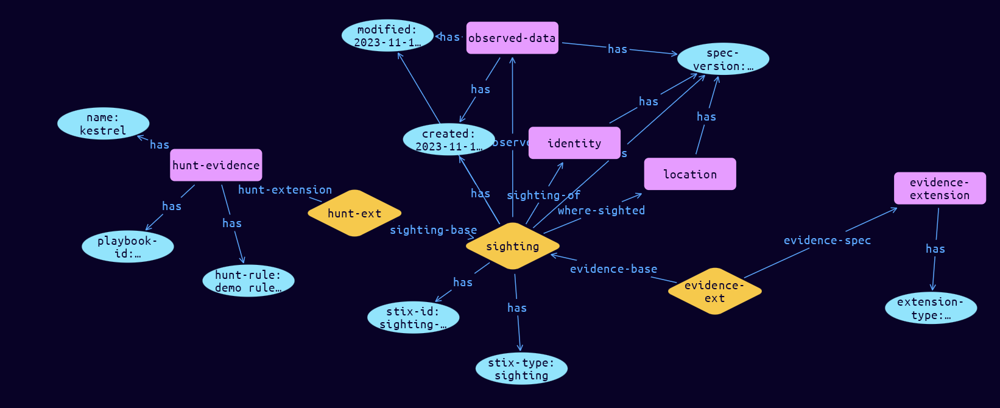

# Sighting-Hunt Extension Object

**Stix and TypeQL Object Type:**  `sighting-hunt`

The Sighting object is used for connecting Observed Data objects to SDO’s, such as Indicators, Malware and Threat Actors, based on Locations. Observations and Sightings have different evidentiary weightings based on their type (what they are) and provenance (how they were derived). A Hunt is a targeted search using a hunting platform, such as Kestrel, or similar, started as a Task. A Hunt can result in: 1. Confirmation that an Alert has resulted in a negative Impact (e.g. user clicked on link, Outlook, which downloaded software and started a process), 2. Scope of Impact, which machines were impacted, 3. An Alert, since an unknown threat has been discovered.

Weightings cannot be established as provenance data is not collected for each observation, and confidence cannot be established. At present, Observations and Sightings cannot be added together as evidence, as they are different in nature. Sighting Extensions are used to collect the provenance for each type of data source. A Hunt will result in an Event when an SCO is found, but can also result only in an Impact. The Python class name is SightingHunt. It MUST be accompanied by the extension definition with extension-definition—?0d76d6d9-16ca-43fd-bd41-4f800ba8fc43 as its extension ID. The Python class name is SightingEvidence.

[Reference in Stix2.1 Standard](https://github.com/os-threat/cti-stix-common-objects/blob/main/extension-definition-specifications/incident-core/Incident%20Extension%20Suite.adoc)
## Stix 2.1 Properties Converted to TypeQL
Mapping of the Stix Attack Pattern Properties to TypeDB

|  Stix 2.1 Property    |           Schema Name             | Required  Optional  |      Schema Object Type | Schema Parent  |
|:--------------------|:--------------------------------:|:------------------:|:------------------------:|:-------------:|
| name |name |Required |  stix-attribute-string    |   attribute    |
| playbook_id |playbook-id |Required |  stix-attribute-string    |   attribute    |
| rule |hunt-rule |Required |  stix-attribute-boolean    |   attribute    |

## The Example Sighting-Hunt in JSON
The original JSON, accessible in the Python environment
```json
{
    "type": "sighting",
    "spec_version": "2.1",
    "id": "sighting--03c1cfce-e63c-4eb4-b071-5123e8f2c7ed",
    "created": "2023-11-12T13:19:14.290678Z",
    "modified": "2023-11-12T13:19:14.290678Z",
    "sighting_of_ref": "identity--6f410bea-0221-4041-8599-f20905a67519",
    "observed_data_refs": [
          "observed-data--2d2311be-b85c-4c34-9953-b8e0edf07f3b"
    ],
    "where_sighted_refs": [
          "location--b1cd3da8-d53f-445b-816e-c1ec520ad5db"
    ],
    "extensions": {
          "extension-definition--0d76d6d9-16ca-43fd-bd41-4f800ba8fc43": {
                "extension_type": "property-extension"
          },
          "sighting-hunt": {
                "name": "kestrel",
                "playbook_id": "playbook_1_1",
                "rule": "demo rule string"
          }
    }
}
```


## Inserting the Example Sighting-Hunt in TypeQL
The TypeQL insert statement
```typeql
match
 $identity0 isa identity, has stix-id "identity--6f410bea-0221-4041-8599-f20905a67519";
 $observed-data0 isa observed-data, has stix-id "observed-data--2d2311be-b85c-4c34-9953-b8e0edf07f3b";
 $location1 isa location, has stix-id "location--b1cd3da8-d53f-445b-816e-c1ec520ad5db";
insert
$sighting (sighting-of:$identity0, observed:$observed-data0, where-sighted:$location1) isa sighting,
 has stix-type $stix-type,
 has spec-version $spec-version,
 has stix-id $stix-id,
 has created $created,
 has modified $modified;

 $stix-type "sighting";
 $spec-version "2.1";
 $stix-id "sighting--03c1cfce-e63c-4eb4-b071-5123e8f2c7ed";
 $created 2023-11-12T13:19:14.290;
 $modified 2023-11-12T13:19:14.290;

 $evidence-extension isa evidence-extension,
 has extension-type $extension-type;

 $extension-type "property-extension";

 $evidence-ext0 (evidence-base:$sighting, evidence-spec:$evidence-extension) isa evidence-ext;

 $hunt-evidence isa hunt-evidence,
 has name $name,
 has playbook-id $playbook-id,
 has hunt-rule $hunt-rule;

 $name "kestrel";
 $playbook-id "playbook_1_1";
 $hunt-rule "demo rule string";

 $hunt-ext1 (sighting-base:$sighting, hunt-extension:$hunt-evidence) isa hunt-ext;
```

## Retrieving the Example Sighting-Hunt in TypeQL
The typeQL match statement

```typeql
match 
   $a ($role:$b) isa sighting,
      has stix-id  "sighting--03c1cfce-e63c-4eb4-b071-5123e8f2c7ed",
      has $c;
   $d isa stix-sub-object, 
      has $e;
   $f (owner:$a, pointed-to:$d) isa embedded;
```


will retrieve the example attack-pattern object in Vaticle Studio


## Retrieving the Example Sighting-Hunt  in Python
The Python retrieval statement

```python
from stixorm.module.typedb import TypeDBSink, TypeDBSource
connection = {
    "uri": "localhost",
    "port": "1729",
    "database": "stix",
    "user": None,
    "password": None
}

import_type = {
    "STIX21": True,
    "CVE": False,
    "identity": False,
    "location": False,
    "rules": False,
    "ATT&CK": False,
    "ATT&CK_Versions": ["12.0"],
    "ATT&CK_Domains": ["enterprise-attack", "mobile-attack", "ics-attack"],
    "CACAO": False
}

typedb = TypeDBSource(connection, import_type)
stix_obj = typedb.get("sighting--03c1cfce-e63c-4eb4-b071-5123e8f2c7ed")
```

 

[Back to OS-Threat Stix Extensions Overview](../overview.md)
 

[Back to All Protocols Overview](../../overview.md)
 

[Back to Overview Doc](../../../overview.md)
