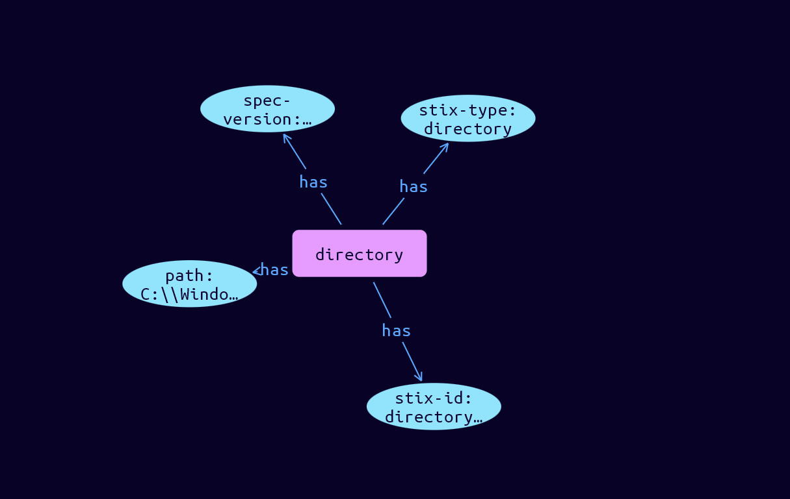

# Directory Cyber Obervable Object

**Stix and TypeQL Object Type:**  `directory`

The Directory object represents the properties common to a file system directory.

[Reference in Stix2.1 Standard](https://docs.oasis-open.org/cti/stix/v2.1/os/stix-v2.1-os.html#_lyvpga5hlw52)
## Stix 2.1 Properties Converted to TypeQL
Mapping of the Stix Attack Pattern Properties to TypeDB

|  Stix 2.1 Property    |           Schema Name             | Required  Optional  |      Schema Object Type | Schema Parent  |
|:--------------------|:--------------------------------:|:------------------:|:------------------------:|:-------------:|
|  type                 |            stix-type              |      Required       |  stix-attribute-string    |   attribute    |
|  id                   |             stix-id               |      Required       |  stix-attribute-string    |   attribute    |
|  spec_version         |           spec-version            |      Optional       |  stix-attribute-string    |   attribute    |
|  object_marking_refs  |      object-marking:marked        |      Optional       |   embedded     |relation |
|  granular_markings    |     granular-marking:marked       |      Optional       |   embedded     |relation |
| defanged |defanged |      Optional       |stix-attribute-boolean |   attribute    |
|  extensions           |               n/a                 |        n/a          |           n/a             |      n/a       |
| path |path |Required |  stix-attribute-integer    |   attribute    |
| path_enc |path_enc |      Optional       |  stix-attribute-string    |   attribute    |
| ctime |ctime |      Optional       |  stix-attribute-timestamp    |   attribute    |
| mtime |mtime |      Optional       |  stix-attribute-timestamp    |   attribute    |
| atime |atime |      Optional       |  stix-attribute-timestamp    |   attribute    |
| contains_refs |directory-contains:container |      Optional       |   embedded     |relation |

## The Example Directory in JSON
The original JSON, accessible in the Python environment
```json
{
    "type": "directory",  
    "spec_version": "2.1",  
    "id": "directory--93c0a9b0-520d-545d-9094-1d80adf46b05",  
    "path": "C:\\Windows\\System32"  
  }
```


## Inserting the Example Directory in TypeQL
The TypeQL insert statement
```typeql
insert 
    $directory isa directory,
        has stix-type $stix-type,
        has spec-version $spec-version,
        has stix-id $stix-id,
        has path $path;
    
    $stix-type "directory";
    $spec-version "2.1";
    $stix-id "directory--93c0a9b0-520d-545d-9094-1d80adf46b05";
    $path "C:\\Windows\\System32";
```

## Retrieving the Example Directory in TypeQL
The typeQL match statement

```typeql
match
    $a isa directory,
        has stix-id "directory--93c0a9b0-520d-545d-9094-1d80adf46b05",
        has $b;
```


will retrieve the example attack-pattern object in Vaticle Studio


## Retrieving the Example Directory  in Python
The Python retrieval statement

```python
from stix.module.typedb_lib import TypeDBSink, TypeDBSource

connection = {
    "uri": "localhost",
    "port": "1729",
    "database": "stix",
    "user": None,
    "password": None
}

import_type = {
    "STIX21": True,
    "CVE": False,
    "identity": False,
    "location": False,
    "rules": False,
    "ATT&CK": False,
    "ATT&CK_Versions": ["12.0"],
    "ATT&CK_Domains": ["enterprise-attack", "mobile-attack", "ics-attack"],
    "CACAO": False
}

typedb = TypeDBSource(connection, import_type)
stix_obj = typedb.get("directory--93c0a9b0-520d-545d-9094-1d80adf46b05")
```

