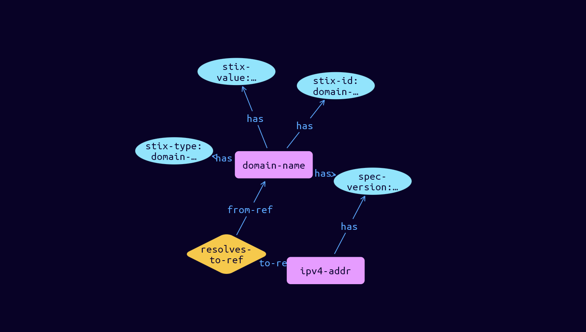

# Domain-Name Cyber Obervable Object

**Stix and TypeQL Object Type:**  `domain-name`

The Domain Name object represents the properties of a network domain name.

[Reference in Stix2.1 Standard](https://docs.oasis-open.org/cti/stix/v2.1/os/stix-v2.1-os.html#_prhhksbxbg87)
## Stix 2.1 Properties Converted to TypeQL
Mapping of the Stix Attack Pattern Properties to TypeDB

|  Stix 2.1 Property    |           Schema Name             | Required  Optional  |      Schema Object Type | Schema Parent  |
|:--------------------|:--------------------------------:|:------------------:|:------------------------:|:-------------:|
|  type                 |            stix-type              |      Required       |  stix-attribute-string    |   attribute    |
|  id                   |             stix-id               |      Required       |  stix-attribute-string    |   attribute    |
|  spec_version         |           spec-version            |      Optional       |  stix-attribute-string    |   attribute    |
|  object_marking_refs  |      object-marking:marked        |      Optional       |   embedded     |relation |
|  granular_markings    |     granular-marking:marked       |      Optional       |   embedded     |relation |
| defanged |defanged |      Optional       |stix-attribute-boolean |   attribute    |
|  extensions           |               n/a                 |        n/a          |           n/a             |      n/a       |
| value |stix-value |      Optional       |  stix-attribute-string    |   attribute    |
| resolves_to_refs |resolve-to:resolves-from |      Optional       |   embedded     |relation |

## The Example Domain-Name in JSON
The original JSON, accessible in the Python environment
```json
{
  "type": "domain-name",      
  "spec_version": "2.1",      
  "id": "domain-name--3c10e93f-798e-52a6-a0c1-08156efab7f5",
  "value": "example.com",      
  "resolves_to_refs": ["ipv4-addr--ff26c055-6336-5bc5-b98d-13d6226742dd"]
}
```


## Inserting the Example Domain-Name in TypeQL
The TypeQL insert statement
```typeql
match  
    $ipv4-addr00 isa ipv4-addr, 
        has stix-id "ipv4-addr--ff26c055-6336-5bc5-b98d-13d6226742dd";
insert 
    $domain-name isa domain-name,
        has stix-type $stix-type,
        has spec-version $spec-version,
        has stix-id $stix-id,
        has stix-value $stix-value;
    
    $stix-type "domain-name";
    $spec-version "2.1";
    $stix-id "domain-name--3c10e93f-798e-52a6-a0c1-08156efab7f5";
    $stix-value "example.com";
    
    $resolves-to-ref0 (from-ref:$domain-name, to-ref:$ipv4-addr00) isa resolves-to-ref;
```

## Retrieving the Example Domain-Name in TypeQL
The typeQL match statement

```typeql
match
    $a isa domain-name,
        has stix-id "domain-name--3c10e93f-798e-52a6-a0c1-08156efab7f5",
        has $b;
    $c (owner:$a, pointed-to:$d) isa embedded;
```


will retrieve the example attack-pattern object in Vaticle Studio


## Retrieving the Example Domain-Name  in Python
The Python retrieval statement

```python
from stix.module.typedb_lib import TypeDBSink, TypeDBSource

connection = {
    "uri": "localhost",
    "port": "1729",
    "database": "stix",
    "user": None,
    "password": None
}

import_type = {
    "STIX21": True,
    "CVE": False,
    "identity": False,
    "location": False,
    "rules": False,
    "ATT&CK": False,
    "ATT&CK_Versions": ["12.0"],
    "ATT&CK_Domains": ["enterprise-attack", "mobile-attack", "ics-attack"],
    "CACAO": False
}

typedb = TypeDBSource(connection, import_type)
stix_obj = typedb.get("domain-name--3c10e93f-798e-52a6-a0c1-08156efab7f5")
```

