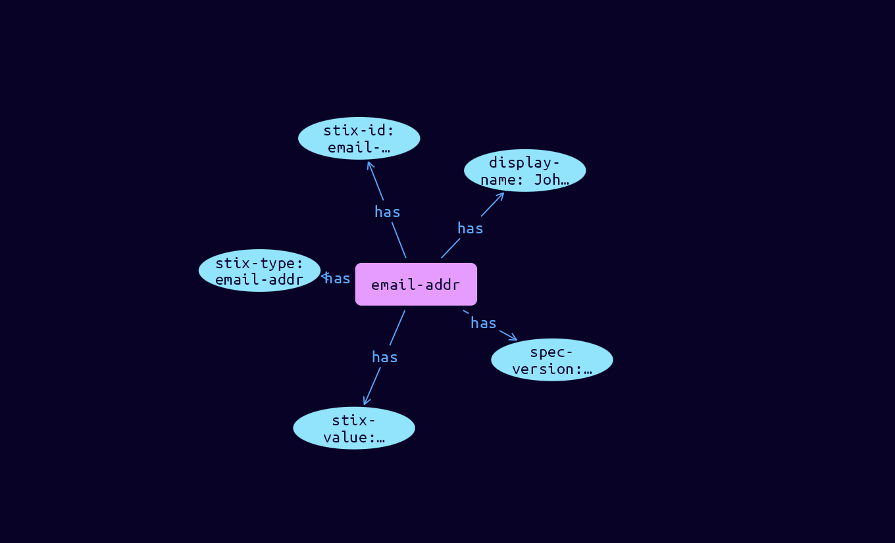

# Email-Address Cyber Obervable Object

**Stix and TypeQL Object Type:**  `email-addr`

The Email Address object represents a single email address

[Reference in Stix2.1 Standard](https://docs.oasis-open.org/cti/stix/v2.1/os/stix-v2.1-os.html#_wmenahkvqmgj)
## Stix 2.1 Properties Converted to TypeQL
Mapping of the Stix Attack Pattern Properties to TypeDB

|  Stix 2.1 Property    |           Schema Name             | Required  Optional  |      Schema Object Type | Schema Parent  |
|:--------------------|:--------------------------------:|:------------------:|:------------------------:|:-------------:|
|  type                 |            stix-type              |      Required       |  stix-attribute-string    |   attribute    |
|  id                   |             stix-id               |      Required       |  stix-attribute-string    |   attribute    |
|  spec_version         |           spec-version            |      Optional       |  stix-attribute-string    |   attribute    |
|  object_marking_refs  |      object-marking:marked        |      Optional       |   embedded     |relation |
|  granular_markings    |     granular-marking:marked       |      Optional       |   embedded     |relation |
| defanged |defanged |      Optional       |stix-attribute-boolean |   attribute    |
|  extensions           |               n/a                 |        n/a          |           n/a             |      n/a       |
| value |stix-value |      Optional       |  stix-attribute-string    |   attribute    |
| resolves_to_refs |resolve-to:resolves-from |      Optional       |   embedded     |relation |

## The Example Email-Address in JSON
The original JSON, accessible in the Python environment
```json
{
    "type": "email-addr",  
    "spec_version": "2.1",  
    "id": "email-addr--2d77a846-6264-5d51-b586-e48322ea1ea3",
    "value": "john@example.com",  
    "display_name": "John Doe"
  }
```


## Inserting the Example Email-Address in TypeQL
The TypeQL insert statement
```typeql
insert 
    $email-addr isa email-addr,
        has stix-type $stix-type,
        has spec-version $spec-version,
        has stix-id $stix-id,
        has stix-value $stix-value,
        has display-name $display-name;
    
    $stix-type "email-addr";
    $spec-version "2.1";
    $stix-id "email-addr--2d77a846-6264-5d51-b586-e48322ea1ea3";
    $stix-value "john@example.com";
    $display-name "John Doe";
```

## Retrieving the Example Email-Address in TypeQL
The typeQL match statement

```typeql
match
    $a isa email-addr,
        has stix-id "email-addr--2d77a846-6264-5d51-b586-e48322ea1ea3",
        has $b;
```


will retrieve the example attack-pattern object in Vaticle Studio


## Retrieving the Example Email-Address  in Python
The Python retrieval statement

```python
from stix.module.typedb_lib import TypeDBSink, TypeDBSource

connection = {
    "uri": "localhost",
    "port": "1729",
    "database": "stix",
    "user": None,
    "password": None
}

import_type = {
    "STIX21": True,
    "CVE": False,
    "identity": False,
    "location": False,
    "rules": False,
    "ATT&CK": False,
    "ATT&CK_Versions": ["12.0"],
    "ATT&CK_Domains": ["enterprise-attack", "mobile-attack", "ics-attack"],
    "CACAO": False
}

typedb = TypeDBSource(connection, import_type)
stix_obj = typedb.get("email-addr--2d77a846-6264-5d51-b586-e48322ea1ea3")
```

