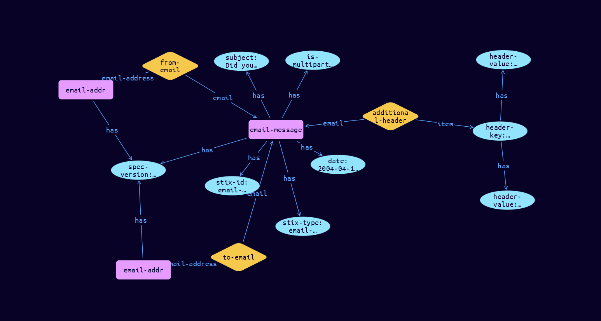

# Email-Message Cyber Obervable Object

**Stix and TypeQL Object Type:**  `email-message`

The Email Message object represents an instance of an email message, corresponding to the internet message format described in [RFC5322] and related RFCs.

Header field values that have been encoded as described in section 2 of [RFC2047] MUST be decoded before inclusion in Email Message object properties. For example, this is some text MUST be used instead of =?iso-8859-1?q?this=20is=20some=20text?=. Any characters in the encoded value which cannot be decoded into Unicode SHOULD be replaced with the 'REPLACEMENT CHARACTER' (U+FFFD). If it is necessary to capture the header value as observed, this can be achieved by referencing an Artifact object through the raw_email_ref property.

[Reference in Stix2.1 Standard](https://docs.oasis-open.org/cti/stix/v2.1/os/stix-v2.1-os.html#_grboc7sq5514)
## Stix 2.1 Properties Converted to TypeQL
Mapping of the Stix Attack Pattern Properties to TypeDB

|  Stix 2.1 Property    |           Schema Name             | Required  Optional  |      Schema Object Type | Schema Parent  |
|:--------------------|:--------------------------------:|:------------------:|:------------------------:|:-------------:|
|  type                 |            stix-type              |      Required       |  stix-attribute-string    |   attribute    |
|  id                   |             stix-id               |      Required       |  stix-attribute-string    |   attribute    |
|  spec_version         |           spec-version            |      Optional       |  stix-attribute-string    |   attribute    |
|  object_marking_refs  |      object-marking:marked        |      Optional       |   embedded     |relation |
|  granular_markings    |     granular-marking:marked       |      Optional       |   embedded     |relation |
| defanged |defanged |      Optional       |stix-attribute-boolean |   attribute    |
|  extensions           |               n/a                 |        n/a          |           n/a             |      n/a       |
| is_multipart  |stix-value |      Optional       |  stix-attribute-string    |   attribute    |
| date |resolve-to:resolves-from |      Optional       |  stix-attribute-string    |   attribute    |
| content_type | |      Optional       |  stix-attribute-string    |   attribute    |
| from_ref |from-email:email |      Optional       |   embedded     |relation |
| sender_ref |sender-email:email |      Optional       |   embedded     |relation |
| to_refs |to-email:email |      Optional       |   embedded     |relation |
| cc_refs |cc-email:email |      Optional       |   embedded     |relation |
| bcc_refs |bcc-email:email |      Optional       |   embedded     |relation |
| message_id  |message-id  |      Optional       |  stix-attribute-string    |   attribute    |
| subject |subject |      Optional       |  stix-attribute-string    |   attribute    |
| received_lines  |received-lines |      Optional       |  stix-attribute-string    |   attribute    |
| additional_header_fields |additional-header:email |      Optional       |   embedded     |relation |
| body |body |      Optional       |  stix-attribute-string    |   attribute    |
| body_multipart |body-multipart:email |      Optional       |   embedded     |relation |
| raw_email_ref |raw-email-references:email |      Optional       |   embedded     |relation |

## The Example Email-Message in JSON
The original JSON, accessible in the Python environment
```json
{
  "type": "email-message",      
  "spec_version": "2.1",      
  "id": "email-message--0c57a381-2a17-5e61-8754-5ef96efb286c",      
  "from_ref": "email-addr--9b7e29b3-fd8d-562e-b3f0-8fc8134f5dda",      
  "to_refs": ["email-addr--2d77a846-6264-5d51-b586-e43822ea1ea3"],      
  "is_multipart": false,      
  "date": "2004-04-19T12:22:23.000Z",      
  "subject": "Did you see this?",      
  "additional_header_fields": {      
    "Reply-To": [      
      "steve@example.com",      
      "jane@example.com"      
    ]      
  }      
}
```


## Inserting the Example Email-Message in TypeQL
The TypeQL insert statement
```typeql
match  
    $email-addr0 isa email-addr, 
        has stix-id "email-addr--9b7e29b3-fd8d-562e-b3f0-8fc8134f5dda";
    $email-addr01 isa email-addr, 
        has stix-id "email-addr--2d77a846-6264-5d51-b586-e43822ea1ea3";
insert 
    $email-message isa email-message,
        has stix-type $stix-type,
        has spec-version $spec-version,
        has stix-id $stix-id,
        has is-multipart $is-multipart,
        has date $date,
        has subject $subject;
    
    $stix-type "email-message";
    $spec-version "2.1";
    $stix-id "email-message--0c57a381-2a17-5e61-8754-5ef96efb286c";
    $is-multipart false;
    $date 2004-04-19T12:22:23.000;
    $subject "Did you see this?";
    
    $from-email0 (email:$email-message, email-address:$email-addr0) isa from-email;
    
    $to-email1 (email:$email-message, email-address:$email-addr01) isa to-email;
    
    $header-key0 isa header-key;  $header-key0 "Reply-To";
    $header-key0 has header-value "steve@example.com";
    $header-key0 has header-value "jane@example.com";
    $additional-header (email:$email-message, item: $header-key0) isa additional-header;
```

## Retrieving the Example Email-Message in TypeQL
The typeQL match statement

```typeql
match
    $a isa email-message,
        has stix-id "email-message--0c57a381-2a17-5e61-8754-5ef96efb286c",
        has $b;
    $c (owner:$a, pointed-to:$d) isa embedded;
    $e isa header-key, has $f;
    $g (owner:$a, pointed-to:$e) isa embedded;
```


will retrieve the example attack-pattern object in Vaticle Studio


## Retrieving the Example Email-Message  in Python
The Python retrieval statement

```python
from stix.module.typedb_lib import TypeDBSink, TypeDBSource

connection = {
    "uri": "localhost",
    "port": "1729",
    "database": "stix",
    "user": None,
    "password": None
}

import_type = {
    "STIX21": True,
    "CVE": False,
    "identity": False,
    "location": False,
    "rules": False,
    "ATT&CK": False,
    "ATT&CK_Versions": ["12.0"],
    "ATT&CK_Domains": ["enterprise-attack", "mobile-attack", "ics-attack"],
    "CACAO": False
}

typedb = TypeDBSource(connection, import_type)
stix_obj = typedb.get("email-addr--9b7e29b3-fd8d-562e-b3f0-8fc8134f5dda")
```

