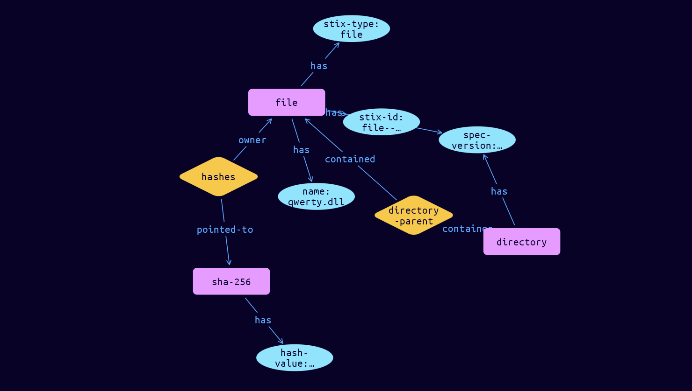

# File- Cyber Obervable Object

**Stix and TypeQL Object Type:**  `file`

The File object represents the properties of a file. A File object MUST contain at least one of hashes or name.

[Reference in Stix2.1 Standard](https://docs.oasis-open.org/cti/stix/v2.1/os/stix-v2.1-os.html#_99bl2dibcztv)
## Stix 2.1 Properties Converted to TypeQL
Mapping of the Stix Attack Pattern Properties to TypeDB

|  Stix 2.1 Property    |           Schema Name             | Required  Optional  |      Schema Object Type | Schema Parent  |
|:--------------------|:--------------------------------:|:------------------:|:------------------------:|:-------------:|
|  type                 |            stix-type              |      Required       |  stix-attribute-string    |   attribute    |
|  id                   |             stix-id               |      Required       |  stix-attribute-string    |   attribute    |
|  spec_version         |           spec-version            |      Optional       |  stix-attribute-string    |   attribute    |
|  object_marking_refs  |      object-marking:marked        |      Optional       |   embedded     |relation |
|  granular_markings    |     granular-marking:marked       |      Optional       |   embedded     |relation |
| defanged |defanged |      Optional       |stix-attribute-boolean |   attribute    |
|  extensions           |ntfs-ext, raster-image-ext, pdf-ext, archive-ext, windows-pebinary-ext |      Optional       |   embedded + |relation |
| hashes |hashes:owner |      Optional       |   embedded     |relation |
| size |size |      Optional       |  stix-attribute-integer    |   attribute    |
| name |name |      Optional       |  stix-attribute-string    |   attribute    |
| name_enc |name-enc |      Optional       |  stix-attribute-string    |   attribute    |
| magic_number_hex |magic-number-hex |      Optional       |  stix-attribute-string    |   attribute    |
| mime_type |mime-type |      Optional       |  stix-attribute-string    |   attribute    |
| ctime |ctime |      Optional       |  stix-attribute-timestamp    |   attribute    |
| mtime |mtime |      Optional       |  stix-attribute-timestamp    |   attribute    |
| atime |atime |      Optional       |  stix-attribute-timestamp    |   attribute    |
| parent_directory_ref |additional-header:email |      Optional       |   embedded     |relation |
| contains_refs |body-multipart:email |      Optional       |   embedded     |relation |
| content_ref |raw-email-references:email |      Optional       |   embedded     |relation |

## The Example File- in JSON
The original JSON, accessible in the Python environment
```json
{      
  "type": "file",      
  "spec_version": "2.1",      
  "id": "file--5a27d487-c542-5f97-a131-a8866b477b46",      
  "hashes": {      
    "SHA-256": "ceafbfd424be2ca4a5f0402cae090dda2fb0526cf521b60b60077c0f622b285a"      
  },      
  "parent_directory_ref": "directory--93c0a9b0-520d-545d-9094-1a08ddf46b05",      
  "name": "qwerty.dll"      
}
```


## Inserting the Example File- in TypeQL
The TypeQL insert statement
```typeql
match  
    $directory1 isa directory, 
        has stix-id "directory--93c0a9b0-520d-545d-9094-1a08ddf46b05";
insert 
    $file isa file,
        has stix-type $stix-type,
        has spec-version $spec-version,
        has stix-id $stix-id,
        has name $name;    
    
    $stix-type "file";
    $spec-version "2.1";
    $stix-id "file--5a27d487-c542-5f97-a131-a8866b477b46";
    $name "qwerty.dll";
    
    $hash0 isa sha-256, has hash-value "ceafbfd424be2ca4a5f0402cae090dda2fb0526cf521b60b60077c0f622b285a";
    
    $hash_rel (owner:$file, pointed-to:$hash0) isa hashes;
    
    $directory-parent1 (contained:$file, container:$directory1) isa directory-parent;
```

## Retrieving the Example File- in TypeQL
The typeQL match statement

```typeql
match
    $a isa file,
        has stix-id "file--5a27d487-c542-5f97-a131-a8866b477b46",
        has $b;
    $c (owner:$a, pointed-to:$d) isa embedded;
    $e isa stix-sub-object, 
        has $f;
    $g (owner:$a, pointed-to:$e) isa embedded;
```


will retrieve the example attack-pattern object in Vaticle Studio


## Retrieving the Example File-  in Python
The Python retrieval statement

```python
from stix.module.typedb_lib import TypeDBSink, TypeDBSource

connection = {
    "uri": "localhost",
    "port": "1729",
    "database": "stix",
    "user": None,
    "password": None
}

import_type = {
    "STIX21": True,
    "CVE": False,
    "identity": False,
    "location": False,
    "rules": False,
    "ATT&CK": False,
    "ATT&CK_Versions": ["12.0"],
    "ATT&CK_Domains": ["enterprise-attack", "mobile-attack", "ics-attack"],
    "CACAO": False
}

typedb = TypeDBSource(connection, import_type)
stix_obj = typedb.get("file--5a27d487-c542-5f97-a131-a8866b477b46")
```

