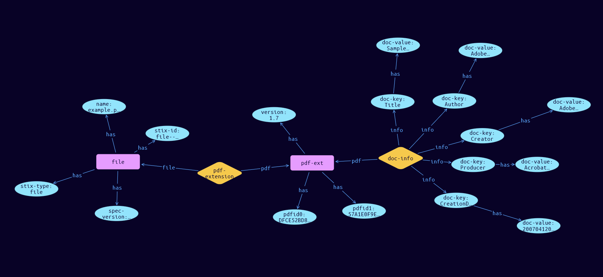

# File-PDF Cyber Obervable Object

**Stix and TypeQL Object Type:**  `pdf-ext`

The PDF file extension specifies a default extension for capturing properties specific to PDF files. The key for this extension when used in the extensions dictionary MUST be pdf-ext. Note that this predefined extension does not use the extension facility described in section 7.3.


An object using the PDF File Extension MUST contain at least one property from this extension.

[Reference in Stix2.1 Standard](https://docs.oasis-open.org/cti/stix/v2.1/os/stix-v2.1-os.html#_8xmpb2ghp9km)
## Stix 2.1 Properties Converted to TypeQL
Mapping of the Stix Attack Pattern Properties to TypeDB

|  Stix 2.1 Property    |           Schema Name             | Required  Optional  |      Schema Object Type | Schema Parent  |
|:--------------------|:--------------------------------:|:------------------:|:------------------------:|:-------------:|
| version |version |      Optional       |  stix-attribute-string    |   attribute    |
| is_optimized |is_optimized |      Optional       |  stix-attribute-boolean    |   attribute    |
| document_info_dict |doc-info:pdf |      Optional       |   embedded     |relation |
| pdfid0 |pdfid0 |      Optional       |  stix-attribute-string    |   attribute    |
| pdfid1 |pdfid1 |      Optional       |  stix-attribute-string    |   attribute    |

## The Example File-PDF in JSON
The original JSON, accessible in the Python environment
```json
{
    "type": "file",  
    "spec_version": "2.1",  
    "id": "file--ec3415cc-5f4f-5ec8-bdb1-6f86996ae66d",  
    "name": "example.pdf",  
    "extensions": {  
      "pdf-ext": {  
        "version": "1.7",  
        "document_info_dict": {  
          "Title": "Sample document",  
          "Author": "Adobe Systems Incorporated",  
          "Creator": "Adobe FrameMaker 5.5.3 for Power Macintosh",  
          "Producer": "Acrobat Distiller 3.01 for Power Macintosh",  
          "CreationDate": "20070412090123-02"  
        },  
        "pdfid0": "DFCE52BD827ECF765649852119D",  
        "pdfid1": "57A1E0F9ED2AE523E313C"  
      }  
    }  
  }
```


## Inserting the Example File-PDF in TypeQL
The TypeQL insert statement
```typeql
insert 
    $file isa file,
        has stix-type $stix-type,
        has spec-version $spec-version,
        has stix-id $stix-id,
        has name $name;
    
    $stix-type "file";
    $spec-version "2.1";
    $stix-id "file--ec3415cc-5f4f-5ec8-bdb1-6f86996ae66d";
    $name "example.pdf";
    
    $pdf-ext isa pdf-ext,
        has version $version,
        has pdfid0 $pdfid0,
        has pdfid1 $pdfid1;
    
    $version "1.7";
    $pdfid0 "DFCE52BD827ECF765649852119D";
    $pdfid1 "57A1E0F9ED2AE523E313C";
    
    $pdf-extension (file:$file, pdf:$pdf-ext) isa pdf-extension;
    
    $doc-key0 isa doc-key;  $doc-key0 "Title";
    $doc-key0 has doc-value "Sample document";
    $doc-key1 isa doc-key;  $doc-key1 "Author";
    $doc-key1 has doc-value "Adobe Systems Incorporated";
    $doc-key2 isa doc-key;  $doc-key2 "Creator";
    $doc-key2 has doc-value "Adobe FrameMaker 5.5.3 for Power Macintosh";
    $doc-key3 isa doc-key;  $doc-key3 "Producer";
    $doc-key3 has doc-value "Acrobat Distiller 3.01 for Power Macintosh";
    $doc-key4 isa doc-key;  $doc-key4 "CreationDate";
    $doc-key4 has doc-value "20070412090123-02";
    $doc-info (pdf:$pdf-ext, info: $doc-key0, info: $doc-key1, info: $doc-key2, info: $doc-key3, info: $doc-key4) isa doc-info;
```

## Retrieving the Example File-PDF in TypeQL
The typeQL match statement

```typeql
match
    $a isa file,
        has stix-id "file--ec3415cc-5f4f-5ec8-bdb1-6f86996ae66d",
        has $b;
    $c isa stix-sub-object,
        has $d;
    $e (owner:$a, pointed-to:$c) isa embedded;
    $g has $h;
    $i (owner:$c, pointed-to:$g) isa embedded;
```


will retrieve the example attack-pattern object in Vaticle Studio


## Retrieving the Example File-PDF  in Python
The Python retrieval statement

```python
from stix.module.typedb_lib import TypeDBSink, TypeDBSource

connection = {
    "uri": "localhost",
    "port": "1729",
    "database": "stix",
    "user": None,
    "password": None
}

import_type = {
    "STIX21": True,
    "CVE": False,
    "identity": False,
    "location": False,
    "rules": False,
    "ATT&CK": False,
    "ATT&CK_Versions": ["12.0"],
    "ATT&CK_Domains": ["enterprise-attack", "mobile-attack", "ics-attack"],
    "CACAO": False
}

typedb = TypeDBSource(connection, import_type)
stix_obj = typedb.get("file--ec3415cc-5f4f-5ec8-bdb1-6f86996ae66d")
```

