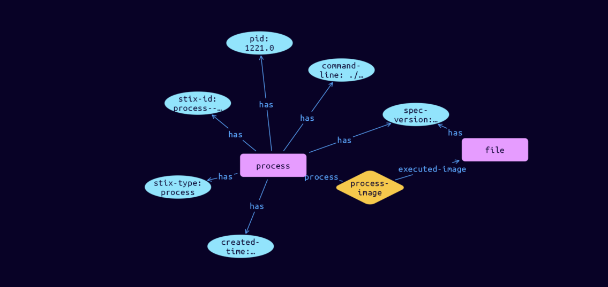

# Process Cyber Obervable Object

**Stix and TypeQL Object Type:**  `process`

The Process object represents common properties of an instance of a computer program as executed on an operating system. A Process object MUST contain at least one property (other than type) from this object (or one of its extensions).

[Reference in Stix2.1 Standard](https://docs.oasis-open.org/cti/stix/v2.1/os/stix-v2.1-os.html#_hpppnm86a1jm)
## Stix 2.1 Properties Converted to TypeQL
Mapping of the Stix Attack Pattern Properties to TypeDB

|  Stix 2.1 Property    |           Schema Name             | Required  Optional  |      Schema Object Type | Schema Parent  |
|:--------------------|:--------------------------------:|:------------------:|:------------------------:|:-------------:|
|  type                 |            stix-type              |      Required       |  stix-attribute-string    |   attribute    |
|  id                   |             stix-id               |      Required       |  stix-attribute-string    |   attribute    |
|  spec_version         |           spec-version            |      Optional       |  stix-attribute-string    |   attribute    |
|  object_marking_refs  |      object-marking:marked        |      Optional       |   embedded     |relation |
|  granular_markings    |     granular-marking:marked       |      Optional       |   embedded     |relation |
| defanged |defanged |      Optional       |stix-attribute-boolean |   attribute    |
|  extensions           |               n/a                 |        n/a          |           n/a             |      n/a       |
| is_hidden |is-hidden |      Optional       |  stix-attribute-boolean    |   attribute    |
| �pid |pid |      Optional       |  stix-attribute-string    |   attribute    |
| �created_time |created-time |      Optional       |  stix-attribute-timestamp    |   attribute    |
| �cwd |cwd |      Optional       |  stix-attribute-string    |   attribute    |
| �command_line |command-line |      Optional       |  stix-attribute-string    |   attribute    |
| �environment_variables |environment-variables:process |      Optional       |   embedded     |relation |
| �opened_connection_refs |open-connections:process |      Optional       |   embedded     |relation |
| �creator_user_ref |user-created-by:created |      Optional       |   embedded     |relation |
| �image_ref |process-image:process |      Optional       |   embedded     |relation |
| �parent_ref |process-parent:parent |      Optional       |   embedded     |relation |
| �child_refs |process-child:process |      Optional       |   embedded     |relation |

## The Example Process in JSON
The original JSON, accessible in the Python environment
```json
{      
    "type": "process",      
    "spec_version": "2.1",      
    "id": "process--d2ec5aab-808d-4492-890a-3c1a1e3cb06e",      
    "pid": 1221,      
    "created_time": "2016-01-20T14:11:25.55Z",      
    "command_line": "./gedit-bin --new-window",      
    "image_ref": "file--c7d1e135-8b34-549a-bb47-302f5cf998ed"      
}
```


## Inserting the Example Process in TypeQL
The TypeQL insert statement
```typeql
match  
    $file0 isa file, 
        has stix-id "file--c7d1e135-8b34-549a-bb47-302f5cf998ed";
insert 
    $process isa process,
        has stix-type $stix-type,
        has spec-version $spec-version,
        has stix-id $stix-id,
        has pid $pid,
        has created-time $created-time,
        has command-line $command-line;
    
    $stix-type "process";
    $spec-version "2.1";
    $stix-id "process--d2ec5aab-808d-4492-890a-3c1a1e3cb06e";
    $pid 1221;
    $created-time 2016-01-20T14:11:25.550;
    $command-line "./gedit-bin --new-window";
    
    $process-image0 (process:$process, executed-image:$file0) isa process-image;
```

## Retrieving the Example Process in TypeQL
The typeQL match statement

```typeql
match
    $a isa process,
        has stix-id  "process--d2ec5aab-808d-4492-890a-3c1a1e3cb06e",
        has $b;
    $c (owner:$a, pointed-to:$d) isa embedded;
```


will retrieve the example attack-pattern object in Vaticle Studio


## Retrieving the Example Process  in Python
The Python retrieval statement

```python
from stix.module.typedb_lib import TypeDBSink, TypeDBSource

connection = {
    "uri": "localhost",
    "port": "1729",
    "database": "stix",
    "user": None,
    "password": None
}

import_type = {
    "STIX21": True,
    "CVE": False,
    "identity": False,
    "location": False,
    "rules": False,
    "ATT&CK": False,
    "ATT&CK_Versions": ["12.0"],
    "ATT&CK_Domains": ["enterprise-attack", "mobile-attack", "ics-attack"],
    "CACAO": False
}

typedb = TypeDBSource(connection, import_type)
stix_obj = typedb.get("process--d2ec5aab-808d-4492-890a-3c1a1e3cb06e")
```

