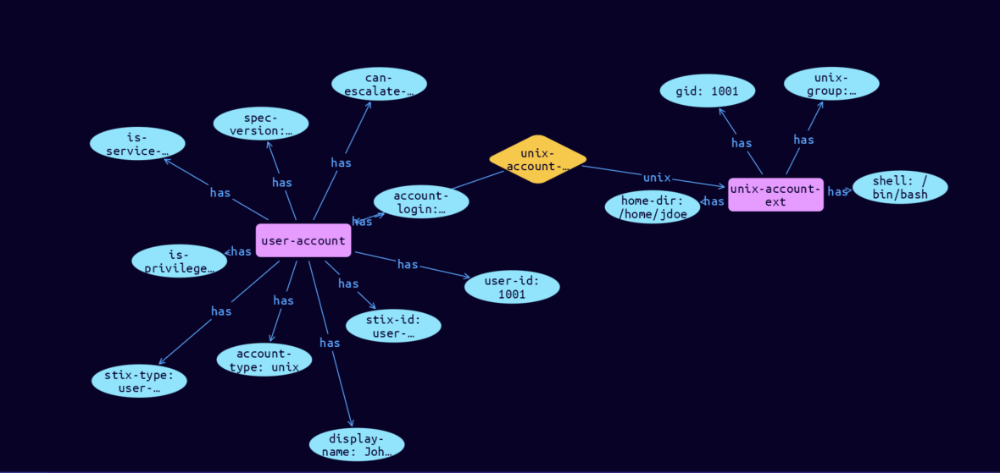

# User-UNIX-Account Cyber Obervable Object

**Stix and TypeQL Object Type:**  `unix-account-ext`

The UNIX account extension specifies a default extension for capturing the additional information for an account on a UNIX system. The key for this extension when used in the extensions dictionary MUST be unix-account-ext. Note that this predefined extension does not use the extension facility described in section 7.3.

An object using the UNIX Account Extension MUST contain at least one property from this extension.

[Reference in Stix2.1 Standard](https://docs.oasis-open.org/cti/stix/v2.1/os/stix-v2.1-os.html#_hodiamlggpw5)
## Stix 2.1 Properties Converted to TypeQL
Mapping of the Stix Attack Pattern Properties to TypeDB

|  Stix 2.1 Property    |           Schema Name             | Required  Optional  |      Schema Object Type | Schema Parent  |
|:--------------------|:--------------------------------:|:------------------:|:------------------------:|:-------------:|
| gid |gid |Optional |  stix-attribute-string    |   attribute    |
| groups |groups |Optional |  stix-attribute-string    |   attribute    |
| home_dir |home-dir |Optional |  stix-attribute-string    |   attribute    |
| shell |shell |Optional |  stix-attribute-string    |   attribute    |

## The Example User-UNIX-Account in JSON
The original JSON, accessible in the Python environment
```json
{
    "type": "user-account",  
    "spec_version": "2.1",  
    "id": "user-account--0d5b424b-93b8-5cd8-ac36-306e1789d63c",  
    "user_id": "1001",  
    "account_login": "jdoe",  
    "account_type": "unix",  
    "display_name": "John Doe",  
    "is_service_account": false,  
    "is_privileged": false,  
    "can_escalate_privs": true,  
    "extensions": {  
      "unix-account-ext": {  
        "gid": 1001,  
        "groups": ["wheel"],  
        "home_dir": "/home/jdoe",  
        "shell": "/bin/bash"  
      }  
    }  
  }
```


## Inserting the Example User-UNIX-Account in TypeQL
The TypeQL insert statement
```typeql
insert 
    $user-account isa user-account,
        has stix-type $stix-type,
        has spec-version $spec-version,
        has stix-id $stix-id,
        has user-id $user-id,
        has account-login $account-login,
        has account-type $account-type,
        has display-name $display-name,
        has is-service-account $is-service-account,
        has is-privileged $is-privileged,
        has can-escalate-privs $can-escalate-privs;
    
    $stix-type "user-account";
    $spec-version "2.1";
    $stix-id "user-account--0d5b424b-93b8-5cd8-ac36-306e1789d63c";
    $user-id "1001";
    $account-login "jdoe";
    $account-type "unix";
    $display-name "John Doe";
    $is-service-account false;
    $is-privileged false;
    $can-escalate-privs true;
    
    $unix-account-ext isa unix-account-ext,
        has gid $gid,
        has unix-group $groups0,
        has home-dir $home-dir,
        has shell $shell;
        
    $gid 1001;
    $groups0 "wheel";
    $home-dir "/home/jdoe";
    $shell "/bin/bash";
    
    $unix-account-extension (account:$user-account, unix:$unix-account-ext) isa unix-account-extension;
```

## Retrieving the Example User-UNIX-Account in TypeQL
The typeQL match statement

```typeql
match
    $a isa user-account,
        has stix-id  "user-account--0d5b424b-93b8-5cd8-ac36-306e1789d63c",
        has $b;
    $c isa stix-sub-object,
        has $d;
    $f (owner:$a, pointed-to:$c) isa embedded;
```


will retrieve the example attack-pattern object in Vaticle Studio


## Retrieving the Example User-UNIX-Account  in Python
The Python retrieval statement

```python
from stix.module.typedb_lib import TypeDBSink, TypeDBSource

connection = {
    "uri": "localhost",
    "port": "1729",
    "database": "stix",
    "user": None,
    "password": None
}

import_type = {
    "STIX21": True,
    "CVE": False,
    "identity": False,
    "location": False,
    "rules": False,
    "ATT&CK": False,
    "ATT&CK_Versions": ["12.0"],
    "ATT&CK_Domains": ["enterprise-attack", "mobile-attack", "ics-attack"],
    "CACAO": False
}

typedb = TypeDBSource(connection, import_type)
stix_obj = typedb.get("user-account--0d5b424b-93b8-5cd8-ac36-306e1789d63c")
```

