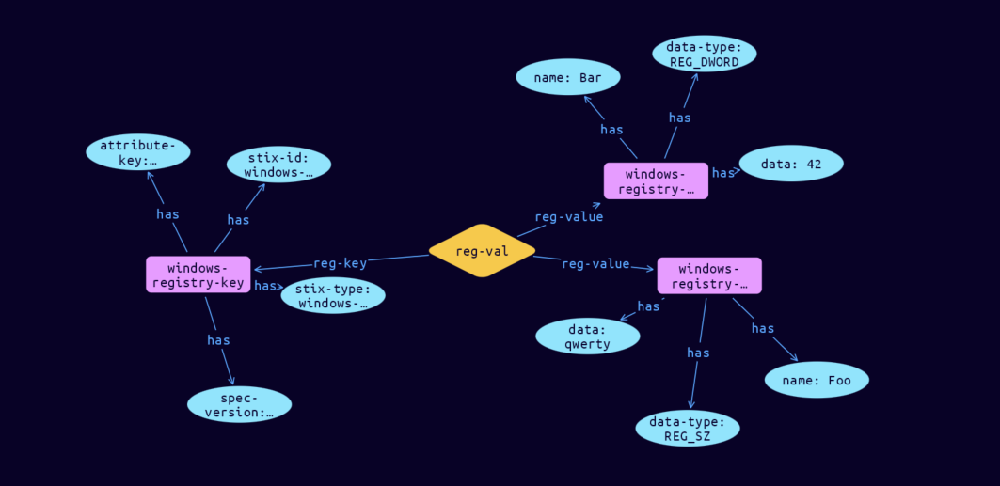

# Windows-Registry-Value Cyber Obervable Object

**Stix and TypeQL Object Type:**  `windows-registry-value-type`

The Windows Registry Value type captures the properties of a Windows Registry Key Value. As all properties of this type are optional, at least one of the properties defined below MUST be included when using this type.

[Reference in Stix2.1 Standard](https://docs.oasis-open.org/cti/stix/v2.1/os/stix-v2.1-os.html#_u7n4ndghs3qq)
## Stix 2.1 Properties Converted to TypeQL
Mapping of the Stix Attack Pattern Properties to TypeDB

|  Stix 2.1 Property    |           Schema Name             | Required  Optional  |      Schema Object Type | Schema Parent  |
|:--------------------|:--------------------------------:|:------------------:|:------------------------:|:-------------:|
| name |name |Optional |  stix-attribute-string    |   attribute    |
| data |data |Optional |  stix-attribute-string    |   attribute    |
| data_type |data-type |Optional |  stix-attribute-string    |   attribute    |

## The Example Windows-Registry-Value in JSON
The original JSON, accessible in the Python environment
```json
{    "type": "windows-registry-key",  
    "spec_version": "2.1",  
    "id": "windows-registry-key--2ba37ae7-2745-5082-9dfd-9486dad41016",  
    "key": "hkey_local_machine\\system\\bar\\foo",  
    "values": [  
      {  
        "name": "Foo",  
        "data": "qwerty",  
        "data_type": "REG_SZ"  
      },  
      {  
        "name": "Bar",  
        "data": "42",  
        "data_type": "REG_DWORD"  
      }  
    ]  
  }
```


## Inserting the Example Windows-Registry-Value in TypeQL
The TypeQL insert statement
```typeql
insert 
    $windows-registry-key isa windows-registry-key,
        has stix-type $stix-type,
        has spec-version $spec-version,
        has stix-id $stix-id,
        has attribute-key $attribute-key;
    
    $stix-type "windows-registry-key";
    $spec-version "2.1";
    $stix-id "windows-registry-key--2ba37ae7-2745-5082-9dfd-9486dad41016";
    $attribute-key "hkey_local_machine\\system\\bar\\foo";
    
    $windows-registry-value-type0 isa windows-registry-value-type,
        has name "Foo",
        has data "qwerty",
        has data-type "REG_SZ";
    $windows-registry-value-type1 isa windows-registry-value-type,
        has name "Bar",
        has data "42",
        has data-type "REG_DWORD";
    
    $reg-val (reg-key:$windows-registry-key, reg-value:$windows-registry-value-type0, reg-value:$windows-registry-value-type1) isa reg-val;
```

## Retrieving the Example Windows-Registry-Value in TypeQL
The typeQL match statement

```typeql
match
    $a isa windows-registry-key,
        has stix-id  "windows-registry-key--2ba37ae7-2745-5082-9dfd-9486dad41016",
        has $b;
    $c isa stix-sub-object,
        has $d;
    $e (owner:$a, pointed-to:$c) isa embedded;
```


will retrieve the example attack-pattern object in Vaticle Studio


## Retrieving the Example Windows-Registry-Value  in Python
The Python retrieval statement

```python
from stix.module.typedb_lib import TypeDBSink, TypeDBSource

connection = {
    "uri": "localhost",
    "port": "1729",
    "database": "stix",
    "user": None,
    "password": None
}

import_type = {
    "STIX21": True,
    "CVE": False,
    "identity": False,
    "location": False,
    "rules": False,
    "ATT&CK": False,
    "ATT&CK_Versions": ["12.0"],
    "ATT&CK_Domains": ["enterprise-attack", "mobile-attack", "ics-attack"],
    "CACAO": False
}

typedb = TypeDBSource(connection, import_type)
stix_obj = typedb.get("windows-registry-key--2ba37ae7-2745-5082-9dfd-9486dad41016")
```

