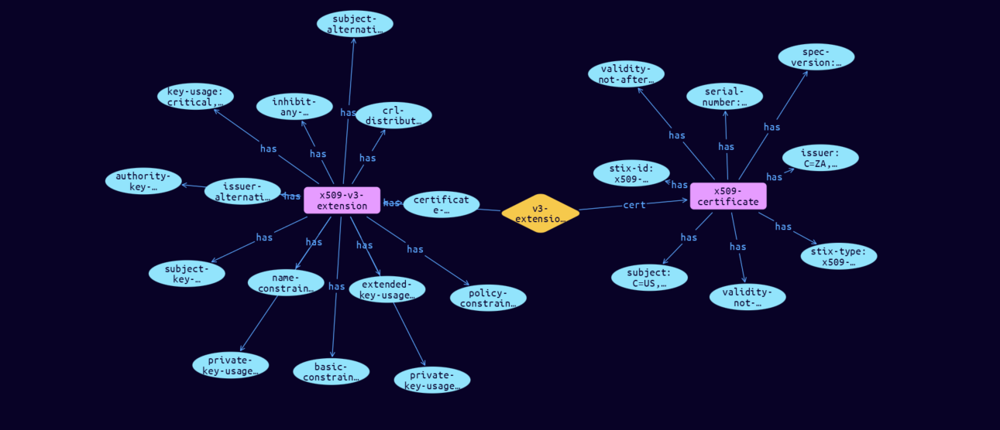

# X.509-Certificate Extension Cyber Obervable Object

**Stix and TypeQL Object Type:**  `x509-v3-extensions-type`

The X.509 v3 Extensions type captures properties associated with X.509 v3 extensions, which serve as a mechanism for specifying additional information such as alternative subject names. An object using the X.509 v3 Extensions type MUST contain at least one property from this type.

The X.509 v3 Extensions type captures properties associated with X.509 v3 extensions, which serve as a mechanism for specifying additional information such as alternative subject names. An object using the X.509 v3 Extensions type MUST contain at least one property from this type.

[Reference in Stix2.1 Standard](https://docs.oasis-open.org/cti/stix/v2.1/os/stix-v2.1-os.html#_oudvonxzdlku)
## Stix 2.1 Properties Converted to TypeQL
Mapping of the Stix Attack Pattern Properties to TypeDB

|  Stix 2.1 Property    |           Schema Name             | Required  Optional  |      Schema Object Type | Schema Parent  |
|:--------------------|:--------------------------------:|:------------------:|:------------------------:|:-------------:|
| basic_constraints� |basic-constraints |Optional |  stix-attribute-string    |   attribute    |
| name_constraints� |name-constraints |Optional |  stix-attribute-string    |   attribute    |
| policy_constraints� |policy-constraints |Optional |  stix-attribute-string    |   attribute    |
| key_usage� |key-usage |Optional |  stix-attribute-string    |   attribute    |
| extended_key_usage� |extended-key-usage |Optional |  stix-attribute-string    |   attribute    |
| subject_key_identifier� |subject-key-identifier |Optional |  stix-attribute-string    |   attribute    |
| authority_key_identifier� |authority-key-identifier |Optional |  stix-attribute-string    |   attribute    |
| subject_alternative_name� |subject-alternative-name |Optional |  stix-attribute-string    |   attribute    |
| issuer_alternative_name� |issuer-alternative-name |Optional |  stix-attribute-string    |   attribute    |
| subject_directory_attributes� |subject-directory-attributes |Optional |  stix-attribute-string    |   attribute    |
| crl_distribution_points� |crl-distribution-points |Optional |  stix-attribute-string    |   attribute    |
| inhibit_any_policy� |inhibit-any-policy |Optional |  stix-attribute-string    |   attribute    |
| private_key_usage_period_not_before� |private-key-usage-period-not-before |Optional |  stix-attribute-timestamp    |   attribute    |
| private_key_usage_period_not_after� |private-key-usage-period-not-after |Optional |  stix-attribute-timestamp    |   attribute    |
| certificate_policies� |certificate-policies |Optional |  stix-attribute-string    |   attribute    |
| policy_mappings� |policy-mappings |Optional |  stix-attribute-string    |   attribute    |

## The Example X.509-Certificate Extension in JSON
The original JSON, accessible in the Python environment
```json
{
    "type":"x509-certificate",  
    "spec_version": "2.1",  
    "id": "x509-certificate--b595eaf0-0b28-5dad-9e8e-0fab9c1facc9",  
    "issuer":"C=ZA, ST=Western Cape, L=Cape Town, O=Thawte Consulting cc, OU=Certification Services Division, CN=Thawte Server CA/emailAddress=server-certs@thawte.com",  
    "validity_not_before":"2016-03-12T12:00:00Z",  
    "validity_not_after":"2016-08-21T12:00:00Z",  
    "subject":"C=US, ST=Maryland, L=Pasadena, O=Brent Baccala, OU=FreeSoft, CN=www.freesoft.org/emailAddress=baccala@freesoft.org",  
    "serial_number": "02:08:87:83:f2:13:58:1f:79:52:1e:66:90:0a:02:24:c9:6b:c7:dc",  
    "x509_v3_extensions":{  
      "basic_constraints":"critical,CA:TRUE, pathlen:0",  
      "name_constraints":"permitted;IP:192.168.0.0/255.255.0.0",  
      "policy_constraints":"requireExplicitPolicy:3",  
      "key_usage":"critical, keyCertSign",  
      "extended_key_usage":"critical,codeSigning,1.2.3.4",  
      "subject_key_identifier":"hash",  
      "authority_key_identifier":"keyid,issuer",  
      "subject_alternative_name":"email:my@other.address,RID:1.2.3.4",  
      "issuer_alternative_name":"issuer:copy",  
      "crl_distribution_points":"URI:http://myhost.com/myca.crl",  
      "inhibit_any_policy":"2",  
      "private_key_usage_period_not_before":"2016-03-12T12:00:00Z",  
      "private_key_usage_period_not_after":"2018-03-12T12:00:00Z",  
      "certificate_policies":"1.2.4.5, 1.1.3.4"  
    }
  
  }
```


## Inserting the Example X.509-Certificate Extension in TypeQL
The TypeQL insert statement
```typeql
insert 
    $x509-certificate isa x509-certificate,
        has stix-type $stix-type,
        has spec-version $spec-version,
        has stix-id $stix-id,
        has serial-number $serial-number,
        has issuer $issuer,
        has validity-not-before $validity-not-before,
        has validity-not-after $validity-not-after,
        has subject $subject;
    
    $stix-type "x509-certificate";
    $spec-version "2.1";
    $stix-id "x509-certificate--b595eaf0-0b28-5dad-9e8e-0fab9c1facc9";
    $serial-number "02:08:87:83:f2:13:58:1f:79:52:1e:66:90:0a:02:24:c9:6b:c7:dc";
    $issuer "C=ZA, ST=Western Cape, L=Cape Town, O=Thawte Consulting cc, OU=Certification Services Division, CN=Thawte Server CA/emailAddress=server-certs@thawte.com";
    $validity-not-before 2016-03-12T12:00:00.000;
    $validity-not-after 2016-08-21T12:00:00.000;
    $subject "C=US, ST=Maryland, L=Pasadena, O=Brent Baccala, OU=FreeSoft, CN=www.freesoft.org/emailAddress=baccala@freesoft.org";
    
    $x509-v3-extension isa x509-v3-extension,
        has basic-constraints $basic-constraints,
        has name-constraints $name-constraints,
        has policy-constraints $policy-constraints,
        has key-usage $key-usage,
        has extended-key-usage $extended-key-usage,
        has subject-key-identifier $subject-key-identifier,
        has authority-key-identifier $authority-key-identifier,
        has subject-alternative-name $subject-alternative-name,
        has issuer-alternative-name $issuer-alternative-name,
        has crl-distribution-points $crl-distribution-points,
        has inhibit-any-policy $inhibit-any-policy,
        has private-key-usage-period-not-before $private-key-usage-period-not-before,
        has private-key-usage-period-not-after $private-key-usage-period-not-after,
        has certificate-policies $certificate-policies;
    
    $basic-constraints "critical,CA:TRUE, pathlen:0";
    $name-constraints "permitted;IP:192.168.0.0/255.255.0.0";
    $policy-constraints "requireExplicitPolicy:3";
    $key-usage "critical, keyCertSign";
    $extended-key-usage "critical,codeSigning,1.2.3.4";
    $subject-key-identifier "hash";
    $authority-key-identifier "keyid,issuer";
    $subject-alternative-name "email:my@other.address,RID:1.2.3.4";
    $issuer-alternative-name "issuer:copy";
    $crl-distribution-points "URI:http://myhost.com/myca.crl";
    $inhibit-any-policy "2";
    $private-key-usage-period-not-before 2016-03-12T12:00:00.000;
    $private-key-usage-period-not-after 2018-03-12T12:00:00.000;
    $certificate-policies "1.2.4.5, 1.1.3.4";
    
    $v3-extensions (cert:$x509-certificate, v3-extension:$x509-v3-extension) isa v3-extensions;
```

## Retrieving the Example X.509-Certificate Extension in TypeQL
The typeQL match statement

```typeql
match
    $a isa x509-certificate,
        has stix-id   "x509-certificate--b595eaf0-0b28-5dad-9e8e-0fab9c1facc9",
        has $b;
    $c isa stix-sub-object,
        has $d;
    $e (owner:$a, pointed-to:$c) isa embedded;
```


will retrieve the example attack-pattern object in Vaticle Studio


## Retrieving the Example X.509-Certificate Extension  in Python
The Python retrieval statement

```python
from stix.module.typedb_lib import TypeDBSink, TypeDBSource

connection = {
    "uri": "localhost",
    "port": "1729",
    "database": "stix",
    "user": None,
    "password": None
}

import_type = {
    "STIX21": True,
    "CVE": False,
    "identity": False,
    "location": False,
    "rules": False,
    "ATT&CK": False,
    "ATT&CK_Versions": ["12.0"],
    "ATT&CK_Domains": ["enterprise-attack", "mobile-attack", "ics-attack"],
    "CACAO": False
}

typedb = TypeDBSource(connection, import_type)
stix_obj = typedb.get("x509-certificate--b595eaf0-0b28-5dad-9e8e-0fab9c1facc9")
```

