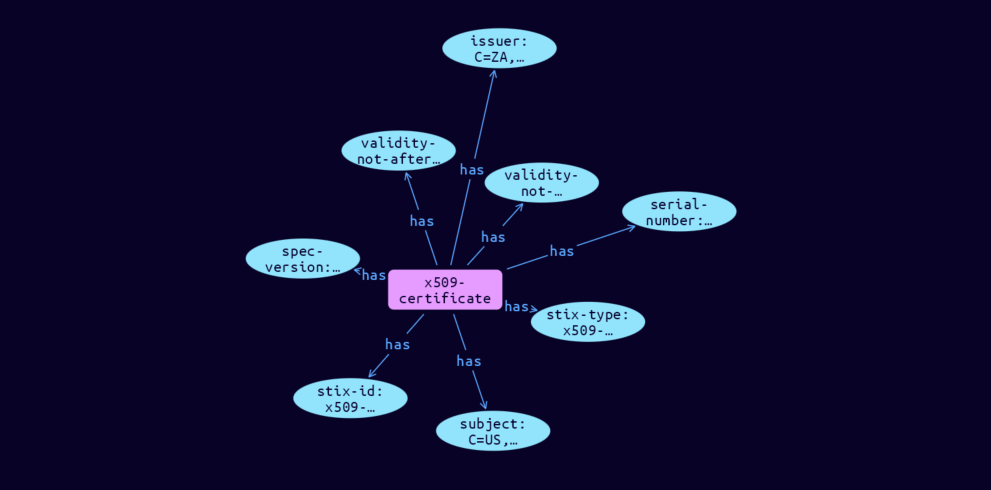

# X.509-Certificate Cyber Obervable Object

**Stix and TypeQL Object Type:**  `x509-certificate`

The X.509 Certificate object represents the properties of an X.509 certificate, as defined by ITU recommendation X.509 [X.509]. An X.509 Certificate object MUST contain at least one object specific property (other than type) from this object.

[Reference in Stix2.1 Standard](https://docs.oasis-open.org/cti/stix/v2.1/os/stix-v2.1-os.html#_8abcy1o5x9w1)
## Stix 2.1 Properties Converted to TypeQL
Mapping of the Stix Attack Pattern Properties to TypeDB

|  Stix 2.1 Property    |           Schema Name             | Required  Optional  |      Schema Object Type | Schema Parent  |
|:--------------------|:--------------------------------:|:------------------:|:------------------------:|:-------------:|
|  type                 |            stix-type              |      Required       |  stix-attribute-string    |   attribute    |
|  id                   |             stix-id               |      Required       |  stix-attribute-string    |   attribute    |
|  spec_version         |           spec-version            |      Optional       |  stix-attribute-string    |   attribute    |
|  object_marking_refs  |      object-marking:marked        |      Optional       |   embedded     |relation |
|  granular_markings    |     granular-marking:marked       |      Optional       |   embedded     |relation |
| defanged |defanged |      Optional       |stix-attribute-boolean |   attribute    |
|  extensions           |               n/a                 |        n/a          |           n/a             |      n/a       |
| is_self_signed |is-self-signed |      Optional       |  stix-attribute-boolean    |   attribute    |
| �hashes |hashes:owner |      Optional       |embedded |relation |
| �version |version |      Optional       |  stix-attribute-string    |   attribute    |
| �serial_number |serial-number |      Optional       |  stix-attribute-string    |   attribute    |
| �signature_algorithm |signature-algorithm |      Optional       |  stix-attribute-string    |   attribute    |
| �issuer |issuer |      Optional       |  stix-attribute-string    |   attribute    |
| �validity_not_before |validity-not-before |      Optional       |  stix-attribute-timestamp    |   attribute    |
| �validity_not_after |validity-not-after |      Optional       |  stix-attribute-timestamp    |   attribute    |
| �subject |subject |      Optional       |  stix-attribute-string    |   attribute    |
| �subject_public_key_algorithm |subject-public-key-algorithm |      Optional       |  stix-attribute-string    |   attribute    |
| �subject_public_key_modulus |subject-public-key-modulus |      Optional       |  stix-attribute-string    |   attribute    |
| �subject_public_key_exponent |subject-public-key-exponent |      Optional       |  stix-attribute-integer    |   attribute    |
| �x509_v3_extensions |v3-extensions:cert |      Optional       |embedded |relation |

## The Example X.509-Certificate in JSON
The original JSON, accessible in the Python environment
```json
{
    "type": "x509-certificate",  
    "spec_version": "2.1",  
    "id": "x509-certificate--463d7b2a-8516-5a50-a3d7-6f801465d5de",  
    "issuer": "C=ZA, ST=Western Cape, L=Cape Town, O=Thawte Consulting cc, OU=Certification Services Division, CN=Thawte Server CA/emailAddress=server-certs@thawte.com",  
    "validity_not_before": "2016-03-12T12:00:00Z",  
    "validity_not_after": "2016-08-21T12:00:00Z",  
    "subject": "C=US, ST=Maryland, L=Pasadena, O=Brent Baccala, OU=FreeSoft, CN=www.freesoft.org/emailAddress=baccala@freesoft.org",  
    "serial_number": "36:f7:d4:32:f4:ab:70:ea:d3:ce:98:6e:ea:99:93:49:32:0a:b7:06"
}
```


## Inserting the Example X.509-Certificate in TypeQL
The TypeQL insert statement
```typeql
insert 
    $x509-certificate isa x509-certificate,
        has stix-type $stix-type,
        has spec-version $spec-version,
        has stix-id $stix-id,
        has serial-number $serial-number,
        has issuer $issuer,
        has validity-not-before $validity-not-before,
        has validity-not-after $validity-not-after,
        has subject $subject;
    
    $stix-type "x509-certificate";
    $spec-version "2.1";
    $stix-id "x509-certificate--463d7b2a-8516-5a50-a3d7-6f801465d5de";
    $serial-number "36:f7:d4:32:f4:ab:70:ea:d3:ce:98:6e:ea:99:93:49:32:0a:b7:06";
    $issuer "C=ZA, ST=Western Cape, L=Cape Town, O=Thawte Consulting cc, OU=Certification Services Division, CN=Thawte Server CA/emailAddress=server-certs@thawte.com";
    $validity-not-before 2016-03-12T12:00:00.000;
    $validity-not-after 2016-08-21T12:00:00.000;
    $subject "C=US, ST=Maryland, L=Pasadena, O=Brent Baccala, OU=FreeSoft, CN=www.freesoft.org/emailAddress=baccala@freesoft.org";
```

## Retrieving the Example X.509-Certificate in TypeQL
The typeQL match statement

```typeql
match
    $a isa x509-certificate,
        has stix-id   "x509-certificate--463d7b2a-8516-5a50-a3d7-6f801465d5de",
        has $b;
```


will retrieve the example attack-pattern object in Vaticle Studio


## Retrieving the Example X.509-Certificate  in Python
The Python retrieval statement

```python
from stix.module.typedb_lib import TypeDBSink, TypeDBSource

connection = {
    "uri": "localhost",
    "port": "1729",
    "database": "stix",
    "user": None,
    "password": None
}

import_type = {
    "STIX21": True,
    "CVE": False,
    "identity": False,
    "location": False,
    "rules": False,
    "ATT&CK": False,
    "ATT&CK_Versions": ["12.0"],
    "ATT&CK_Domains": ["enterprise-attack", "mobile-attack", "ics-attack"],
    "CACAO": False
}

typedb = TypeDBSource(connection, import_type)
stix_obj = typedb.get("x509-certificate--463d7b2a-8516-5a50-a3d7-6f801465d5de")
```

