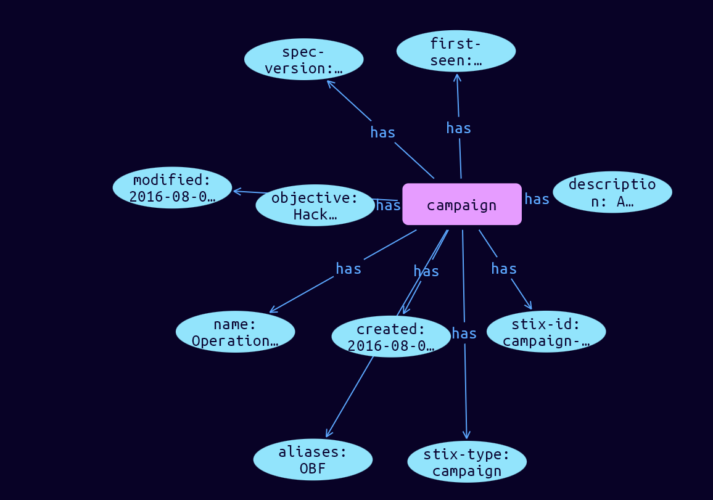

# Campaign Domain Object

**Stix and TypeQL Object Type:**  `campaign`

A Campaign is a grouping of adversarial behaviors that describes a set of malicious activities or attacks (sometimes called waves) that occur over a period of time against a specific set of targets. Campaigns usually have well defined objectives and may be part of an Intrusion Set.

 

Campaigns are often attributed to an intrusion set and threat actors. The threat actors may reuse known infrastructure from the intrusion set or may set up new infrastructure specific for conducting that campaign.

Campaigns can be characterized by their objectives and the incidents they cause, people or resources they target, and the resources (infrastructure, intelligence, Malware, Tools, etc.) they use.

 

For example, a Campaign could be used to describe a crime syndicate's attack using a specific variant of malware and new C2 servers against the executives of ACME Bank during the summer of 2016 in order to gain secret information about an upcoming merger with another bank.

[Reference in Stix2.1 Standard](https://docs.oasis-open.org/cti/stix/v2.1/os/stix-v2.1-os.html#_pcpvfz4ik6d6)
## Stix 2.1 Properties Converted to TypeQL
Mapping of the Stix Attack Pattern Properties to TypeDB

|  Stix 2.1 Property    |           Schema Name             | Required  Optional  |      Schema Object Type | Schema Parent  |
|:--------------------|:--------------------------------:|:------------------:|:------------------------:|:-------------:|
|  type                 |            stix-type              |      Required       |  stix-attribute-string    |   attribute    |
|  id                   |             stix-id               |      Required       |  stix-attribute-string    |   attribute    |
|  spec_version         |           spec-version            |      Required       |  stix-attribute-string    |   attribute    |
|  created              |             created               |      Required       | stix-attribute-timestamp  |   attribute    |
|  modified             |             modified              |      Required       | stix-attribute-timestamp  |   attribute    |
|  name                 |               name                |      Required       |  stix-attribute-string    |   attribute    |
|  description          |           description             |      Optional       |  stix-attribute-string    |   attribute    |
|  aliases              | aliases              |      Optional       |  stix-attribute-string    |   attribute    |
| first_seen |first-seen |      Optional       | stix-attribute-timestamp  |   attribute    |
| last_seen |last-seen |      Optional       | stix-attribute-timestamp  |   attribute    |
| objective |objective |      Optional       |  stix-attribute-string    |   attribute    |
|  created_by_ref       |        created-by:created         |      Optional       |   embedded     |relation |
|  revoked              |             revoked               |      Optional       |  stix-attribute-boolean   |   attribute    |
|  labels               |              labels               |      Optional       |  stix-attribute-string    |   attribute    |
|  confidence           |            confidence             |      Optional       |  stix-attribute-integer   |   attribute    |
|  lang                 |               lang                |      Optional       |  stix-attribute-string    |   attribute    |
|  external_references  | external-references:referencing   |      Optional       |   embedded     |relation |
|  object_marking_refs  |      object-marking:marked        |      Optional       |   embedded     |relation |
|  granular_markings    |     granular-marking:marked       |      Optional       |   embedded     |relation |
|  extensions           |               n/a                 |        n/a          |           n/a             |      n/a       |

## The Example Campaign in JSON
The original JSON, accessible in the Python environment
```json
{
    "type": "campaign",
    "spec_version": "2.1",
    "id": "campaign--e5268b6e-4931-42f1-b379-87f48eb41b1e",
    "created": "2016-08-08T15:50:10.983Z",
    "modified": "2016-08-08T15:50:10.983Z",
    "name": "Operation Bran Flakes",
    "description": "A concerted effort to insert false information into the BPP's web pages.",
    "aliases": [
        "OBF"
    ],
    "first_seen": "2016-01-08T12:50:40.123Z",
    "objective": "Hack www.bpp.bn"
}
```


## Inserting the Example Campaign in TypeQL
The TypeQL insert statement
```typeql
insert 
    $campaign isa campaign,
        has stix-type $stix-type,
        has spec-version $spec-version,
        has stix-id $stix-id,
        has created $created,
        has modified $modified,
        has name $name,
        has description $description,
        has aliases $aliases0,
        has first-seen $first-seen,
        has objective $objective;
        
        $stix-type "campaign";
        $spec-version "2.1";
        $stix-id "campaign--1d8897a7-fdc2-4e59-afc9-becbe04df727";
        $created 2016-08-08T15:50:10.983;
        $modified 2016-08-08T15:50:10.983;
        $name "Operation Raisin Bran";
        $description "A DDOS campaign to flood BPP web servers.";
        $aliases0 "ORB";
        $first-seen 2016-02-07T19:45:32.126;
        $objective "Flood www.bpp.bn";
```

## Retrieving the Example Campaign in TypeQL
The typeQL match statement

```typeql
match
    $a isa campaign,
        has stix-id "campaign--e5268b6e-4931-42f1-b379-87f48eb41b1e",
        has $b;
```


will retrieve the example attack-pattern object in Vaticle Studio


## Retrieving the Example Campaign  in Python
The Python retrieval statement

```python
from stix.module.typedb import TypeDBSink, TypeDBSource

connection = {
    "uri": "localhost",
    "port": "1729",
    "database": "stix",
    "user": None,
    "password": None
}

import_type = {
    "STIX21": True,
    "CVE": False,
    "identity": False,
    "location": False,
    "rules": False,
    "ATT&CK": False,
    "ATT&CK_Versions": ["12.0"],
    "ATT&CK_Domains": ["enterprise-attack", "mobile-attack", "ics-attack"],
    "CACAO": False
}

typedb = TypeDBSource(connection, import_type)
stix_obj = typedb.get("campaign--e5268b6e-4931-42f1-b379-87f48eb41b1e")
```

