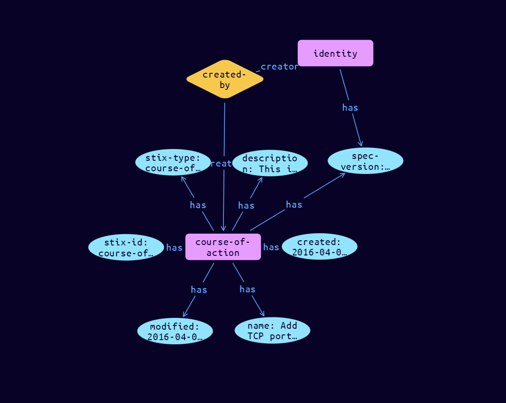

# Course-of-Action Domain Object

**Stix and TypeQL Object Type:**  `course-of-action`

Note: The Course of Action object in STIX 2.1 is a stub. It is included to support basic use cases (such as sharing prose courses of action) but does not support the ability to represent automated courses of action or contain properties to represent metadata about courses of action. Future STIX 2 releases will expand it to include these capabilities.

 

A Course of Action is an action taken either to prevent an attack or to respond to an attack that is in progress. It may describe technical, automatable responses (applying patches, reconfiguring firewalls) but can also describe higher level actions like employee training or policy changes. For example, a course of action to mitigate a vulnerability could describe applying the patch that fixes it.

The Course of Action SDO contains a textual description of the action; a reserved action property also serves as a placeholder for future inclusion of machine automatable courses of action.

[Reference in Stix2.1 Standard](https://docs.oasis-open.org/cti/stix/v2.1/os/stix-v2.1-os.html#_a925mpw39txn)
## Stix 2.1 Properties Converted to TypeQL
Mapping of the Stix Attack Pattern Properties to TypeDB

|  Stix 2.1 Property    |           Schema Name             | Required  Optional  |      Schema Object        | Schema Parent  |
|:--------------------|:--------------------------------:|:------------------:|:------------------------:|:-------------:|
|  type                 |            stix-type              |      Required       |  stix-attribute-string    |   attribute    |
|  id                   |             stix-id               |      Required       |  stix-attribute-string    |   attribute    |
|  spec_version         |           spec-version            |      Required       |  stix-attribute-string    |   attribute    |
|  created              |             created               |      Required       | stix-attribute-timestamp  |   attribute    |
|  modified             |             modified              |      Required       | stix-attribute-timestamp  |   attribute    |
|  name                 |               name                |      Required       |  stix-attribute-string    |   attribute    |
|  description          |           description             |      Optional       |  stix-attribute-string    |   attribute    |
|  aliases              | aliases              |      Optional       |  stix-attribute-string    |   attribute    |
| action |action |Reserved |  stix-attribute-string    |   attribute    |
|  created_by_ref       |        created-by:created         |      Optional       |   embedded     |relation |
|  revoked              |             revoked               |      Optional       |  stix-attribute-boolean   |   attribute    |
|  labels               |              labels               |      Optional       |  stix-attribute-string    |   attribute    |
|  confidence           |            confidence             |      Optional       |  stix-attribute-integer   |   attribute    |
|  lang                 |               lang                |      Optional       |  stix-attribute-string    |   attribute    |
|  external_references  | external-references:referencing   |      Optional       |   embedded     |relation |
|  object_marking_refs  |      object-marking:marked        |      Optional       |   embedded     |relation |
|  granular_markings    |     granular-marking:marked       |      Optional       |   embedded     |relation |
|  extensions           |               n/a                 |        n/a          |           n/a             |      n/a       |

## The Example Course-of-Action in JSON
The original JSON, accessible in the Python environment
```json
{  
  "type": "course-of-action",  
  "spec_version": "2.1",  
  "id": "course-of-action--8e2e2d2b-17d4-4cbf-938f-98ee46b3cd3f",  
  "created_by_ref": "identity--e5f1b90a-d9b6-40ab-81a9-8a29df4b6b65",  
  "created": "2016-04-06T20:03:48.000Z",  
  "modified": "2016-04-06T20:03:48.000Z",  
  "name": "Add TCP port 80 Filter Rule to the existing Block UDP 1434 Filter",  
  "description": "This is how to add a filter rule to block inbound access to TCP port 80 to the existing UDP 1434 filter ..."
}
```


## Inserting the Example Course-of-Action in TypeQL
The TypeQL insert statement
```typeql
match  
    $identity0 isa identity, 
        has stix-id "identity--e5f1b90a-d9b6-40ab-81a9-8a29df4b6b65";
insert 
    $course-of-action isa course-of-action,
        has stix-type $stix-type,
        has spec-version $spec-version,
        has stix-id $stix-id,
        has created $created,
        has modified $modified,
        has name $name,
        has description $description;
    
    $stix-type "course-of-action";
    $spec-version "2.1";
    $stix-id "course-of-action--8e2e2d2b-17d4-4cbf-938f-98ee46b3cd3f";
    $created 2016-04-06T20:03:48.000;
    $modified 2016-04-06T20:03:48.000;
    $name "Add TCP port 80 Filter Rule to the existing Block UDP 1434 Filter";
    $description "This is how to add a filter rule to block inbound access to TCP port 80 to the existing UDP 1434 filter ...";
        
    $created-by0 (created:$course-of-action, creator:$identity0) isa created-by;
```

## Retrieving the Example Course-of-Action in TypeQL
The typeQL match statement

```typeql
match
    $a isa course-of-action,
        has stix-id "course-of-action--8e2e2d2b-17d4-4cbf-938f-98ee46b3cd3f",
        has $b;
    $c (owner:$a, pointed-to:$d) isa embedded;
```


will retrieve the example attack-pattern object in Vaticle Studio


## Retrieving the Example Course-of-Action  in Python
The Python retrieval statement

```python
from stix.module.typedb import TypeDBSink, TypeDBSource

connection = {
    "uri": "localhost",
    "port": "1729",
    "database": "stix",
    "user": None,
    "password": None
}

import_type = {
    "STIX21": True,
    "CVE": False,
    "identity": False,
    "location": False,
    "rules": False,
    "ATT&CK": False,
    "ATT&CK_Versions": ["12.0"],
    "ATT&CK_Domains": ["enterprise-attack", "mobile-attack", "ics-attack"],
    "CACAO": False
}

typedb = TypeDBSource(connection, import_type)
stix_obj = typedb.get("course-of-action--8e2e2d2b-17d4-4cbf-938f-98ee46b3cd3f")
```

