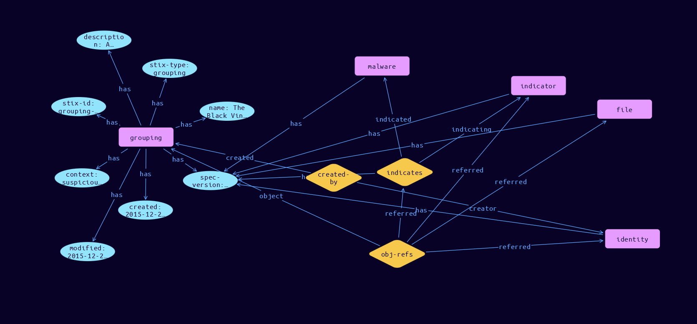

# Grouping Domain Object

**Stix and TypeQL Object Type:**  `grouping`

A Grouping object explicitly asserts that the referenced STIX Objects have a shared context, unlike a STIX Bundle (which explicitly conveys no context). A Grouping object should not be confused with an intelligence product, which should be conveyed via a STIX Report.

A STIX Grouping object might represent a set of data that, in time, given sufficient analysis, would mature to convey an incident or threat report as a STIX Report object. For example, a Grouping could be used to characterize an ongoing investigation into a security event or incident. A Grouping object could also be used to assert that the referenced STIX Objects are related to an ongoing analysis process, such as when a threat analyst is collaborating with others in their trust community to examine a series of Campaigns and Indicators. The Grouping SDO contains a list of references to SDOs, SCOs, SROs, and SMOs, along with an explicit statement of the context shared by the content, a textual description, and the name of the grouping.

[Reference in Stix2.1 Standard](https://docs.oasis-open.org/cti/stix/v2.1/os/stix-v2.1-os.html#_t56pn7elv6u7)
## Stix 2.1 Properties Converted to TypeQL
Mapping of the Stix Attack Pattern Properties to TypeDB

|  Stix 2.1 Property    |           Schema Name             | Required  Optional  | Schema Object Type | Schema Parent  |
|:--------------------|:--------------------------------:|:------------------:|:------------------------:|:-------------:|
|  type                 |            stix-type              |      Required       |  stix-attribute-string    |   attribute    |
|  id                   |             stix-id               |      Required       |  stix-attribute-string    |   attribute    |
|  spec_version         |           spec-version            |      Required       |  stix-attribute-string    |   attribute    |
|  created              |             created               |      Required       | stix-attribute-timestamp  |   attribute    |
|  modified             |             modified              |      Required       | stix-attribute-timestamp  |   attribute    |
|  name                 |               name                |      Optional       |  stix-attribute-string    |   attribute    |
|  description          |           description             |      Optional       |  stix-attribute-string    |   attribute    |
| context |context |Required |  stix-attribute-string    |   attribute    |
| object_refs |obj-refs:object |Required |   embedded     |relation |
|  created_by_ref       |        created-by:created         |      Optional       |   embedded     |relation |
|  revoked              |             revoked               |      Optional       |  stix-attribute-boolean   |   attribute    |
|  labels               |              labels               |      Optional       |  stix-attribute-string    |   attribute    |
|  confidence           |            confidence             |      Optional       |  stix-attribute-integer   |   attribute    |
|  lang                 |               lang                |      Optional       |  stix-attribute-string    |   attribute    |
|  external_references  | external-references:referencing   |      Optional       |   embedded     |relation |
|  object_marking_refs  |      object-marking:marked        |      Optional       |   embedded     |relation |
|  granular_markings    |     granular-marking:marked       |      Optional       |   embedded     |relation |
|  extensions           |               n/a                 |        n/a          |           n/a             |      n/a       |

## The Example Grouping in JSON
The original JSON, accessible in the Python environment
```json
{
    "type": "grouping",  
    "spec_version": "2.1",  
    "id": "grouping--84e4d88f-44ea-4bcd-bbf3-b2c1c320bcb3",  
    "created_by_ref": "identity--e5f1b90a-d9b6-40ab-81a9-8a29df4b6b65",  
    "created": "2015-12-21T19:59:11.000Z",  
    "modified": "2015-12-21T19:59:11.000Z",  
    "name": "The Black Vine Cyberespionage Group",  
    "description": "A simple collection of Black Vine Cyberespionage Group attributed intel",  
    "context": "suspicious-activity",  
    "object_refs": [  
      "indicator--8e2e2d2b-17d4-4cbf-938f-98ee46b3cd3f",  
      "identity--e5f1b90a-d9b6-40ab-81a9-8a29df4b6b65",  
      "relationship--44298a74-ba52-4f0c-87a3-1824e67d7fad",  
      "file--fb0419a8-f09c-57f8-be64-71a80417591c"  
    ]  
  }
```


## Inserting the Example Grouping in TypeQL
The TypeQL insert statement
```typeql
match  
    $identity0 isa identity, has stix-id "identity--e5f1b90a-d9b6-40ab-81a9-8a29df4b6b65";
    $indicator01 isa indicator, has stix-id "indicator--8e2e2d2b-17d4-4cbf-938f-98ee46b3cd3f";
    $identity11 isa identity, has stix-id "identity--e5f1b90a-d9b6-40ab-81a9-8a29df4b6b65";
    $stix-core-relationship21 isa stix-core-relationship, has stix-id "relationship--44298a74-ba52-4f0c-87a3-1824e67d7fad";
    $file31 isa file, has stix-id "file--fb0419a8-f09c-57f8-be64-71a80417591c";

insert 
    $grouping isa grouping,
        has stix-type $stix-type,
        has spec-version $spec-version,
        has stix-id $stix-id,
        has created $created,
        has modified $modified,
        has name $name,
        has description $description,
        has context $context;
    
    $stix-type "grouping";
    $spec-version "2.1";
    $stix-id "grouping--84e4d88f-44ea-4bcd-bbf3-b2c1c320bcb3";
    $created 2015-12-21T19:59:11.000;
    $modified 2015-12-21T19:59:11.000;
    $name "The Black Vine Cyberespionage Group";
    $description "A simple collection of Black Vine Cyberespionage Group attributed intel";
    $context "suspicious-activity";
    
    $created-by0 (created:$grouping, creator:$identity0) isa created-by;
    
    $obj-refs1 (object:$grouping, referred:$indicator01, referred:$identity11, referred:$stix-core-relationship21, 
                                referred:$file31) isa obj-refs;
```

## Retrieving the Example Grouping in TypeQL
The typeQL match statement

```typeql
match
    $a isa grouping,
        has stix-id "grouping--84e4d88f-44ea-4bcd-bbf3-b2c1c320bcb3",
        has $b;
    $c (owner:$a, pointed-to:$d) isa embedded;
```


will retrieve the example attack-pattern object in Vaticle Studio


## Retrieving the Example Grouping  in Python
The Python retrieval statement

```python
from stix.module.typedb import TypeDBSink, TypeDBSource

connection = {
    "uri": "localhost",
    "port": "1729",
    "database": "stix",
    "user": None,
    "password": None
}

import_type = {
    "STIX21": True,
    "CVE": False,
    "identity": False,
    "location": False,
    "rules": False,
    "ATT&CK": False,
    "ATT&CK_Versions": ["12.0"],
    "ATT&CK_Domains": ["enterprise-attack", "mobile-attack", "ics-attack"],
    "CACAO": False
}

typedb = TypeDBSource(connection, import_type)
stix_obj = typedb.get('match $a isa campaign, has stix-id "campaign--e5268b6e-4931-42f1-b379-87f48eb41b1e", has $b;')
```

