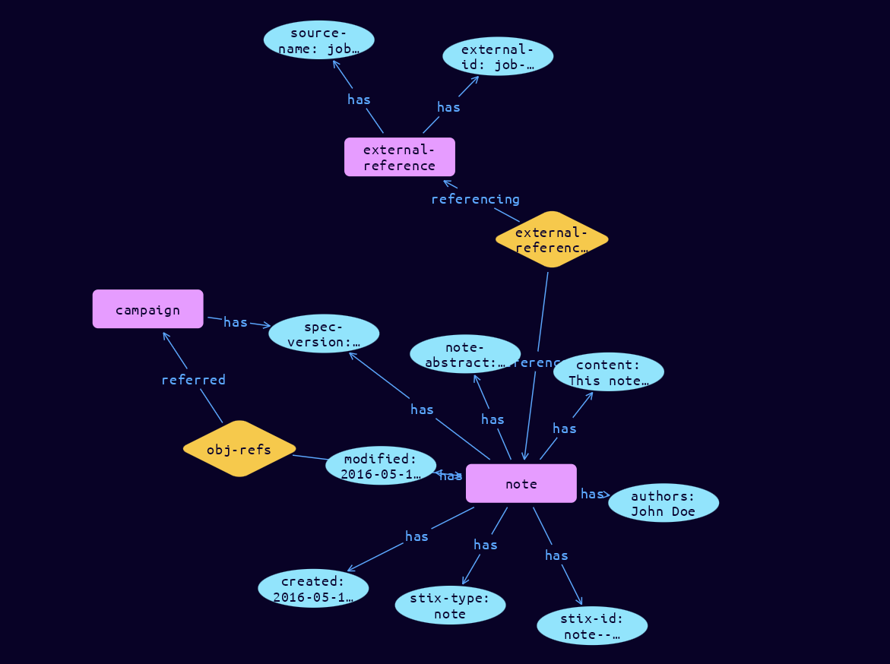

# Note Domain Object

**Stix and TypeQL Object Type:**  `note`

A Note is intended to convey informative text to provide further context and/or to provide additional analysis not contained in the STIX Objects, Marking Definition objects, or Language Content objects which the Note relates to. Notes can be created by anyone (not just the original object creator).

 

For example, an analyst may add a Note to a Campaign object created by another organization indicating that they've seen posts related to that Campaign on a hacker forum.

 A Note is intended to convey informative text to provide further context and/or to provide additional analysis not contained in the STIX Objects, Marking Definition objects, or Language Content objects which the Note relates to. Notes can be created by anyone (not just the original object creator).

 

For example, an analyst may add a Note to a Campaign object created by another organization indicating that they've seen posts related to that Campaign on a hacker forum.

 A Note is intended to convey informative text to provide further context and/or to provide additional analysis not contained in the STIX Objects, Marking Definition objects, or Language Content objects which the Note relates to. Notes can be created by anyone (not just the original object creator).

 

For example, an analyst may add a Note to a Campaign object created by another organization indicating that they've seen posts related to that Campaign on a hacker forum.

Because Notes are typically (though not always) created by human analysts and are comprised of human-oriented text, they contain an additional property to capture the analyst(s) that created the Note. This is distinct from the created_by_ref property, which is meant to capture the organization that created the object.

[Reference in Stix2.1 Standard](https://docs.oasis-open.org/cti/stix/v2.1/os/stix-v2.1-os.html#_gudodcg1sbb9)
## Stix 2.1 Properties Converted to TypeQL
Mapping of the Stix Attack Pattern Properties to TypeDB

|  Stix 2.1 Property    |           Schema Name             | Required  Optional  |      Schema Object Type | Schema Parent  |
|:--------------------|:--------------------------------:|:------------------:|:------------------------:|:-------------:|
|  type                 |            stix-type              |      Required       |  stix-attribute-string    |   attribute    |
|  id                   |             stix-id               |      Required       |  stix-attribute-string    |   attribute    |
|  spec_version         |           spec-version            |      Required       |  stix-attribute-string    |   attribute    |
|  created              |             created               |      Required       | stix-attribute-timestamp  |   attribute    |
|  modified             |             modified              |      Required       | stix-attribute-timestamp  |   attribute    |
| abstract |note-abstract |      Optional       |  stix-attribute-string    |   attribute    |
| content |content |      Optional       |  stix-attribute-string    |   attribute    |
| authors |authors |      Optional       |  stix-attribute-string    |   attribute    |
| object_refs |obj-refs:object |      Optional       |   embedded     |relation |
| created_by_ref       |        created-by:created         |      Optional       |   embedded     |relation |
|  revoked              |             revoked               |      Optional       |  stix-attribute-boolean   |   attribute    |
|  labels               |              labels               |      Optional       |  stix-attribute-string    |   attribute    |
|  confidence           |            confidence             |      Optional       |  stix-attribute-integer   |   attribute    |
|  lang                 |               lang                |      Optional       |  stix-attribute-string    |   attribute    |
|  external_references  | external-references:referencing   |      Optional       |   embedded     |relation |
|  object_marking_refs  |      object-marking:marked        |      Optional       |   embedded     |relation |
|  granular_markings    |     granular-marking:marked       |      Optional       |   embedded     |relation |
|  extensions           |               n/a                 |        n/a          |           n/a             |      n/a       |

## The Example Note in JSON
The original JSON, accessible in the Python environment
```json
{
  "type": "note",
  "spec_version": "2.1",
  "id": "note--0c7b5b88-8ff7-4a4d-aa9d-feb398cd0061",
  "created": "2016-05-12T08:17:27.000Z",
  "modified": "2016-05-12T08:17:27.000Z",
  "external_references": [
    {
      "source_name": "job-tracker",
      "external_id": "job-id-1234"
    }
  ],
  "abstract": "Tracking Team Note#1",
  "content": "This note indicates the various steps taken by the threat analyst team to investigate this specific campaign. Step 1) Do a scan 2) Review scanned results for identified hosts not known by external intel�etc.",
  "authors": ["John Doe"],
  "object_refs": ["campaign--8e2e2d2b-17d4-4cbf-938f-98ee46b3cd3f"]
}
```


## Inserting the Example Note in TypeQL
The TypeQL insert statement
```typeql
match  
    $campaign00 isa campaign, 
        has stix-id "campaign--8e2e2d2b-17d4-4cbf-938f-98ee46b3cd3f";

insert 
    $note isa note,
        has stix-type $stix-type,
        has spec-version $spec-version,
        has stix-id $stix-id,
        has created $created,
        has modified $modified,
        has note-abstract $note-abstract,
        has content $content,
        has authors $authors0;
        
    $stix-type "note";
    $spec-version "2.1";
    $stix-id "note--0c7b5b88-8ff7-4a4d-aa9d-feb398cd0061";
    $created 2016-05-12T08:17:27.000;
    $modified 2016-05-12T08:17:27.000;
    $note-abstract "Tracking Team Note#1";
    $content "This note indicates the various steps taken by the threat analyst team to investigate this specific campaign. Step 1) Do a scan 2) Review scanned results for identified hosts not known by external intel�etc.";
    $authors0 "John Doe";
    
    $obj-refs0 (object:$note, referred:$campaign00) isa obj-refs;
    
    $external-reference0 isa external-reference,
        has source-name "job-tracker",
        has external-id "job-id-1234";
    
    $external-references (referenced:$note, referencing:$external-reference0) isa external-references;
```

## Retrieving the Example Note in TypeQL
The typeQL match statement

```typeql
match
    $a isa note,
        has stix-id "note--0c7b5b88-8ff7-4a4d-aa9d-feb398cd0061",
        has $b;
    $c isa stix-sub-object,
        has $d;
    $e (owner:$a, pointed-to:$c) isa embedded;
    $f (owner:$a, pointed-to:$g) isa embedded;
```


will retrieve the example attack-pattern object in Vaticle Studio


## Retrieving the Example Note  in Python
The Python retrieval statement

```python
from stix.module.typedb_lib import TypeDBSink, TypeDBSource

connection = {
    "uri": "localhost",
    "port": "1729",
    "database": "stix",
    "user": None,
    "password": None
}

import_type = {
    "STIX21": True,
    "CVE": False,
    "identity": False,
    "location": False,
    "rules": False,
    "ATT&CK": False,
    "ATT&CK_Versions": ["12.0"],
    "ATT&CK_Domains": ["enterprise-attack", "mobile-attack", "ics-attack"],
    "CACAO": False
}

typedb = TypeDBSource(connection, import_type)
stix_obj = typedb.get("note--0c7b5b88-8ff7-4a4d-aa9d-feb398cd0061")
```

