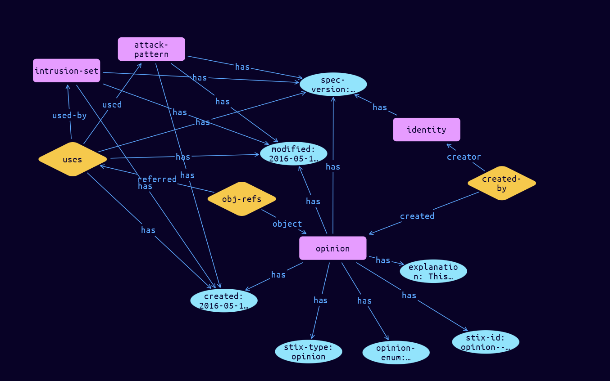

# Opinion Domain Object

**Stix and TypeQL Object Type:**  `opinion`

An Opinion is an assessment of the correctness of the information in a STIX Object produced by a different entity. The primary property is the opinion property, which captures the level of agreement or disagreement using a fixed scale. That fixed scale also supports a numeric mapping to allow for consistent statistical operations across opinions.

 

For example, an analyst from a consuming organization might say that they "strongly disagree" with a Campaign object and provide an explanation about why. In a more automated workflow, a SOC operator might give an Indicator "one star" in their TIP (expressing "strongly disagree") because it is considered to be a false positive within their environment. Opinions are subjective, and the specification does not address how best to interpret them. Sharing communities are encouraged to provide clear guidelines to their constituents regarding best practice for the use of Opinion objects within the community.

Because Opinions are typically (though not always) created by human analysts and are comprised of human-oriented text, they contain an additional property to capture the analyst(s) that created the Opinion. This is distinct from the created_by_ref property, which is meant to capture the organization that created the object.

[Reference in Stix2.1 Standard](https://docs.oasis-open.org/cti/stix/v2.1/os/stix-v2.1-os.html#_ht1vtzfbtzda)
## Stix 2.1 Properties Converted to TypeQL
Mapping of the Stix Attack Pattern Properties to TypeDB

|  Stix 2.1 Property    |           Schema Name             | Required  Optional  |      Schema Object Type | Schema Parent  |
|:--------------------|:--------------------------------:|:------------------:|:------------------------:|:-------------:|
|  type                 |            stix-type              |      Required       |  stix-attribute-string    |   attribute    |
|  id                   |             stix-id               |      Required       |  stix-attribute-string    |   attribute    |
|  spec_version         |           spec-version            |      Required       |  stix-attribute-string    |   attribute    |
|  created              |             created               |      Required       | stix-attribute-timestamp  |   attribute    |
|  modified             |             modified              |      Required       | stix-attribute-timestamp  |   attribute    |
| explanation  |explanation  |      Optional       |  stix-attribute-string    |   attribute    |
| authors |authors |      Optional       |  stix-attribute-string    |   attribute    |
| opinion |opinion-enum |      Required       |  stix-attribute-string    |   attribute    |
| object_refs |obj-refs:object |      Required       |   embedded     |relation |
| created_by_ref       |        created-by:created         |      Optional       |   embedded     |relation |
|  revoked              |             revoked               |      Optional       |  stix-attribute-boolean   |   attribute    |
|  labels               |              labels               |      Optional       |  stix-attribute-string    |   attribute    |
|  confidence           |            confidence             |      Optional       |  stix-attribute-integer   |   attribute    |
|  lang                 |               lang                |      Optional       |  stix-attribute-string    |   attribute    |
|  external_references  | external-references:referencing   |      Optional       |   embedded     |relation |
|  object_marking_refs  |      object-marking:marked        |      Optional       |   embedded     |relation |
|  granular_markings    |     granular-marking:marked       |      Optional       |   embedded     |relation |
|  extensions           |               n/a                 |        n/a          |           n/a             |      n/a       |

## The Example Opinion in JSON
The original JSON, accessible in the Python environment
```json
{
    "type": "opinion",
    "spec_version": "2.1",
    "id": "opinion--b01efc25-77b4-4003-b18b-f6e24b5cd9f7",
    "created_by_ref": "identity--f431f809-377b-45e0-aa1c-6a4751cae5ff",
    "created": "2016-05-12T08:17:27.000Z",
    "modified": "2016-05-12T08:17:27.000Z",
    "object_refs": ["relationship--57b56a43-b8b0-4cba-9deb-34e3e1faed9e"],       
    "opinion": "strongly-disagree",
    "explanation": "This doesn't seem like it is feasible. We've seen how PandaCat has attacked Spanish infrastructure over the last 3 years, so this change in targeting seems too great to be viable. The methods used are more commonly associated with the FlameDragonCrew."
  }
```


## Inserting the Example Opinion in TypeQL
The TypeQL insert statement
```typeql
match
    $identity0 isa identity,         has stix-id "identity--f431f809-377b-45e0-aa1c-6a4751cae5ff";
    $stix-core-relationship01 isa stix-core-relationship,
        has stix-id "relationship--57b56a43-b8b0-4cba-9deb-34e3e1faed9e";
insert 
    $opinion isa opinion,
        has stix-type $stix-type,
        has spec-version $spec-version,
        has stix-id $stix-id,
        has created $created,
        has modified $modified,
        has explanation $explanation,
        has opinion-enum $opinion-enum;

    $stix-type "opinion";
    $spec-version "2.1";
    $stix-id "opinion--b01efc25-77b4-4003-b18b-f6e24b5cd9f7";
    $created 2016-05-12T08:17:27.000;
    $modified 2016-05-12T08:17:27.000;
    $explanation "This doesn't seem like it is feasible. We've seen how PandaCat has attacked Spanish infrastructure over the last 3 years, so this change in targeting seems too great to be viable. The methods used are more commonly associated with the FlameDragonCrew.";
    $opinion-enum "strongly-disagree";

    $created-by0 (created:$opinion, creator:$identity0) isa created-by;

    $obj-refs1 (object:$opinion, referred:$stix-core-relationship01) isa obj-refs;
```

## Retrieving the Example Opinion in TypeQL
The typeQL match statement

```typeql
match
    $a isa opinion,
        has stix-id "opinion--b01efc25-77b4-4003-b18b-f6e24b5cd9f7",
        has $b;
    $c (owner:$a, pointed-to:$d) isa embedded;
```


will retrieve the example attack-pattern object in Vaticle Studio


## Retrieving the Example Opinion  in Python
The Python retrieval statement

```python
from stix.module.typedb_lib import TypeDBSink, TypeDBSource

connection = {
    "uri": "localhost",
    "port": "1729",
    "database": "stix",
    "user": None,
    "password": None
}

import_type = {
    "STIX21": True,
    "CVE": False,
    "identity": False,
    "location": False,
    "rules": False,
    "ATT&CK": False,
    "ATT&CK_Versions": ["12.0"],
    "ATT&CK_Domains": ["enterprise-attack", "mobile-attack", "ics-attack"],
    "CACAO": False
}

typedb = TypeDBSource(connection, import_type)
stix_obj = typedb.get("opinion--b01efc25-77b4-4003-b18b-f6e24b5cd9f7")
```

