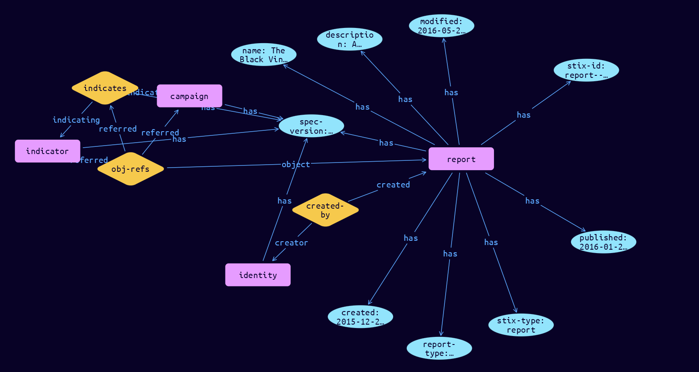

# Report Domain Object

**Stix and TypeQL Object Type:**  `report`

Reports are collections of threat intelligence focused on one or more topics, such as a description of a threat actor, malware, or attack technique, including context and related details. They are used to group related threat intelligence together so that it can be published as a comprehensive cyber threat story.

 

The Report SDO contains a list of references to STIX Objects (the CTI objects included in the report) along with a textual description and the name of the report.

 Reports are collections of threat intelligence focused on one or more topics, such as a description of a threat actor, malware, or attack technique, including context and related details. They are used to group related threat intelligence together so that it can be published as a comprehensive cyber threat story.

 

The Report SDO contains a list of references to STIX Objects (the CTI objects included in the report) along with a textual description and the name of the report.

 Reports are collections of threat intelligence focused on one or more topics, such as a description of a threat actor, malware, or attack technique, including context and related details. They are used to group related threat intelligence together so that it can be published as a comprehensive cyber threat story.

 

The Report SDO contains a list of references to STIX Objects (the CTI objects included in the report) along with a textual description and the name of the report.

or example, a threat report produced by ACME Defense Corp. discussing the Glass Gazelle campaign should be represented using Report. The Report itself would contain the narrative of the report while the Campaign SDO and any related SDOs (e.g., Indicators for the Campaign, Malware it uses, and the associated Relationships) would be referenced in the report contents.

[Reference in Stix2.1 Standard](https://docs.oasis-open.org/cti/stix/v2.1/os/stix-v2.1-os.html#_n8bjzg1ysgdq)
## Stix 2.1 Properties Converted to TypeQL
Mapping of the Stix Attack Pattern Properties to TypeDB

|  Stix 2.1 Property    |           Schema Name             | Required  Optional  |      Schema Object Type | Schema Parent  |
|:--------------------|:--------------------------------:|:------------------:|:------------------------:|:-------------:|
|  type                 |            stix-type              |      Required       |  stix-attribute-string    |   attribute    |
|  id                   |             stix-id               |      Required       |  stix-attribute-string    |   attribute    |
|  spec_version         |           spec-version            |      Required       |  stix-attribute-string    |   attribute    |
|  created              |             created               |      Required       | stix-attribute-timestamp  |   attribute    |
|  modified             |             modified              |      Required       | stix-attribute-timestamp  |   attribute    |
| name |name |      Required       |  stix-attribute-string    |   attribute    |
| description |description |      Optional       |  stix-attribute-string    |   attribute    |
| report_types |report_types |      Optional       |  stix-attribute-string    |   attribute    |
| published |published |      Required       | stix-attribute-timestamp  |   attribute    |
| object_refs |obj-refs:object |      Required       |   embedded     |relation |
| created_by_ref       |        created-by:created         |      Optional       |   embedded     |relation |
|  revoked              |             revoked               |      Optional       |  stix-attribute-boolean   |   attribute    |
|  labels               |              labels               |      Optional       |  stix-attribute-string    |   attribute    |
|  confidence           |            confidence             |      Optional       |  stix-attribute-integer   |   attribute    |
|  lang                 |               lang                |      Optional       |  stix-attribute-string    |   attribute    |
|  external_references  | external-references:referencing   |      Optional       |   embedded     |relation |
|  object_marking_refs  |      object-marking:marked        |      Optional       |   embedded     |relation |
|  granular_markings    |     granular-marking:marked       |      Optional       |   embedded     |relation |
|  extensions           |               n/a                 |        n/a          |           n/a             |      n/a       |

## The Example Report in JSON
The original JSON, accessible in the Python environment
```json
{  
    "type": "report",  
    "spec_version": "2.1",  
    "id": "report--84e4d88f-44ea-4bcd-bbf3-b2c1c320bcbd",  
    "created_by_ref": "identity--a463ffb3-1bd9-4d94-b02d-74e4f1658283",  
    "created": "2015-12-21T19:59:11.000Z",  
    "modified": "2016-05-21T19:59:11.000Z",  
    "name": "The Black Vine Cyberespionage Group",  
    "description": "A simple report with an indicator and campaign",  
    "published": "2016-01-20T17:00:00.000Z",  
    "report_types": ["campaign"],  
    "object_refs": [  
      "indicator--26ffb872-1dd9-446e-b6f5-d58527e5b5d2",  
      "campaign--83422c77-904c-4dc1-aff5-5c38f3a2c55c",  
      "relationship--f82356ae-fe6c-437c-9c24-6b64314ae68a"  
    ]  
  } 
```


## Inserting the Example Report in TypeQL
The TypeQL insert statement
```typeql
match  
    $identity0 isa identity, has stix-id "identity--a463ffb3-1bd9-4d94-b02d-74e4f1658283";
    $indicator01 isa indicator, has stix-id "indicator--26ffb872-1dd9-446e-b6f5-d58527e5b5d2";
    $campaign11 isa campaign, has stix-id "campaign--83422c77-904c-4dc1-aff5-5c38f3a2c55c";
    $stix-core-relationship21 isa stix-core-relationship, has stix-id "relationship--f82356ae-fe6c-437c-9c24-6b64314ae68a";

insert 
    $report isa report,
        has stix-type $stix-type,
        has spec-version $spec-version,
        has stix-id $stix-id,
        has created $created,
        has modified $modified,
        has name $name,
        has description $description,
        has report-type $report_types0,
        has published $published;
    
    $stix-type "report";
    $spec-version "2.1";
    $stix-id "report--84e4d88f-44ea-4bcd-bbf3-b2c1c320bcbd";
    $created 2015-12-21T19:59:11.000;
    $modified 2016-05-21T19:59:11.000;
    $name "The Black Vine Cyberespionage Group";
    $description "A simple report with an indicator and campaign";
    $report_types0 "campaign";
    $published 2016-01-20T17:00:00.000;
    
    $created-by0 (created:$report, creator:$identity0) isa created-by;
    
    $obj-refs1 (object:$report, referred:$indicator01, referred:$campaign11, referred:$stix-core-relationship21) isa obj-refs;
```

## Retrieving the Example Report in TypeQL
The typeQL match statement

```typeql
match
    $a isa report,
        has stix-id "report--84e4d88f-44ea-4bcd-bbf3-b2c1c320bcbd",
        has $b;
    $c (owner:$a, pointed-to:$d) isa embedded;
```


will retrieve the example attack-pattern object in Vaticle Studio


## Retrieving the Example Report  in Python
The Python retrieval statement

```python
from stix.module.typedb_lib import TypeDBSink, TypeDBSource

connection = {
    "uri": "localhost",
    "port": "1729",
    "database": "stix",
    "user": None,
    "password": None
}

import_type = {
    "STIX21": True,
    "CVE": False,
    "identity": False,
    "location": False,
    "rules": False,
    "ATT&CK": False,
    "ATT&CK_Versions": ["12.0"],
    "ATT&CK_Domains": ["enterprise-attack", "mobile-attack", "ics-attack"],
    "CACAO": False
}

typedb = TypeDBSource(connection, import_type)
stix_obj = typedb.get("report--84e4d88f-44ea-4bcd-bbf3-b2c1c320bcbd")
```

