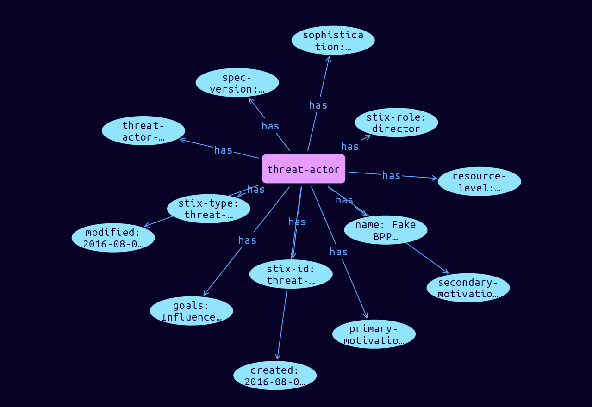

# Threat-Actor Domain Object

**Stix and TypeQL Object Type:**  `threat-actor`

Threat Actors are actual individuals, groups, or organizations believed to be operating with malicious intent. A Threat Actor is not an Intrusion Set but may support or be affiliated with various Intrusion Sets, groups, or organizations over time.

 

Threat Actors leverage their resources, and possibly the resources of an Intrusion Set, to conduct attacks and run Campaigns against targets.

Threat Actors can be characterized by their motives, capabilities, goals, sophistication level, past activities, resources they have access to, and their role in the organization.

[Reference in Stix2.1 Standard](https://docs.oasis-open.org/cti/stix/v2.1/os/stix-v2.1-os.html#_k017w16zutw)
## Stix 2.1 Properties Converted to TypeQL
Mapping of the Stix Attack Pattern Properties to TypeDB

|  Stix 2.1 Property    |           Schema Name             | Required  Optional  |      Schema Object Type | Schema Parent  |
|:--------------------|:--------------------------------:|:------------------:|:------------------------:|:-------------:|
|  type                 |            stix-type              |      Required       |  stix-attribute-string    |   attribute    |
|  id                   |             stix-id               |      Required       |  stix-attribute-string    |   attribute    |
|  spec_version         |           spec-version            |      Required       |  stix-attribute-string    |   attribute    |
|  created              |             created               |      Required       | stix-attribute-timestamp  |   attribute    |
|  modified             |             modified              |      Required       | stix-attribute-timestamp  |   attribute    |
|  name                 |               name                |      Optional       |  stix-attribute-string    |   attribute    |
|  description          |           description             |      Optional       |  stix-attribute-string    |   attribute    |
| aliases |aliases |      Optional       |  stix-attribute-string    |   attribute    |
| first_seen |first_seen |      Optional       | stix-attribute-timestamp  |   attribute    |
| last_seen |last-seen |      Optional       | stix-attribute-timestamp  |   attribute    |
| roles |roles |      Optional       |  stix-attribute-string    |   attribute    |
| goals |goals |      Optional       |  stix-attribute-string    |   attribute    |
| sophistication |sophistication |      Optional       |  stix-attribute-string    |   attribute    |
| resource_level |resource-level |      Optional       |  stix-attribute-string    |   attribute    |
| primary_motivation |primary-motivation |      Optional       |  stix-attribute-string    |   attribute    |
| secondary_motivations |secondary-motivations |      Optional       |  stix-attribute-string    |   attribute    |
| personal_motivations |personal-motivations |      Optional       |  stix-attribute-string    |   attribute    |
|  created_by_ref       |        created-by:created         |      Optional       |   embedded     |relation |
|  revoked              |             revoked               |      Optional       |  stix-attribute-boolean   |   attribute    |
|  labels               |              labels               |      Optional       |  stix-attribute-string    |   attribute    |
|  confidence           |            confidence             |      Optional       |  stix-attribute-integer   |   attribute    |
|  lang                 |               lang                |      Optional       |  stix-attribute-string    |   attribute    |
|  external_references  | external-references:referencing   |      Optional       |   embedded     |relation |
|  object_marking_refs  |      object-marking:marked        |      Optional       |   embedded     |relation |
|  granular_markings    |     granular-marking:marked       |      Optional       |   embedded     |relation |
|  extensions           |               n/a                 |        n/a          |           n/a             |      n/a       |

## The Example Threat-Actor in JSON
The original JSON, accessible in the Python environment
```json
{
    "type": "threat-actor",
    "spec_version": "2.1",
    "id": "threat-actor--56f3f0db-b5d5-431c-ae56-c18f02caf500",
    "created": "2016-08-08T15:50:10.983Z",
    "modified": "2016-08-08T15:50:10.983Z",
    "name": "Fake BPP (Branistan Peoples Party)",
    "threat_actor_types": [
        "nation-state"
    ],
    "roles": [
        "director"
    ],
    "goals": [
        "Influence the election in Branistan"
    ],
    "sophistication": "strategic",
    "resource_level": "government",
    "primary_motivation": "ideology",
    "secondary_motivations": [
        "dominance"
    ]
}
```


## Inserting the Example Threat-Actor in TypeQL
The TypeQL insert statement
```typeql
insert $threat-actor isa threat-actor,
 has stix-type $stix-type,
 has spec-version $spec-version,
 has stix-id $stix-id,
 has created $created,
 has modified $modified,
 has name $name,
 has threat-actor-type $threat_actor_types0,
 has stix-role $roles0,
 has goals $goals0,
 has sophistication $sophistication,
 has resource-level $resource-level,
 has primary-motivation $primary-motivation,
 has secondary-motivations $secondary_motivations0;

 $stix-type "threat-actor";
 $spec-version "2.1";
 $stix-id "threat-actor--56f3f0db-b5d5-431c-ae56-c18f02caf500";
 $created 2016-08-08T15:50:10.983;
 $modified 2016-08-08T15:50:10.983;
 $name "Fake BPP (Branistan Peoples Party)";
 $threat_actor_types0 "nation-state";
 $roles0 "director";
 $goals0 "Influence the election in Branistan";
 $sophistication "strategic";
 $resource-level "government";
 $primary-motivation "ideology";
 $secondary_motivations0 "dominance";
```

## Retrieving the Example Threat-Actor in TypeQL
The typeQL match statement

```typeql
match
    $a isa threat-actor,
        has stix-id "threat-actor--56f3f0db-b5d5-431c-ae56-c18f02caf500",
        has $b;
```


will retrieve the example attack-pattern object in Vaticle Studio


## Retrieving the Example Threat-Actor  in Python
The Python retrieval statement

```python
from stix.module.typedb_lib import TypeDBSink, TypeDBSource

connection = {
    "uri": "localhost",
    "port": "1729",
    "database": "stix",
    "user": None,
    "password": None
}

import_type = {
    "STIX21": True,
    "CVE": False,
    "identity": False,
    "location": False,
    "rules": False,
    "ATT&CK": False,
    "ATT&CK_Versions": ["12.0"],
    "ATT&CK_Domains": ["enterprise-attack", "mobile-attack", "ics-attack"],
    "CACAO": False
}

typedb = TypeDBSource(connection, import_type)
stix_obj = typedb.get("threat-actor--56f3f0db-b5d5-431c-ae56-c18f02caf500")
```

