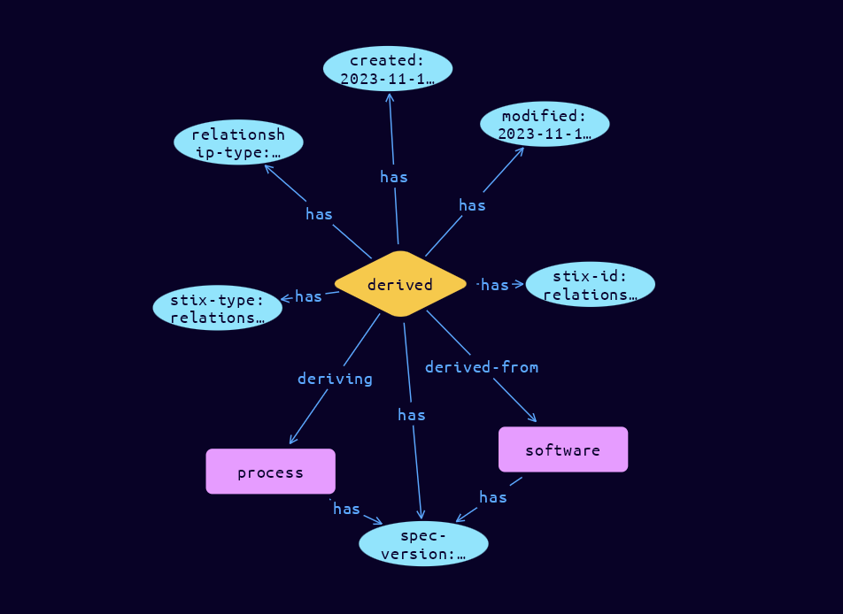

# Relationship Relationship Object

**Stix and TypeQL Object Type:**  `relationship`

The Relationship object is used to link together two SDOs or SCOs in order to describe how they are related to each other. If SDOs and SCOs are considered "nodes" or "vertices" in the graph, the Relationship Objects (SROs) represent "edges". STIX defines many relationship types to link together SDOs and SCOs. Relationship types defined in the specification SHOULD be used to ensure consistency. An example of a specification-defined relationship is that an indicator indicates a campaign. That relationship type is listed in the Relationships section of the Indicator SDO definition.

Relationships have a relationship_type field, which specifies the name of that particular type. In TypeDB, Relationships are modelled as a relation called stix-core-relationship, with attributes, where the source_ref and target_ref are materialised into actual roles. The name of the relationship_type property becomes the name of a sub-type of the stix-core-relationship, and role-names used are individual for each indivudal rolepointing to source and target.. Thus Relationships can be matched in TypeQL based on the parent object, stix-core-relationship, or the individual relationship tye name.

[Reference in Stix2.1 Standard](https://docs.oasis-open.org/cti/stix/v2.1/os/stix-v2.1-os.html#_e2e1szrqfoan)
## Stix 2.1 Properties Converted to TypeQL
Mapping of the Stix Attack Pattern Properties to TypeDB

|  Stix 2.1 Property    |           Schema Name             | Required  Optional  |      Schema Object  Type | Schema Parent  |
|:--------------------|:--------------------------------:|:------------------:|:------------------------:|:-------------:|
|  type                 |            stix-type              |      Required       |  stix-attribute-string    |   attribute    |
|  id                   |             stix-id               |      Required       |  stix-attribute-string    |   attribute    |
|  spec_version         |           spec-version            |      Required       |  stix-attribute-string    |   attribute    |
|  created              |             created               |      Required       | stix-attribute-timestamp  |   attribute    |
|  modified             |             modified              |      Required       | stix-attribute-timestamp  |   attribute    |
|  relationship_type                 |relationship-type |      Required       |  stix-attribute-string    |   attribute    |
|  description          |           description             |      Optional       |  stix-attribute-string    |   attribute    |
| source_ref |source (role) |      Required       |   embedded     |relation |
| target_ref |target (role) |      Required       |   embedded     |relation |
| start_time      |start-time |      Optional       | stix-attribute-timestamp  |   attribute    |
| stop_time |stop-time |      Optional       | stix-attribute-timestamp  |   attribute    |
|  created_by_ref       |        created-by:created         |      Optional       |   embedded     |relation |
|  revoked              |             revoked               |      Optional       |  stix-attribute-boolean   |   attribute    |
|  labels               |              labels               |      Optional       |  stix-attribute-string    |   attribute    |
|  confidence           |            confidence             |      Optional       |  stix-attribute-integer   |   attribute    |
|  lang                 |               lang                |      Optional       |  stix-attribute-string    |   attribute    |
|  external_references  | external-references:referencing   |      Optional       |   embedded     |relation |
|  object_marking_refs  |      object-marking:marked        |      Optional       |   embedded     |relation |
|  granular_markings    |     granular-marking:marked       |      Optional       |   embedded     |relation |
|  extensions           |               n/a                 |        n/a          |           n/a             |      n/a       |

## The Example Relationship in JSON
The original JSON, accessible in the Python environment
```json
{
    "type": "relationship",
    "spec_version": "2.1",
    "id": "relationship--1e553d88-92c2-48fa-aad2-00c55cb27648",
    "created": "2023-11-11T08:45:49.883973Z",
    "modified": "2023-11-11T08:45:49.883973Z",
    "relationship_type": "derived-from",
    "source_ref": "software--3974613c-1980-5209-8f08-17920a04da04",
    "target_ref": "process--d0d3af2d-9edf-4a6a-a484-2632f42f9bef"
}
```


## Inserting the Example Relationship in TypeQL
The TypeQL insert statement
```typeql
match  $software0 isa software, has stix-id "software--3974613c-1980-5209-8f08-17920a04da04";
 $process1 isa process, has stix-id "process--d0d3af2d-9edf-4a6a-a484-2632f42f9bef";
insert
$derived-from (derived-from:$software0, deriving:$process1) isa derived,
 has stix-type $stix-type,
 has spec-version $spec-version,
 has stix-id $stix-id,
 has created $created,
 has modified $modified,
 has relationship-type $relationship-type;

 $stix-type "relationship";
 $spec-version "2.1";
 $stix-id "relationship--1e553d88-92c2-48fa-aad2-00c55cb27648";
 $created 2023-11-11T08:45:49.883;
 $modified 2023-11-11T08:45:49.883;
 $relationship-type "derived-from";
```

## Retrieving the Example Relationship in TypeQL
The typeQL match statement

```typeql
match 
   $a (source:$b, target:$c) isa stix-core-relationship,
      has stix-id  "relationship--1e553d88-92c2-48fa-aad2-00c55cb27648",
      has $d;
```


will retrieve the example attack-pattern object in Vaticle Studio


## Retrieving the Example Relationship  in Python
The Python retrieval statement

```python
from stixorm.module.typedb import TypeDBSink, TypeDBSource
connection = {
    "uri": "localhost",
    "port": "1729",
    "database": "stix",
    "user": None,
    "password": None
}

import_type = {
    "STIX21": True,
    "CVE": False,
    "identity": False,
    "location": False,
    "rules": False,
    "ATT&CK": False,
    "ATT&CK_Versions": ["12.0"],
    "ATT&CK_Domains": ["enterprise-attack", "mobile-attack", "ics-attack"],
    "CACAO": False
}

typedb = TypeDBSource(connection, import_type)
stix_obj = typedb.get("relationship--1e553d88-92c2-48fa-aad2-00c55cb27648")
```

 

[Back to OASIS Stix 2.1 Overview](../overview.md)
 

[Back to All Protocols Overview](../../overview.md)
 

[Back to Overview Doc](../../../overview.md)
